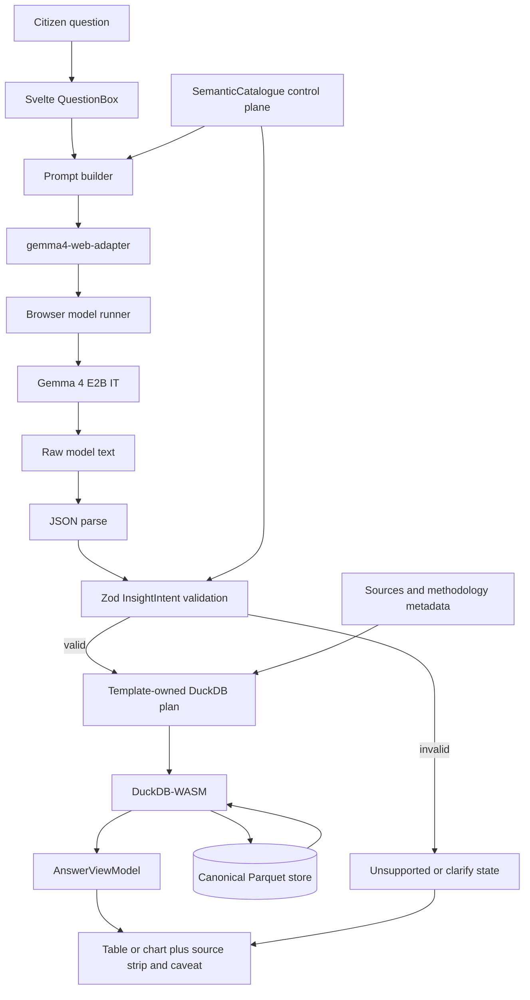

# YENASK browser governance insight assistant plan

**Last Updated**: 2026-05-19
**Status**: Planning scratchpad. User approved `labs/yenask/` and Phase 1 model-free Parquet assistant shell; model runtime implementation remains unapproved pending Phase 2 spike.
**User direction captured here**: explore only; if a scratch note is needed, keep it in `TODO/`; no production code changes in this pass.

## 1. One-line summary

YENASK is a dev-only browser lab where a local Gemma 4 model turns a citizen question into a validated data intent, then DuckDB-WASM computes the answer from yen-gov's canonical Parquet store.

## 2. Accepted decisions

| Decision | Accepted position | Reason |
| --- | --- | --- |
| Product framing | Governance insight assistant, not an AI SQL lab. | Citizens ask governance questions; SQL and joins are private implementation details. |
| Lab home | Use top-level `labs/` and path `labs/yenask/`; visible product name is `YENASK`. | User selected `labs` and `YENASK`; lowercase path keeps repo convention while UI can display uppercase. |
| Approved implementation scope | Phase 1 only: scaffold `labs/yenask/` and build the model-free Parquet assistant shell with canned intents. | User explicitly approved bullets 1 and 2 on 2026-05-18. |
| Production shape | Browser-only and static-first. | yen-gov has no production backend; runtime data must ship statically. |
| Data source | Read `datasets/manifest.json`, schema-controlled catalogue metadata, and canonical Parquet through DuckDB-WASM. | The canonical store is Parquet; assistant metadata must be control-plane only, not a JSON shadow of observations. |
| Semantic catalogue scale target | Use a generated, schema-versioned semantic catalogue/control-plane artifact before broad indicator scale; Phase 1 may use a bounded lab-local catalogue seam only for the tiny election slice. | Startup fact-table scans will not survive 500-1000+ indicators. |
| Model role | Model proposes `InsightIntent` JSON only. | The model should never author or execute raw database queries. |
| Safety gate | Zod validates model output before computation. | The app must reject invented fields, unknown values, and unsupported requests before DuckDB runs. |
| Honesty metadata | Methodology breaks and source confidence are compiler/view-model responsibilities, not model-authored intent fields. | Canonical metadata, not model text, decides whether a result needs a break marker, confidence label, or refusal. |
| First real model | Gemma 4 E2B IT. Runtime wrapper still needs a Phase 2 spike. | Model family is agreed; browser runner is not fully settled. |
| Leading Phase 2 runner candidate | Transformers.js with `onnx-community/gemma-4-E2B-it-ONNX`. | This matches the user's expectation and has public JavaScript/WebGPU usage plus browser cache controls. |
| LiteRT/MediaPipe path | Keep as a serious comparison path, not a settled first implementation. | Google's web-converted artifact is real, but its lab workflow expects a served project asset via `modelAssetPath`. |
| Model readiness | Model-backed free-text chat stays disabled until explicit preflight, download/cache, and warm-up reach `ready`. | A user's first question must not secretly trigger a multi-GB download. |
| UI posture | First screen is the assistant, not a developer console. | User is testing intelligence over governance data, not a query playground. |

Custom-agent roundtable decisions captured 2026-05-19:

- SemanticCatalogue scaling: accept the risk; revise the remedy so any generated catalogue is metadata/control plane, schema-versioned, and not a JSON shadow of observation facts.
- WebGPU payload/cache: accept the risk; add explicit readiness, storage, cache, cancel, retry, and unavailable states; reject any runtime API fallback unless separately approved as dev-only.
- Methodology/provenance: accept strongly; compiler/view-model must inject source confidence and methodology breaks; reject model-authored `methodology_awareness` or `confidence_tier`.
- Loading inertia: accept; free-text model chat must not be the hidden trigger for a multi-GB model fetch.

## 3. Definitions and clarifications

**Zod**: Zod is a widely used open-source TypeScript validation library, not our own invention and not a TypeScript standard-library feature.

One-line value: **Zod turns untrusted model JSON into either a typed, allowed `InsightIntent` or a rejected request.**

TypeScript checks our code during development. Zod checks actual values at runtime. That matters because the model output is just text until the app proves it is valid JSON with allowed concepts, scopes, measures, filters, and limits.

**SemanticCatalogue**: this is not a full ontology. It is a task-scoped semantic layer: a small browser-readable catalogue that maps citizen concepts such as party totals, closest contests, constituency result, and turnout extremes to the allowed Parquet tables, indicators, dimensions, measures, and filters.

An ontology would be more formal and durable: domain classes, relationships, hierarchy, constraints, and possibly inference rules. YENASK does not need that for the first lab. If the project later creates a formal governance/election ontology, `SemanticCatalogue` should become a generated consumer of it rather than the ontology itself.

```ts
const parsed = InsightIntentSchema.safeParse(JSON.parse(modelOutput));

if (!parsed.success) {
  return unsupportedQuestion(parsed.error);
}

return compileInsightIntent(parsed.data);
```

**M0, M1, M2, M3, M4** are only milestone labels inside this plan. They are not industry terms.

When this plan says **Phase 2 runtime spike**, it means: the first browser-model experiment after the model-free Parquet shell works. The runner is deliberately not locked until the spike records load, cache, memory, responsiveness, and intent-quality results.

## 4. Assumptions

- `labs/yenask/` is dev-only, not linked from production navigation, and runs on its own dev port, likely `5175`.
- Adding `labs/` is a repo-topology change. If approved later, `CLAUDE.md` should be updated in the same implementation change to define `labs/` as dev-only.
- The lab reads the same static `/data/manifest.json` and Parquet files that production frontend code reads.
- At indicator scale, the lab reads a schema-controlled semantic catalogue/control-plane artifact generated by the data pipeline from `manifest.json`, taxonomy tables, dimension summaries, methodology metadata, sources, and curated concept templates.
- The lab does not import from `frontend/src/` initially. It may duplicate small dev-server middleware until there are three concrete consumers for shared tooling.
- The first slice is elections, likely Tamil Nadu / May 2026 because those rows exist today, but available states and periods are discovered from Parquet metadata and catalogue queries.
- Model artifacts are large and should not be committed to this repo.
- For intent generation, Gemma 4 thinking mode should likely be disabled unless evaluation proves it improves structured output enough to justify latency.

## 5. Discarded paths

| Discarded path | Why discarded |
| --- | --- |
| AI SQL lab as product framing | User rejected the SQL mental model; DuckDB is an implementation engine, not the citizen surface. |
| LLM writes raw SQL | Too much authority for the model; hard to audit, constrain, and explain. |
| JSON shadow of Parquet | Violates the canonical Parquet direction and risks a second data contract. |
| Hardcoding `S22` or `AcGenMay2026` | These are data values inside Parquet, not schema constants. |
| Startup scans over observation Parquet to build the assistant catalogue | It will not scale to hundreds of indicators and makes TTI depend on data volume before the user has asked anything. |
| JSON shadow of Parquet observations | A generated semantic catalogue may exist only as metadata/control plane; facts still come from canonical Parquet. |
| Gemma 3n as target model | It was an artifact-readiness mistake; Gemma 4 is the current target. |
| Direct LiteRT-LM Web API as an assumption | Public docs checked so far do not show a clear direct JavaScript browser API. |
| WebLLM as first path | Strong browser ergonomics, but no verified ready Gemma 4 MLC artifact found in checked docs. |
| LiteRT/MediaPipe as already-agreed Phase 2 path | The user has not agreed to that. It remains a candidate, not the committed runtime. |
| Model-authored methodology/confidence flags | The model must not decide whether a source is trusted or a methodology break matters; canonical metadata and compiler rules do that. |
| Lightweight API fallback as default | A runtime API fallback would violate the static-first posture unless the user explicitly approves a dev-only experiment later. |

## 6. Model and runtime facts

Gemma 4 is the current target family. The first candidate is **Gemma 4 E2B IT**, instruction-tuned.

Verified model-size facts from public model cards/file listings:

| Item | Size meaning | Publicly observed size |
| --- | --- | ---: |
| Gemma 4 E2B | Effective parameters | 2.3B effective parameters |
| Gemma 4 E2B | Total parameters including embeddings | 5.1B total parameters |
| LiteRT Community `gemma-4-E2B-it-web.task` | Browser task artifact file | about 2 GB |
| Full LiteRT Community E2B repository | All listed variants together | about 10.9 GB |
| ONNX Community Gemma 4 E2B repository | Full ONNX repo, all precision variants | about 47.7 GB |

Important: the ONNX repository size is not necessarily the browser download size for one Transformers.js configuration. The exact `q4f16` WebGPU subset downloaded by Transformers.js must be measured during the runtime comparison milestone.

Runtime decision table:

| Runtime | Role | Current position |
| --- | --- | --- |
| Transformers.js + `onnx-community/gemma-4-E2B-it-ONNX` | Leading lab candidate for first runtime spike | Public JavaScript/WebGPU usage exists; model can be addressed by model id; library exposes browser cache/local-model controls. |
| LiteRT Community `.task` + `@mediapipe/tasks-genai` | Serious comparison path | Google's web artifact is real and benchmarked, but the guide expects the model to be stored/served from the project and passed by `modelAssetPath`. |
| WebLLM | Watch/comparison path | Use only if a ready Gemma 4 MLC path appears or is cheap to add. |
| Direct LiteRT-LM Web API | Future swap-in | Use if Google publishes/clarifies one; hide behind the same local adapter. |

LiteRT and Transformers.js are not mutually exclusive at the project level. They are mutually exclusive only for one concrete model execution path: a single adapter call either runs through ONNX Runtime Web via Transformers.js, or through a LiteRT/MediaPipe runner, or through some future runtime. The rest of YENASK should not care which runner produced the raw text. That is why the local `gemma4-web-adapter.ts` exists.

Why choose one over the other:

| Path | Choose it when | Trade-off |
| --- | --- | --- |
| Transformers.js / ONNX | Lab ergonomics matter: load by model id, WebGPU via `device: "webgpu"`, quantized dtype such as `q4f16`, browser cache support, and a familiar Hugging Face JS API. | Need to measure actual browser download subset, memory, and whether Gemma 4 structured intent output is reliable. |
| LiteRT / MediaPipe | We want Google's web-converted `.task` artifact and the path closest to LiteRT-LM's edge stack. | Lab setup is more manual: download/serve a large model file and point `modelAssetPath` at it. Direct LiteRT-LM JS API is not yet clear in public docs. |

Public performance evidence:

- LiteRT-LM has the stronger public performance documentation for Gemma 4 E2B. Google's Gemma 4 LiteRT-LM page lists E2B model size as 2.58 GB and publishes CPU/GPU performance summaries across Android, iOS, Linux, macOS, IoT, and Windows.
- The LiteRT Community Gemma 4 E2B model card includes a web-specific Chrome/WebGPU benchmark on a 2024 MacBook Pro M4 Max: 1024 prefill tokens, 256 decode tokens, model file about 2 GB for web, GPU throughput 73.9 tokens/sec, 1.1 sec time-to-first-token, about 2004 MB model size, about 1.5 GB GPU process memory and 1.8 GB CPU/tab memory while running. The model card says time-to-first-token does not include load time and first-run latency/memory may differ.
- Transformers.js documents WebGPU acceleration through ONNX Runtime Web: set `device: "webgpu"`; use quantized dtypes such as `q4`/`q4f16`; run models directly in the browser. The Gemma 4 ONNX model card documents JavaScript usage with `Gemma4ForConditionalGeneration.from_pretrained(..., { dtype: "q4f16", device: "webgpu" })`.
- Public docs checked so far do not provide an official apples-to-apples Transformers.js Gemma 4 E2B performance table comparable to the LiteRT-LM table. That does not mean Transformers.js is slower; it means Phase 2 must measure it locally instead of assuming performance.

Performance expectation before measurement: LiteRT may be faster or more memory-efficient for Gemma 4 because it is Google's specialized edge runtime and has published Gemma 4-specific benchmarks. Transformers.js may be easier to bootstrap and good enough for the lab, but its Gemma 4 performance must be measured on the target browser/device.

Plain-English stack:

```text
Svelte 5 UI
  + TypeScript app logic and contracts
  + DuckDB-WASM Parquet reads
  + Zod runtime validation for InsightIntent
  + Gemma 4 E2B IT browser model
  + local gemma4-web-adapter hiding the chosen runner
```

Svelte and TypeScript are complementary here: Svelte owns components and interaction; TypeScript owns contracts, adapters, validators, and DuckDB helper code.

Browser performance posture:

- A 2 GB browser model can absolutely slow the experience. WebGPU helps inference after load; it does not remove the cost of downloading, caching, memory allocation, and warm-up.
- The model must not load on initial page paint. YENASK should load it only after an explicit **Prepare assistant** action, with visible size estimate, progress, cancel, retry, cache state, and failure path.
- Model-backed free-text chat must remain disabled until the model preflight, download/cache, and warm-up state is `ready`. The user may still draft a question or run model-free canned examples.
- The UI must stay responsive while the model loads. Use the model runner's worker/off-main-thread path when available; if a runner blocks the main thread, that runner fails the comparison.
- Cache behavior must be measured. A first load may be minutes on weak networks; a cached load may still be heavy because the browser has to map/initialize the model.
- M1 deliberately has no model, so the data path can be proven without paying this cost.
- M2 should be treated as developer-laptop viable until measured. Mid-tier Android is an open constraint, not an assumption.
- M2 must run a model preflight before download: WebGPU availability, runtime support, storage estimate/quota, weak device-memory hints where exposed, and explicit allocation-failure handling. Browser VRAM is not reliably observable, so the real load result is the authority.
- M4 must compare download size, memory pressure, first-token latency, cached startup, storage persistence behavior, and browser responsiveness across LiteRT, Transformers.js/ONNX, and any smaller viable model path.

Browser model download and storage posture:

- A web page cannot silently write model files into arbitrary local user folders. The browser sandbox prevents that.
- In normal browser use, model files are fetched over HTTPS like other web assets. The browser/library may cache them in origin-managed browser storage. The user can clear them through browser site data; the browser may evict them under storage pressure.
- Transformers.js defaults to hosted pretrained models and can load by model id. Its environment docs expose `allowRemoteModels`, `allowLocalModels`, `localModelPath`, `useBrowserCache`, `cacheKey`, `useFSCache`, and `cacheDir`. In the browser, the relevant mechanism is the Cache API when available, not a user-chosen filesystem folder.
- Cache API persistence is not a product guarantee. Phase 2 should measure Cache API, IndexedDB, and OPFS feasibility for the selected runner, request persistent storage where available, and provide a clear cache-clear action. The lab must say when the assistant core is not installed, cached, warming, ready, or unavailable.
- Transformers.js lab mode can be either remote-first or local-first:
  - Remote-first: call `from_pretrained("onnx-community/gemma-4-E2B-it-ONNX", { device: "webgpu", dtype: "q4f16" })`; first load downloads from Hugging Face and browser cache handles repeat loads when allowed.
  - Local-first: place the model under a served lab path such as `labs/yenask/public/models/...` or another ignored local asset directory, set `env.localModelPath`, and optionally set `env.allowRemoteModels = false`.
- MediaPipe/LiteRT lab mode is local-served by design in the checked guide: download the web model, store it inside the project/assets area, and initialize with `baseOptions: { modelAssetPath: "/assets/..." }`.
- For the first lab, prefer a runtime spike that records both options but does not commit model bytes. If Transformers.js remote-first works reliably, it is the least awkward lab bootstrap. If remote downloads are too slow/flaky or blocked, switch to local-served ignored assets or a smaller browser model path. Do not add a runtime API fallback without a separate explicit user decision.

## 7. Canonical data substrate

The current manifest exposes these Parquet tables for the election slice:

| Table | Rows | Columns |
| --- | ---: | --- |
| `elections.election_results` | 179,746 | `observation_id`, `entity_id`, `year`, `period_label`, `period_seq`, `indicator_id`, `value_numeric`, `value_text`, `source_id`, `derivation` |
| `elections.dim_acs` | 4,112 | `ac_id`, `state_code`, `delim_year`, `eci_no`, `name`, `source_id` |
| `elections.dim_candidates` | 34,906 | `candidate_id`, `ac_id`, `period_label`, `ballot_serial`, `name`, `party_id`, `rank`, `source_id` |
| `elections.dim_parties` | 32 | `party_id`, `eci_code`, `short_name`, `full_name`, `recognition`, `source_id` |
| `taxonomy.sources` | 84 | `source_id`, `url`, `content_hash`, `producer`, `citation_full`, `url_main`, `url_download`, `date_accessed`, `first_fetched_at`, `last_seen_at`, `license`, `vintage`, `confidence_tier`, `is_issuing_authority` |

Correction retained from exploration: `S22` is a `state_code` value in `elections.dim_acs`; `AcGenMay2026` is a `period_label` value in observations/candidates. The assistant discovers these values from data.

## 8. Architecture flow

If Mermaid renders in the Markdown viewer, use this as the architectural diagram source:



ASCII fallback, so the architecture remains readable even where Mermaid is not rendered:

```text
Citizen question
  -> Svelte QuestionBox
  -> Prompt builder + SemanticCatalogue control plane
  -> gemma4-web-adapter
  -> browser model runner
  -> Gemma 4 E2B IT
  -> raw model text
  -> JSON.parse
  -> Zod InsightIntent validation
      -> invalid: unsupported / clarify state
      -> valid: deterministic DuckDB plan
  -> DuckDB-WASM over canonical Parquet
  -> AnswerViewModel with source confidence and methodology notices
  -> table/chart + source strip + break marker/caveat + optional insight line
```

UI shape:

```text
YENASK
|-- top rail
|   |-- model status: not prepared / checking / downloading / warming / ready / unavailable
|   |-- data scope: discovered state + period, not hardcoded
|
|-- question surface
|   |-- Prepare assistant action for model-backed mode
|   |-- natural-language question box
|   |-- free-text Ask locked until model-backed mode is ready
|   |-- suggested questions from SemanticCatalogue
|   |-- model-free canned examples remain usable
|
|-- answer surface
|   |-- one-line grounded observation
|   |-- result table or compact chart
|   |-- source strip from taxonomy.sources
|   |-- visible confidence / methodology break / unsupported-state copy
|
|-- computation disclosure, collapsed by default
    |-- validated InsightIntent JSON
    |-- template name and DuckDB plan summary
    |-- row count and provenance join status
```

## 9. Contracts

### SemanticCatalogue

Scale target: generate this as a schema-versioned control-plane artifact at pipeline/write time, listed by the manifest or fetched next to it. Inputs are `manifest.json`, taxonomy tables, source confidence metadata, methodology/caveat metadata, dimension summaries, and curated concept-to-template mappings.

Phase 1 may keep a bounded lab-local catalogue seam for the tiny election slice, but initial render must not scan fact tables such as `elections.election_results`. DuckDB should be used for selected answer execution and narrow lazy lookups, not broad catalogue hydration.

This artifact may be JSON only if it remains metadata/control plane. It must not duplicate observation rows or become a second factual projection of Parquet.

```ts
interface SemanticCatalogue {
  tables: Array<{
    table_id: string;
    schema_version: string;
    columns: Array<{ name: string; type: string }>;
    row_count_total: number;
  }>;
  election_periods: Array<{ period_label: string; year: number; row_count: number }>;
  states: Array<{ state_code: string; ac_count: number }>;
  indicators: Array<{
    indicator_id: string;
    numeric_count: number;
    text_count: number;
    comparability?: string;
    methodology_version?: string | null;
    methodology_break_ids: string[];
    series_breaks_summary?: string | null;
    latest_break_year?: number | null;
    source_ids: string[];
  }>;
  parties: Array<{ party_id: string; short_name: string; full_name: string | null }>;
  sources: Array<{
    source_id: string;
    producer: string;
    confidence_tier: "gold" | "silver" | "bronze";
    is_issuing_authority: boolean;
    vintage: string;
    license: string;
  }>;
  methodology_breaks: Array<{
    break_id: string;
    indicator_id: string;
    break_year: number | null;
    summary: string;
  }>;
  concepts: Array<{
    concept_id: string;
    label: string;
    required_tables: string[];
    required_indicators: string[];
    supported_dimensions: string[];
    supported_measures: string[];
  }>;
}
```

Example concept mappings:

| Concept | Backing data |
| --- | --- |
| `party_totals` | `elections.election_results` rows where `indicator_id` is `party-seats-won`, `party-votes-polled`, `party-vote-share-pct`; joined to `elections.dim_parties`. |
| `closest_contests` | Candidate vote/share rows joined with `dim_candidates` and `dim_acs`, ranked by winner vs runner-up. |
| `constituency_result` | `dim_candidates` scoped by `ac_id` + `period_label`; candidate indicators from `election_results`. |
| `turnout_extremes` | AC-scope observations for `ac-turnout-pct` joined to `dim_acs`. |

Later, if `taxonomy.indicators` enters the manifest, concept metadata should move out of lab-local mappings and into the canonical indicator catalogue.

### InsightIntent

`InsightIntent` is the only shape the model may produce.

```ts
type InsightIntent = {
  version: "insight.intent.v0";
  concept_id:
    | "party_totals"
    | "closest_contests"
    | "constituency_result"
    | "turnout_extremes"
    | "unsupported";
  scope: {
    family: "elections";
    state_code?: string;
    period_label?: string;
    ac_name_or_number?: string;
  };
  dimensions: Array<"party" | "constituency" | "candidate" | "period">;
  measures: Array<
    | "seats_won"
    | "votes"
    | "vote_share_pct"
    | "margin_votes"
    | "margin_pct"
    | "turnout_pct"
  >;
  filters: Array<{
    field: "party" | "constituency" | "candidate_rank";
    op: "eq" | "contains" | "lte" | "gte";
    value: string | number;
  }>;
  sort?: { measure: string; direction: "asc" | "desc" };
  limit?: number;
  render_hint?: "table" | "bar" | "ranked_table";
  wants_insight?: boolean;
};
```

Validation rules:

- `state_code` must exist in `SemanticCatalogue.states`.
- `period_label` must exist in `SemanticCatalogue.election_periods`.
- `concept_id` decides which dimensions and measures are legal.
- `limit` is capped at 50 for row-returning questions.
- Unsupported questions produce a plain unsupported state, not a guessed query.

Do not add a model-authored `methodology_awareness` or `confidence_tier` field to `InsightIntent`. The model may request a scope, concept, measures, and filters; canonical metadata decides trust and break handling.

Compiler rules:

- Every compiled answer must attach provenance from `taxonomy.sources` for result-supporting rows.
- Every compiled answer must attach relevant indicator methodology/caveat metadata when available.
- Trend/growth templates that cross a methodology break must either segment the answer by methodology version or return a visible unsupported/cannot-compute-one-continuous-trend state.
- The renderer must show break/confidence notices near the answer, not only in the collapsed computation disclosure.

### AnswerViewModel honesty fields

The model does not author answer caveats. The deterministic compiler/view-model layer injects them.

```ts
type AnswerViewModel = {
  rows: unknown[];
  render: "table" | "bar" | "ranked_table";
  source_strip: Array<{
    source_id: string;
    producer: string;
    confidence_tier: "gold" | "silver" | "bronze";
    is_issuing_authority: boolean;
    vintage: string;
    license: string;
  }>;
  methodology_notices: Array<{
    break_id: string;
    break_year: number | null;
    message: string;
    action: "annotate" | "segment" | "refuse_single_trend";
  }>;
  provenance_status: "joined" | "missing";
};
```

## 10. Proposed directory layout

Use `labs/yenask/` if implementation is approved.

```text
labs/yenask/
  AGENTS.md
  package.json
  vite.config.ts
  tsconfig.json
  index.html
  src/
    App.svelte
    main.ts
    ai/
      model-adapter.ts
      gemma4-web-adapter.ts
      transformersjs-gemma4-adapter.ts
      webllm-adapter.ts
      prompt.ts
      insight-intent.ts
    data/
      duckdb-client.ts
      manifest-client.ts
      semantic-catalogue.ts
      query-plan-compiler.ts
      safety-gates.ts
    ui/
      QuestionBox.svelte
      ModelStatus.svelte
      ScopePicker.svelte
      AnswerTable.svelte
      MiniChart.svelte
      ComputationDisclosure.svelte
      SourceStrip.svelte
      InsightLine.svelte
    tests/
      insight-intent.test.ts
      semantic-catalogue.test.ts
      query-plan-compiler.test.ts
      safety-gates.test.ts
  e2e/
    yenask.spec.ts
```

Separation rules:

- The lab may read `/data/manifest.json` and Parquet files under `/data/`.
- The lab should not import from `frontend/src/`.
- The lab should not be linked from production navigation.
- The lab should run on a separate dev port, for example `5175`.
- The lab should duplicate only small dev-server middleware initially; extract shared dev tooling later only if there are three concrete consumers.

## 11. Phases, tasks, and definition of done

Each phase should be tracked as a small checklist in this file or in a follow-up `TODO/20260518-yenask-implementation-tracker.md` before implementation starts. The tracker should record status as `not-started`, `in-progress`, `blocked`, or `done`; owner can be `human`, `default agent`, or a named custom agent review.

### Phase 0: Plan approval

Task definition:

- Confirm `labs/yenask/` as the approved lab path.
- Confirm `YENASK` as the visible lab name.
- Confirm that implementation starts model-free with Parquet/DuckDB and canned intents.
- Confirm whether model files may be remotely downloaded during local lab use.

Definition of done:

- This plan has accepted decisions, assumptions, discarded paths, references, and open questions.
- The Mermaid and ASCII architecture flows are present.
- The user explicitly approves moving from exploration to implementation.
- No production code has been changed in the exploration phase.

### Phase 1: Lab scaffold and Parquet assistant shell

Task definition:

- Create the confined lab only after user approval.
- Load manifest and register Parquet tables through DuckDB-WASM.
- Build the `SemanticCatalogue` seam from manifest plus bounded lab-local metadata without scanning fact tables on initial render.
- Pick default scope from discovered values, not schema literals.
- Execute four canned `InsightIntent` examples.
- Render answer table, provenance/source confidence, visible methodology/caveat notices where present, and collapsed computation disclosure.
- No model yet.

Definition of done:

- `labs/yenask/` runs on its own dev port.
- It reads `/data/manifest.json` and Parquet via DuckDB-WASM.
- It renders four canned answers from validated `InsightIntent` fixtures.
- Initial lab paint does not depend on broad DuckDB scans over fact tables.
- It includes unit tests for `InsightIntent`, `SemanticCatalogue`, and query-plan compilation.
- Compiler/view-model tests prove provenance is attached and cannot be suppressed by the intent fixture.
- It includes one e2e smoke for the lab route and one rendered canned answer.
- The integrated browser tools verify the route renders and no new console errors or 404s appear.
- `CLAUDE.md` is updated in the same implementation change to define `labs/` as dev-only.

### Phase 2: Gemma 4 E2B browser runtime spike

Task definition:

- Keep the local adapter named generically (`gemma4-web-adapter.ts`) so the app contract does not depend on one runtime wrapper.
- Spike Transformers.js first with `onnx-community/gemma-4-E2B-it-ONNX`, `device: "webgpu"`, and `dtype: "q4f16"`, because this is the least awkward browser-lab bootstrap path found so far.
- Add a model readiness state machine: `not_installed` / `checking_device` / `downloading` / `cached` / `warming` / `ready` / `unavailable`.
- Keep model-backed free-text chat disabled until readiness is `ready`; keep model-free canned examples usable.
- Show an explicit Prepare assistant action before download, with measured/estimated size, storage warning, cancel, retry, clear-cache action, and unsupported-device copy.
- Record whether Transformers.js remote-first loading succeeds, where it caches, and whether repeat loads work through browser Cache API.
- Measure Cache API, IndexedDB, and OPFS feasibility for the selected runner before promising persistence.
- If Transformers.js fails on load size, memory, responsiveness, or output reliability, spike the LiteRT Community `gemma-4-E2B-it-web.task` through `@mediapipe/tasks-genai` as the comparison path.
- Show model load progress, WebGPU state, cache state, and friendly unsupported-browser copy.
- Generate `InsightIntent` JSON only.
- Validate with Zod against `SemanticCatalogue`.

Definition of done:

- The model is loaded only after explicit lab interaction, never during initial page paint.
- Free-text model-backed Ask is locked until preflight, download/cache, and warm-up are complete.
- Loading progress, cache state, WebGPU state, cancel/failure states, clear-cache action, and unsupported-browser copy are visible.
- The first runtime tried, model id/path, download mode, cache mode, browser, device, and memory symptoms are recorded.
- The model adapter returns raw text only; JSON parsing and Zod validation remain outside the adapter.
- Invalid or unsupported model output cannot reach DuckDB.
- Browser responsiveness is manually checked during first load and cached load.
- No runtime API fallback is added without a separate explicit user decision.
- Real model download tests are documented as local smoke tests, not normal CI.

### Phase 3: Evaluation set

Task definition:

- 20 citizen-style questions.
- Expected intent fixture for each.
- Record pass/fail, runtime, unsupported cases, and whether rephrase was needed.
- Real model downloads are local smoke tests, not normal CI.

Definition of done:

- Each evaluation question has expected `InsightIntent` JSON.
- Results record exact model path, browser, device class, first/cached load state, and pass/fail reason.
- Failures are classified as prompt issue, model issue, catalogue gap, unsupported data, or UI failure.
- No failing question is silently removed; expected unsupported cases are labelled.

### Phase 4: Runtime comparison and selection

Task definition:

- Compare the Phase 2 leading runtime against at least one serious alternate path.
- Compare Transformers.js with `onnx-community/gemma-4-E2B-it-ONNX` against LiteRT/MediaPipe with `gemma-4-E2B-it-web.task` if both can be made to run in the lab.
- Try WebLLM only if a ready Gemma 4 MLC artifact exists.
- Compare first-load time, cached-load time, memory, structured-output reliability, answer quality, browser download size, and cache persistence behavior.
- Record whether Google later exposes a direct LiteRT-LM Web API; do not block M2 on that if `@mediapipe/tasks-genai` remains the documented browser path.

Definition of done:

- Runtime comparison table records load size, load time, cached startup, cache persistence behavior, memory pressure, first-token latency, structured-intent pass rate, UI responsiveness, and implementation complexity.
- The selected runtime is justified against measured results, not artifact availability alone.
- Any runtime switch updates only adapter wiring and docs; `InsightIntent`, `SemanticCatalogue`, and DuckDB compiler contracts remain stable.

## 12. Tracking, commit, PR, and custom-agent checks

Implementation should be phased as small PRs. Do not combine model-runtime work with the first Parquet shell.

Tracking:

- Keep a checklist per phase with status, blocker, validation command, and browser smoke result.
- Record any new accepted decision or discarded path in this plan while the lab is still experimental.
- Promote stable decisions into canonical `docs/` only when implementation is approved and lands.

Commit slicing:

- Phase 1 should be at least two commits: topology/docs scaffold, then working model-free lab with tests.
- Phase 2 should be separate from Phase 1 because model runtime dependencies, large artifacts, and browser performance risks are a different risk class.
- Phase 3 evaluation fixtures should be separate from runtime implementation so result changes are reviewable.
- Phase 4 comparison should not rewrite the app contract unless the user approves a runtime switch.

PR validation checklist:

- `bun install` in `labs/yenask/` if `package.json` changes, with matching lockfile committed.
- Unit tests for changed TypeScript contract/compiler code.
- Unit tests proving startup catalogue construction does not scan fact tables.
- Unit tests proving methodology/provenance metadata is compiler-injected and cannot be suppressed by model intent.
- E2E smoke for the lab route after any UI-visible change.
- Integrated browser verification against the running lab dev server.
- No model artifact committed to git.
- No production navigation link to `labs/yenask/`.
- No `frontend/` runtime dependency on `labs/`.
- No raw model output reaches DuckDB without Zod validation.
- No model-authored trust/methodology flag controls whether caveats render.
- No hidden model download starts from the first submitted question.
- No hardcoded state/period values in contracts; defaults come from discovered catalogue values.

Custom-agent review gates:

- Before Phase 1 implementation: run a roundtable review, not independent reports, with Gregor Hohpe (contracts/boundaries), Fowler (phase slicing/tests), Jony (UI shape), Hans (governance wording), Max (data-source fidelity), and Citizen User (non-technical usefulness).
- Before Phase 2 implementation: add an applied AI/runtime review focused on model loading, browser responsiveness, output format reliability, and fallback behavior.
- Before merging Phase 2: ask Gregor + Fowler to specifically review whether the model adapter is isolated and whether model uncertainty cannot leak into DuckDB execution.
- Before Phase 4 runtime selection: run a comparison review with the measured table in front of the agents; do not choose based on vibes or library fashion.

## 13. Test plan for implementation

Unit tests:

- `InsightIntent` rejects unknown concepts, measures, dimensions, state codes, and period labels.
- `SemanticCatalogue` startup construction rejects broad fact-table scans; Phase 1 uses bounded metadata and lazy narrow lookups.
- Query plan compiler emits only known templates.
- Compiler rejects invalid filters and cannot emit multiple statements.
- Compiler attaches provenance/source confidence for every successful answer.
- Compiler refuses or segments trend/growth answers that cross a fixture methodology break.
- Renderer chooses table/bar/ranked-table from result shape, not model authority.

Integration tests:

- Register real canonical Parquet tables through manifest.
- Execute canned intents for party totals, closest contests, constituency result, and turnout extremes.
- `EXPLAIN` must pass before execution.
- Provenance joins to `taxonomy.sources` for result-supporting rows.
- Methodology/caveat joins render visible notices when present.

E2E tests:

- Lab page loads on its own dev port.
- A canned intent bypass path renders an answer.
- Model-backed free-text submit is disabled until a fake adapter reports `ready`.
- Failure state renders plain copy, not a stack trace.
- Computation disclosure shows the compiled internal query after execution.

Manual smoke:

- Chromium with WebGPU.
- Gemma 4 E2B first model load time.
- Cached model load time.
- Answer quality over 10 representative questions.
- Behavior when WebGPU is unavailable.

## 14. Public implementation references

Transformers.js / ONNX leading lab candidate:

- [Transformers.js docs](https://huggingface.co/docs/transformers.js/en/index)
- [Transformers.js WebGPU guide](https://huggingface.co/docs/transformers.js/en/guides/webgpu)
- [Transformers.js custom/local model usage](https://huggingface.co/docs/transformers.js/en/custom_usage)
- [Transformers.js environment/cache API](https://huggingface.co/docs/transformers.js/en/api/env)
- [Transformers.js model API](https://huggingface.co/docs/transformers.js/en/api/models)
- [Hugging Face Transformers Gemma4 docs](https://huggingface.co/docs/transformers/main/model_doc/gemma4)
- [Gemma 4 E2B IT ONNX model card with JavaScript usage](https://huggingface.co/onnx-community/gemma-4-E2B-it-ONNX)
- [Public Gemma 4 WebGPU Space linked from model cards](https://huggingface.co/spaces/webml-community/Gemma-4-WebGPU)

LiteRT / MediaPipe comparison path:

- [Google LiteRT-LM overview](https://ai.google.dev/edge/litert-lm/overview)
- [Google LiteRT-LM Gemma 4 page](https://ai.google.dev/edge/litert-lm/models/gemma-4)
- [LiteRT Community Gemma 4 E2B IT](https://huggingface.co/litert-community/gemma-4-E2B-it-litert-lm)
- [Google browser LLM guide using `@mediapipe/tasks-genai`](https://ai.google.dev/edge/mediapipe/solutions/genai/llm_inference/web_js)

Repository facts already checked:

- `frontend/package.json` already includes Svelte 5, TypeScript tooling, DuckDB-WASM, and Zod.
- `frontend/src/lib/duckdb.ts` already has the production DuckDB-WASM/manifest seam to learn from.
- `frontend/vite.config.ts` already has dev middleware patterns for serving `/data` and `.parquet` files.

## 15. Open questions before implementation

- Should model artifacts be downloaded from Hugging Face at runtime in the lab, or manually placed in an ignored local directory?
- Which persistence path does the selected runner actually support well enough for the lab: Cache API, IndexedDB, OPFS, local-served ignored assets, or some combination?
- Can the dev server serve a 2 GB `.task` file acceptably, or should model hosting remain explicitly outside the repo/dev server?
- Is the minimum target device developer laptop only, or should mid-tier Android be a hard constraint from the first model milestone?
- Should Gemma 4 thinking mode be disabled for all intent generation, or tested as a comparison setting?
- How much computation detail should a citizen see by default: collapsed disclosure, developer toggle, or always-visible audit panel?
- Should the generated semantic catalogue be stored as `datasets/taxonomy/semantic_catalogue.json`, a Parquet taxonomy table, or both? It must remain metadata/control plane either way.

## 16. Recommendation before code

Proceed only after user approval of these choices:

1. Create a confined dev-only lab at `labs/yenask/`, with visible name `YENASK`.
2. Start with M1: model-free Parquet assistant shell with canned `InsightIntent` examples.
3. Treat Phase 2 as a runtime spike, not a settled runtime commitment.
4. Try Transformers.js/Gemma 4 ONNX first for the lab because its remote-first/browser-cache workflow fits the lab bootstrap better; keep LiteRT/MediaPipe as the serious comparison path if Transformers.js fails or underperforms.
5. Do not start Phase 2 free-text model work until readiness, cache/storage, and compiler-owned provenance/methodology contracts are accepted.
