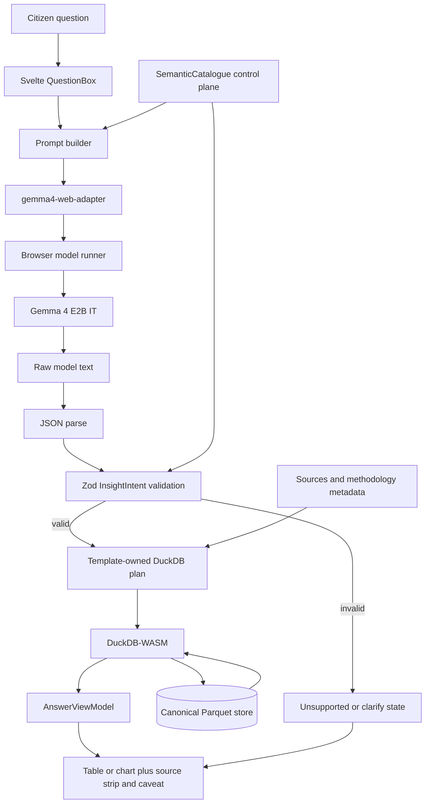

# YENASK browser governance insight assistant plan

**Last Updated**: 2026-05-24
**Status**: **IN IMPLEMENTATION (autonomous)**. User approved autonomous delivery on 2026-05-24. Phase 1 (model-free shell) in PR-1; Phase 2 (smallest-viable SLM with config-driven swappable adapter) in PR-2.
**User direction captured here (2026-05-24)**: Implement the full plan autonomously. Smallest model first; config-driven so models are swappable. Reuse existing `frontend/` assets (do not rebuild). Lab lives INSIDE `frontend/` as a dev route (NOT a standalone Vite app under `labs/`) — pattern mirrors `/dev/charts-sandbox` and `/dev/duckdb-harness`. Removal contract: lab → main is allowed; main → lab is forbidden; deleting the lab leaves the main app intact. Consult custom agents on doubts; defer to their judgement. Track every implementation decision + trade-off in §17 below so the design knowledge can be decomposed into ADRs / subsystem docs once delivery is done.

## 1. One-line summary

YENASK is a dev-only browser lab where a local Gemma 4 model turns a citizen question into a validated data intent, then DuckDB-WASM computes the answer from yen-gov's canonical Parquet store.

## 2. Accepted decisions

| Decision | Accepted position | Reason |
| --- | --- | --- |
| Product framing | Governance insight assistant, not an AI SQL lab. | Citizens ask governance questions; SQL and joins are private implementation details. |
| Lab home | Use top-level `labs/` and path `labs/yenask/`; visible product name is `YENASK`. | User selected `labs` and `YENASK`; lowercase path keeps repo convention while UI can display uppercase. |
| Approved implementation scope | Phase 1 only: scaffold `labs/yenask/` and build the model-free Parquet assistant shell with canned intents. | User explicitly approved bullets 1 and 2 on 2026-05-18. |
| Production shape | Browser-only and static-first. | yen-gov has no production backend; runtime data must ship statically. |
| Data source | Read `datasets/manifest.json`, schema-controlled catalogue metadata, and canonical Parquet through DuckDB-WASM. | The canonical store is Parquet; assistant metadata must be control-plane only, not a JSON shadow of observations. |
| Semantic catalogue scale target | Use a generated, schema-versioned semantic catalogue/control-plane artifact before broad indicator scale; Phase 1 may use a bounded lab-local catalogue seam only for the tiny election slice. | Startup fact-table scans will not survive 500-1000+ indicators. |
| Model role | Model proposes `InsightIntent` JSON only. | The model should never author or execute raw database queries. |
| Safety gate | Zod validates model output before computation. | The app must reject invented fields, unknown values, and unsupported requests before DuckDB runs. |
| Honesty metadata | Methodology breaks and source confidence are compiler/view-model responsibilities, not model-authored intent fields. | Canonical metadata, not model text, decides whether a result needs a break marker, confidence label, or refusal. |
| First real model | Gemma 4 E2B IT. Runtime wrapper still needs a Phase 2 spike. | Model family is agreed; browser runner is not fully settled. |
| Leading Phase 2 runner candidate | Transformers.js with `onnx-community/gemma-4-E2B-it-ONNX`. | This matches the user's expectation and has public JavaScript/WebGPU usage plus browser cache controls. |
| LiteRT/MediaPipe path | Keep as a serious comparison path, not a settled first implementation. | Google's web-converted artifact is real, but its lab workflow expects a served project asset via `modelAssetPath`. |
| Model readiness | Model-backed free-text chat stays disabled until explicit preflight, download/cache, and warm-up reach `ready`. | A user's first question must not secretly trigger a multi-GB download. |
| UI posture | First screen is the assistant, not a developer console. | User is testing intelligence over governance data, not a query playground. |

Custom-agent roundtable decisions captured 2026-05-19:

- SemanticCatalogue scaling: accept the risk; revise the remedy so any generated catalogue is metadata/control plane, schema-versioned, and not a JSON shadow of observation facts.
- WebGPU payload/cache: accept the risk; add explicit readiness, storage, cache, cancel, retry, and unavailable states; reject any runtime API fallback unless separately approved as dev-only.
- Methodology/provenance: accept strongly; compiler/view-model must inject source confidence and methodology breaks; reject model-authored `methodology_awareness` or `confidence_tier`.
- Loading inertia: accept; free-text model chat must not be the hidden trigger for a multi-GB model fetch.

## 3. Definitions and clarifications

**Zod**: Zod is a widely used open-source TypeScript validation library, not our own invention and not a TypeScript standard-library feature.

One-line value: **Zod turns untrusted model JSON into either a typed, allowed `InsightIntent` or a rejected request.**

TypeScript checks our code during development. Zod checks actual values at runtime. That matters because the model output is just text until the app proves it is valid JSON with allowed concepts, scopes, measures, filters, and limits.

**SemanticCatalogue**: this is not a full ontology. It is a task-scoped semantic layer: a small browser-readable catalogue that maps citizen concepts such as party totals, closest contests, constituency result, and turnout extremes to the allowed Parquet tables, indicators, dimensions, measures, and filters.

An ontology would be more formal and durable: domain classes, relationships, hierarchy, constraints, and possibly inference rules. YENASK does not need that for the first lab. If the project later creates a formal governance/election ontology, `SemanticCatalogue` should become a generated consumer of it rather than the ontology itself.

```ts
const parsed = InsightIntentSchema.safeParse(JSON.parse(modelOutput));

if (!parsed.success) {
  return unsupportedQuestion(parsed.error);
}

return compileInsightIntent(parsed.data);
```

**M0, M1, M2, M3, M4** are only milestone labels inside this plan. They are not industry terms.

When this plan says **Phase 2 runtime spike**, it means: the first browser-model experiment after the model-free Parquet shell works. The runner is deliberately not locked until the spike records load, cache, memory, responsiveness, and intent-quality results.

## 4. Assumptions

- `labs/yenask/` is dev-only, not linked from production navigation, and runs on its own dev port, likely `5175`.
- Adding `labs/` is a repo-topology change. If approved later, `CLAUDE.md` should be updated in the same implementation change to define `labs/` as dev-only.
- The lab reads the same static `/data/manifest.json` and Parquet files that production frontend code reads.
- At indicator scale, the lab reads a schema-controlled semantic catalogue/control-plane artifact generated by the data pipeline from `manifest.json`, taxonomy tables, dimension summaries, methodology metadata, sources, and curated concept templates.
- The lab does not import from `frontend/src/` initially. It may duplicate small dev-server middleware until there are three concrete consumers for shared tooling.
- The first slice is elections, likely Tamil Nadu / May 2026 because those rows exist today, but available states and periods are discovered from Parquet metadata and catalogue queries.
- Model artifacts are large and should not be committed to this repo.
- For intent generation, Gemma 4 thinking mode should likely be disabled unless evaluation proves it improves structured output enough to justify latency.

## 5. Discarded paths

| Discarded path | Why discarded |
| --- | --- |
| AI SQL lab as product framing | User rejected the SQL mental model; DuckDB is an implementation engine, not the citizen surface. |
| LLM writes raw SQL | Too much authority for the model; hard to audit, constrain, and explain. |
| JSON shadow of Parquet | Violates the canonical Parquet direction and risks a second data contract. |
| Hardcoding `S22` or `AcGenMay2026` | These are data values inside Parquet, not schema constants. |
| Startup scans over observation Parquet to build the assistant catalogue | It will not scale to hundreds of indicators and makes TTI depend on data volume before the user has asked anything. |
| JSON shadow of Parquet observations | A generated semantic catalogue may exist only as metadata/control plane; facts still come from canonical Parquet. |
| Gemma 3n as target model | It was an artifact-readiness mistake; Gemma 4 is the current target. |
| Direct LiteRT-LM Web API as an assumption | Public docs checked so far do not show a clear direct JavaScript browser API. |
| WebLLM as first path | Strong browser ergonomics, but no verified ready Gemma 4 MLC artifact found in checked docs. |
| LiteRT/MediaPipe as already-agreed Phase 2 path | The user has not agreed to that. It remains a candidate, not the committed runtime. |
| Model-authored methodology/confidence flags | The model must not decide whether a source is trusted or a methodology break matters; canonical metadata and compiler rules do that. |
| Lightweight API fallback as default | A runtime API fallback would violate the static-first posture unless the user explicitly approves a dev-only experiment later. |

## 6. Model and runtime facts

Gemma 4 is the current target family. The first candidate is **Gemma 4 E2B IT**, instruction-tuned.

Verified model-size facts from public model cards/file listings:

| Item | Size meaning | Publicly observed size |
| --- | --- | ---: |
| Gemma 4 E2B | Effective parameters | 2.3B effective parameters |
| Gemma 4 E2B | Total parameters including embeddings | 5.1B total parameters |
| LiteRT Community `gemma-4-E2B-it-web.task` | Browser task artifact file | about 2 GB |
| Full LiteRT Community E2B repository | All listed variants together | about 10.9 GB |
| ONNX Community Gemma 4 E2B repository | Full ONNX repo, all precision variants | about 47.7 GB |

Important: the ONNX repository size is not necessarily the browser download size for one Transformers.js configuration. The exact `q4f16` WebGPU subset downloaded by Transformers.js must be measured during the runtime comparison milestone.

Runtime decision table:

| Runtime | Role | Current position |
| --- | --- | --- |
| Transformers.js + `onnx-community/gemma-4-E2B-it-ONNX` | Leading lab candidate for first runtime spike | Public JavaScript/WebGPU usage exists; model can be addressed by model id; library exposes browser cache/local-model controls. |
| LiteRT Community `.task` + `@mediapipe/tasks-genai` | Serious comparison path | Google's web artifact is real and benchmarked, but the guide expects the model to be stored/served from the project and passed by `modelAssetPath`. |
| WebLLM | Watch/comparison path | Use only if a ready Gemma 4 MLC path appears or is cheap to add. |
| Direct LiteRT-LM Web API | Future swap-in | Use if Google publishes/clarifies one; hide behind the same local adapter. |

LiteRT and Transformers.js are not mutually exclusive at the project level. They are mutually exclusive only for one concrete model execution path: a single adapter call either runs through ONNX Runtime Web via Transformers.js, or through a LiteRT/MediaPipe runner, or through some future runtime. The rest of YENASK should not care which runner produced the raw text. That is why the local `gemma4-web-adapter.ts` exists.

Why choose one over the other:

| Path | Choose it when | Trade-off |
| --- | --- | --- |
| Transformers.js / ONNX | Lab ergonomics matter: load by model id, WebGPU via `device: "webgpu"`, quantized dtype such as `q4f16`, browser cache support, and a familiar Hugging Face JS API. | Need to measure actual browser download subset, memory, and whether Gemma 4 structured intent output is reliable. |
| LiteRT / MediaPipe | We want Google's web-converted `.task` artifact and the path closest to LiteRT-LM's edge stack. | Lab setup is more manual: download/serve a large model file and point `modelAssetPath` at it. Direct LiteRT-LM JS API is not yet clear in public docs. |

Public performance evidence:

- LiteRT-LM has the stronger public performance documentation for Gemma 4 E2B. Google's Gemma 4 LiteRT-LM page lists E2B model size as 2.58 GB and publishes CPU/GPU performance summaries across Android, iOS, Linux, macOS, IoT, and Windows.
- The LiteRT Community Gemma 4 E2B model card includes a web-specific Chrome/WebGPU benchmark on a 2024 MacBook Pro M4 Max: 1024 prefill tokens, 256 decode tokens, model file about 2 GB for web, GPU throughput 73.9 tokens/sec, 1.1 sec time-to-first-token, about 2004 MB model size, about 1.5 GB GPU process memory and 1.8 GB CPU/tab memory while running. The model card says time-to-first-token does not include load time and first-run latency/memory may differ.
- Transformers.js documents WebGPU acceleration through ONNX Runtime Web: set `device: "webgpu"`; use quantized dtypes such as `q4`/`q4f16`; run models directly in the browser. The Gemma 4 ONNX model card documents JavaScript usage with `Gemma4ForConditionalGeneration.from_pretrained(..., { dtype: "q4f16", device: "webgpu" })`.
- Public docs checked so far do not provide an official apples-to-apples Transformers.js Gemma 4 E2B performance table comparable to the LiteRT-LM table. That does not mean Transformers.js is slower; it means Phase 2 must measure it locally instead of assuming performance.

Performance expectation before measurement: LiteRT may be faster or more memory-efficient for Gemma 4 because it is Google's specialized edge runtime and has published Gemma 4-specific benchmarks. Transformers.js may be easier to bootstrap and good enough for the lab, but its Gemma 4 performance must be measured on the target browser/device.

Plain-English stack:

```text
Svelte 5 UI
  + TypeScript app logic and contracts
  + DuckDB-WASM Parquet reads
  + Zod runtime validation for InsightIntent
  + Gemma 4 E2B IT browser model
  + local gemma4-web-adapter hiding the chosen runner
```

Svelte and TypeScript are complementary here: Svelte owns components and interaction; TypeScript owns contracts, adapters, validators, and DuckDB helper code.

Browser performance posture:

- A 2 GB browser model can absolutely slow the experience. WebGPU helps inference after load; it does not remove the cost of downloading, caching, memory allocation, and warm-up.
- The model must not load on initial page paint. YENASK should load it only after an explicit **Prepare assistant** action, with visible size estimate, progress, cancel, retry, cache state, and failure path.
- Model-backed free-text chat must remain disabled until the model preflight, download/cache, and warm-up state is `ready`. The user may still draft a question or run model-free canned examples.
- The UI must stay responsive while the model loads. Use the model runner's worker/off-main-thread path when available; if a runner blocks the main thread, that runner fails the comparison.
- Cache behavior must be measured. A first load may be minutes on weak networks; a cached load may still be heavy because the browser has to map/initialize the model.
- M1 deliberately has no model, so the data path can be proven without paying this cost.
- M2 should be treated as developer-laptop viable until measured. Mid-tier Android is an open constraint, not an assumption.
- M2 must run a model preflight before download: WebGPU availability, runtime support, storage estimate/quota, weak device-memory hints where exposed, and explicit allocation-failure handling. Browser VRAM is not reliably observable, so the real load result is the authority.
- M4 must compare download size, memory pressure, first-token latency, cached startup, storage persistence behavior, and browser responsiveness across LiteRT, Transformers.js/ONNX, and any smaller viable model path.

Browser model download and storage posture:

- A web page cannot silently write model files into arbitrary local user folders. The browser sandbox prevents that.
- In normal browser use, model files are fetched over HTTPS like other web assets. The browser/library may cache them in origin-managed browser storage. The user can clear them through browser site data; the browser may evict them under storage pressure.
- Transformers.js defaults to hosted pretrained models and can load by model id. Its environment docs expose `allowRemoteModels`, `allowLocalModels`, `localModelPath`, `useBrowserCache`, `cacheKey`, `useFSCache`, and `cacheDir`. In the browser, the relevant mechanism is the Cache API when available, not a user-chosen filesystem folder.
- Cache API persistence is not a product guarantee. Phase 2 should measure Cache API, IndexedDB, and OPFS feasibility for the selected runner, request persistent storage where available, and provide a clear cache-clear action. The lab must say when the assistant core is not installed, cached, warming, ready, or unavailable.
- Transformers.js lab mode can be either remote-first or local-first:
  - Remote-first: call `from_pretrained("onnx-community/gemma-4-E2B-it-ONNX", { device: "webgpu", dtype: "q4f16" })`; first load downloads from Hugging Face and browser cache handles repeat loads when allowed.
  - Local-first: place the model under a served lab path such as `labs/yenask/public/models/...` or another ignored local asset directory, set `env.localModelPath`, and optionally set `env.allowRemoteModels = false`.
- MediaPipe/LiteRT lab mode is local-served by design in the checked guide: download the web model, store it inside the project/assets area, and initialize with `baseOptions: { modelAssetPath: "/assets/..." }`.
- For the first lab, prefer a runtime spike that records both options but does not commit model bytes. If Transformers.js remote-first works reliably, it is the least awkward lab bootstrap. If remote downloads are too slow/flaky or blocked, switch to local-served ignored assets or a smaller browser model path. Do not add a runtime API fallback without a separate explicit user decision.

## 7. Canonical data substrate

The current manifest exposes these Parquet tables for the election slice:

| Table | Rows | Columns |
| --- | ---: | --- |
| `elections.election_results` | 179,746 | `observation_id`, `entity_id`, `year`, `period_label`, `period_seq`, `indicator_id`, `value_numeric`, `value_text`, `source_id`, `derivation` |
| `elections.dim_acs` | 4,112 | `ac_id`, `state_code`, `delim_year`, `eci_no`, `name`, `source_id` |
| `elections.dim_candidates` | 34,906 | `candidate_id`, `ac_id`, `period_label`, `ballot_serial`, `name`, `party_id`, `rank`, `source_id` |
| `elections.dim_parties` | 32 | `party_id`, `eci_code`, `short_name`, `full_name`, `recognition`, `source_id` |
| `taxonomy.sources` | 84 | `source_id`, `url`, `content_hash`, `producer`, `citation_full`, `url_main`, `url_download`, `date_accessed`, `first_fetched_at`, `last_seen_at`, `license`, `vintage`, `confidence_tier`, `is_issuing_authority` |

Correction retained from exploration: `S22` is a `state_code` value in `elections.dim_acs`; `AcGenMay2026` is a `period_label` value in observations/candidates. The assistant discovers these values from data.

## 8. Architecture flow

If Mermaid renders in the Markdown viewer, use this as the architectural diagram source:


```mermaid
flowchart TD
  Question[Citizen question] --> QuestionBox[Svelte QuestionBox]
  QuestionBox --> Prompt[Prompt builder]
  Catalogue[SemanticCatalogue control plane] --> Prompt
  Prompt --> Adapter[gemma4-web-adapter]
  Adapter --> Runner[Browser model runner]
  Runner --> Model[Gemma 4 E2B IT]
  Model --> RawOutput[Raw model text]
  RawOutput --> JsonParse[JSON parse]
  JsonParse --> Zod[Zod InsightIntent validation]
  Catalogue --> Zod
  Zod -->|valid| Compiler[Template-owned DuckDB plan]
  Zod -->|invalid| Clarify[Unsupported or clarify state]
  Honesty[Sources and methodology metadata] --> Compiler
  Compiler --> DuckDB[DuckDB-WASM]
  DuckDB --> Store[(Canonical Parquet store)]
  Store --> DuckDB
  DuckDB --> ViewModel[AnswerViewModel]
  ViewModel --> Answer[Table or chart plus source strip and caveat]
  Clarify --> Answer
```

ASCII fallback, so the architecture remains readable even where Mermaid is not rendered:

```text
Citizen question
  -> Svelte QuestionBox
  -> Prompt builder + SemanticCatalogue control plane
  -> gemma4-web-adapter
  -> browser model runner
  -> Gemma 4 E2B IT
  -> raw model text
  -> JSON.parse
  -> Zod InsightIntent validation
      -> invalid: unsupported / clarify state
      -> valid: deterministic DuckDB plan
  -> DuckDB-WASM over canonical Parquet
  -> AnswerViewModel with source confidence and methodology notices
  -> table/chart + source strip + break marker/caveat + optional insight line
```

UI shape:

```text
YENASK
|-- top rail
|   |-- model status: not prepared / checking / downloading / warming / ready / unavailable
|   |-- data scope: discovered state + period, not hardcoded
|
|-- question surface
|   |-- Prepare assistant action for model-backed mode
|   |-- natural-language question box
|   |-- free-text Ask locked until model-backed mode is ready
|   |-- suggested questions from SemanticCatalogue
|   |-- model-free canned examples remain usable
|
|-- answer surface
|   |-- one-line grounded observation
|   |-- result table or compact chart
|   |-- source strip from taxonomy.sources
|   |-- visible confidence / methodology break / unsupported-state copy
|
|-- computation disclosure, collapsed by default
    |-- validated InsightIntent JSON
    |-- template name and DuckDB plan summary
    |-- row count and provenance join status
```

## 9. Contracts

### SemanticCatalogue

Scale target: generate this as a schema-versioned control-plane artifact at pipeline/write time, listed by the manifest or fetched next to it. Inputs are `manifest.json`, taxonomy tables, source confidence metadata, methodology/caveat metadata, dimension summaries, and curated concept-to-template mappings.

Phase 1 may keep a bounded lab-local catalogue seam for the tiny election slice, but initial render must not scan fact tables such as `elections.election_results`. DuckDB should be used for selected answer execution and narrow lazy lookups, not broad catalogue hydration.

This artifact may be JSON only if it remains metadata/control plane. It must not duplicate observation rows or become a second factual projection of Parquet.

```ts
interface SemanticCatalogue {
  tables: Array<{
    table_id: string;
    schema_version: string;
    columns: Array<{ name: string; type: string }>;
    row_count_total: number;
  }>;
  election_periods: Array<{ period_label: string; year: number; row_count: number }>;
  states: Array<{ state_code: string; ac_count: number }>;
  indicators: Array<{
    indicator_id: string;
    numeric_count: number;
    text_count: number;
    comparability?: string;
    methodology_version?: string | null;
    methodology_break_ids: string[];
    series_breaks_summary?: string | null;
    latest_break_year?: number | null;
    source_ids: string[];
  }>;
  parties: Array<{ party_id: string; short_name: string; full_name: string | null }>;
  sources: Array<{
    source_id: string;
    producer: string;
    confidence_tier: "gold" | "silver" | "bronze";
    is_issuing_authority: boolean;
    vintage: string;
    license: string;
  }>;
  methodology_breaks: Array<{
    break_id: string;
    indicator_id: string;
    break_year: number | null;
    summary: string;
  }>;
  concepts: Array<{
    concept_id: string;
    label: string;
    required_tables: string[];
    required_indicators: string[];
    supported_dimensions: string[];
    supported_measures: string[];
  }>;
}
```

Example concept mappings:

| Concept | Backing data |
| --- | --- |
| `party_totals` | `elections.election_results` rows where `indicator_id` is `party-seats-won`, `party-votes-polled`, `party-vote-share-pct`; joined to `elections.dim_parties`. |
| `closest_contests` | Candidate vote/share rows joined with `dim_candidates` and `dim_acs`, ranked by winner vs runner-up. |
| `constituency_result` | `dim_candidates` scoped by `ac_id` + `period_label`; candidate indicators from `election_results`. |
| `turnout_extremes` | AC-scope observations for `ac-turnout-pct` joined to `dim_acs`. |

Later, if `taxonomy.indicators` enters the manifest, concept metadata should move out of lab-local mappings and into the canonical indicator catalogue.

### InsightIntent

`InsightIntent` is the only shape the model may produce.

```ts
type InsightIntent = {
  version: "insight.intent.v0";
  concept_id:
    | "party_totals"
    | "closest_contests"
    | "constituency_result"
    | "turnout_extremes"
    | "unsupported";
  scope: {
    family: "elections";
    state_code?: string;
    period_label?: string;
    ac_name_or_number?: string;
  };
  dimensions: Array<"party" | "constituency" | "candidate" | "period">;
  measures: Array<
    | "seats_won"
    | "votes"
    | "vote_share_pct"
    | "margin_votes"
    | "margin_pct"
    | "turnout_pct"
  >;
  filters: Array<{
    field: "party" | "constituency" | "candidate_rank";
    op: "eq" | "contains" | "lte" | "gte";
    value: string | number;
  }>;
  sort?: { measure: string; direction: "asc" | "desc" };
  limit?: number;
  render_hint?: "table" | "bar" | "ranked_table";
  wants_insight?: boolean;
};
```

Validation rules:

- `state_code` must exist in `SemanticCatalogue.states`.
- `period_label` must exist in `SemanticCatalogue.election_periods`.
- `concept_id` decides which dimensions and measures are legal.
- `limit` is capped at 50 for row-returning questions.
- Unsupported questions produce a plain unsupported state, not a guessed query.

Do not add a model-authored `methodology_awareness` or `confidence_tier` field to `InsightIntent`. The model may request a scope, concept, measures, and filters; canonical metadata decides trust and break handling.

Compiler rules:

- Every compiled answer must attach provenance from `taxonomy.sources` for result-supporting rows.
- Every compiled answer must attach relevant indicator methodology/caveat metadata when available.
- Trend/growth templates that cross a methodology break must either segment the answer by methodology version or return a visible unsupported/cannot-compute-one-continuous-trend state.
- The renderer must show break/confidence notices near the answer, not only in the collapsed computation disclosure.

### AnswerViewModel honesty fields

The model does not author answer caveats. The deterministic compiler/view-model layer injects them.

```ts
type AnswerViewModel = {
  rows: unknown[];
  render: "table" | "bar" | "ranked_table";
  source_strip: Array<{
    source_id: string;
    producer: string;
    confidence_tier: "gold" | "silver" | "bronze";
    is_issuing_authority: boolean;
    vintage: string;
    license: string;
  }>;
  methodology_notices: Array<{
    break_id: string;
    break_year: number | null;
    message: string;
    action: "annotate" | "segment" | "refuse_single_trend";
  }>;
  provenance_status: "joined" | "missing";
};
```

## 10. Proposed directory layout

Use `labs/yenask/` if implementation is approved.

```text
labs/yenask/
  AGENTS.md
  package.json
  vite.config.ts
  tsconfig.json
  index.html
  src/
    App.svelte
    main.ts
    ai/
      model-adapter.ts
      gemma4-web-adapter.ts
      transformersjs-gemma4-adapter.ts
      webllm-adapter.ts
      prompt.ts
      insight-intent.ts
    data/
      duckdb-client.ts
      manifest-client.ts
      semantic-catalogue.ts
      query-plan-compiler.ts
      safety-gates.ts
    ui/
      QuestionBox.svelte
      ModelStatus.svelte
      ScopePicker.svelte
      AnswerTable.svelte
      MiniChart.svelte
      ComputationDisclosure.svelte
      SourceStrip.svelte
      InsightLine.svelte
    tests/
      insight-intent.test.ts
      semantic-catalogue.test.ts
      query-plan-compiler.test.ts
      safety-gates.test.ts
  e2e/
    yenask.spec.ts
```

Separation rules:

- The lab may read `/data/manifest.json` and Parquet files under `/data/`.
- The lab should not import from `frontend/src/`.
- The lab should not be linked from production navigation.
- The lab should run on a separate dev port, for example `5175`.
- The lab should duplicate only small dev-server middleware initially; extract shared dev tooling later only if there are three concrete consumers.

## 11. Phases, tasks, and definition of done

Each phase should be tracked as a small checklist in this file or in a follow-up `TODO/20260518-yenask-implementation-tracker.md` before implementation starts. The tracker should record status as `not-started`, `in-progress`, `blocked`, or `done`; owner can be `human`, `default agent`, or a named custom agent review.

### Phase 0: Plan approval

Task definition:

- Confirm `labs/yenask/` as the approved lab path.
- Confirm `YENASK` as the visible lab name.
- Confirm that implementation starts model-free with Parquet/DuckDB and canned intents.
- Confirm whether model files may be remotely downloaded during local lab use.

Definition of done:

- This plan has accepted decisions, assumptions, discarded paths, references, and open questions.
- The Mermaid and ASCII architecture flows are present.
- The user explicitly approves moving from exploration to implementation.
- No production code has been changed in the exploration phase.

### Phase 1: Lab scaffold and Parquet assistant shell

Task definition:

- Create the confined lab only after user approval.
- Load manifest and register Parquet tables through DuckDB-WASM.
- Build the `SemanticCatalogue` seam from manifest plus bounded lab-local metadata without scanning fact tables on initial render.
- Pick default scope from discovered values, not schema literals.
- Execute four canned `InsightIntent` examples.
- Render answer table, provenance/source confidence, visible methodology/caveat notices where present, and collapsed computation disclosure.
- No model yet.

Definition of done:

- `labs/yenask/` runs on its own dev port.
- It reads `/data/manifest.json` and Parquet via DuckDB-WASM.
- It renders four canned answers from validated `InsightIntent` fixtures.
- Initial lab paint does not depend on broad DuckDB scans over fact tables.
- It includes unit tests for `InsightIntent`, `SemanticCatalogue`, and query-plan compilation.
- Compiler/view-model tests prove provenance is attached and cannot be suppressed by the intent fixture.
- It includes one e2e smoke for the lab route and one rendered canned answer.
- The integrated browser tools verify the route renders and no new console errors or 404s appear.
- `CLAUDE.md` is updated in the same implementation change to define `labs/` as dev-only.

### Phase 2: Gemma 4 E2B browser runtime spike

Task definition:

- Keep the local adapter named generically (`gemma4-web-adapter.ts`) so the app contract does not depend on one runtime wrapper.
- Spike Transformers.js first with `onnx-community/gemma-4-E2B-it-ONNX`, `device: "webgpu"`, and `dtype: "q4f16"`, because this is the least awkward browser-lab bootstrap path found so far.
- Add a model readiness state machine: `not_installed` / `checking_device` / `downloading` / `cached` / `warming` / `ready` / `unavailable`.
- Keep model-backed free-text chat disabled until readiness is `ready`; keep model-free canned examples usable.
- Show an explicit Prepare assistant action before download, with measured/estimated size, storage warning, cancel, retry, clear-cache action, and unsupported-device copy.
- Record whether Transformers.js remote-first loading succeeds, where it caches, and whether repeat loads work through browser Cache API.
- Measure Cache API, IndexedDB, and OPFS feasibility for the selected runner before promising persistence.
- If Transformers.js fails on load size, memory, responsiveness, or output reliability, spike the LiteRT Community `gemma-4-E2B-it-web.task` through `@mediapipe/tasks-genai` as the comparison path.
- Show model load progress, WebGPU state, cache state, and friendly unsupported-browser copy.
- Generate `InsightIntent` JSON only.
- Validate with Zod against `SemanticCatalogue`.

Definition of done:

- The model is loaded only after explicit lab interaction, never during initial page paint.
- Free-text model-backed Ask is locked until preflight, download/cache, and warm-up are complete.
- Loading progress, cache state, WebGPU state, cancel/failure states, clear-cache action, and unsupported-browser copy are visible.
- The first runtime tried, model id/path, download mode, cache mode, browser, device, and memory symptoms are recorded.
- The model adapter returns raw text only; JSON parsing and Zod validation remain outside the adapter.
- Invalid or unsupported model output cannot reach DuckDB.
- Browser responsiveness is manually checked during first load and cached load.
- No runtime API fallback is added without a separate explicit user decision.
- Real model download tests are documented as local smoke tests, not normal CI.

### Phase 3: Evaluation set

Task definition:

- 20 citizen-style questions.
- Expected intent fixture for each.
- Record pass/fail, runtime, unsupported cases, and whether rephrase was needed.
- Real model downloads are local smoke tests, not normal CI.

Definition of done:

- Each evaluation question has expected `InsightIntent` JSON.
- Results record exact model path, browser, device class, first/cached load state, and pass/fail reason.
- Failures are classified as prompt issue, model issue, catalogue gap, unsupported data, or UI failure.
- No failing question is silently removed; expected unsupported cases are labelled.

### Phase 4: Runtime comparison and selection

Task definition:

- Compare the Phase 2 leading runtime against at least one serious alternate path.
- Compare Transformers.js with `onnx-community/gemma-4-E2B-it-ONNX` against LiteRT/MediaPipe with `gemma-4-E2B-it-web.task` if both can be made to run in the lab.
- Try WebLLM only if a ready Gemma 4 MLC artifact exists.
- Compare first-load time, cached-load time, memory, structured-output reliability, answer quality, browser download size, and cache persistence behavior.
- Record whether Google later exposes a direct LiteRT-LM Web API; do not block M2 on that if `@mediapipe/tasks-genai` remains the documented browser path.

Definition of done:

- Runtime comparison table records load size, load time, cached startup, cache persistence behavior, memory pressure, first-token latency, structured-intent pass rate, UI responsiveness, and implementation complexity.
- The selected runtime is justified against measured results, not artifact availability alone.
- Any runtime switch updates only adapter wiring and docs; `InsightIntent`, `SemanticCatalogue`, and DuckDB compiler contracts remain stable.

## 12. Tracking, commit, PR, and custom-agent checks

Implementation should be phased as small PRs. Do not combine model-runtime work with the first Parquet shell.

Tracking:

- Keep a checklist per phase with status, blocker, validation command, and browser smoke result.
- Record any new accepted decision or discarded path in this plan while the lab is still experimental.
- Promote stable decisions into canonical `docs/` only when implementation is approved and lands.

Commit slicing:

- Phase 1 should be at least two commits: topology/docs scaffold, then working model-free lab with tests.
- Phase 2 should be separate from Phase 1 because model runtime dependencies, large artifacts, and browser performance risks are a different risk class.
- Phase 3 evaluation fixtures should be separate from runtime implementation so result changes are reviewable.
- Phase 4 comparison should not rewrite the app contract unless the user approves a runtime switch.

PR validation checklist:

- `bun install` in `labs/yenask/` if `package.json` changes, with matching lockfile committed.
- Unit tests for changed TypeScript contract/compiler code.
- Unit tests proving startup catalogue construction does not scan fact tables.
- Unit tests proving methodology/provenance metadata is compiler-injected and cannot be suppressed by model intent.
- E2E smoke for the lab route after any UI-visible change.
- Integrated browser verification against the running lab dev server.
- No model artifact committed to git.
- No production navigation link to `labs/yenask/`.
- No `frontend/` runtime dependency on `labs/`.
- No raw model output reaches DuckDB without Zod validation.
- No model-authored trust/methodology flag controls whether caveats render.
- No hidden model download starts from the first submitted question.
- No hardcoded state/period values in contracts; defaults come from discovered catalogue values.

Custom-agent review gates:

- Before Phase 1 implementation: run a roundtable review, not independent reports, with Gregor Hohpe (contracts/boundaries), Fowler (phase slicing/tests), Jony (UI shape), Hans (governance wording), Max (data-source fidelity), and Citizen User (non-technical usefulness).
- Before Phase 2 implementation: add an applied AI/runtime review focused on model loading, browser responsiveness, output format reliability, and fallback behavior.
- Before merging Phase 2: ask Gregor + Fowler to specifically review whether the model adapter is isolated and whether model uncertainty cannot leak into DuckDB execution.
- Before Phase 4 runtime selection: run a comparison review with the measured table in front of the agents; do not choose based on vibes or library fashion.

## 13. Test plan for implementation

Unit tests:

- `InsightIntent` rejects unknown concepts, measures, dimensions, state codes, and period labels.
- `SemanticCatalogue` startup construction rejects broad fact-table scans; Phase 1 uses bounded metadata and lazy narrow lookups.
- Query plan compiler emits only known templates.
- Compiler rejects invalid filters and cannot emit multiple statements.
- Compiler attaches provenance/source confidence for every successful answer.
- Compiler refuses or segments trend/growth answers that cross a fixture methodology break.
- Renderer chooses table/bar/ranked-table from result shape, not model authority.

Integration tests:

- Register real canonical Parquet tables through manifest.
- Execute canned intents for party totals, closest contests, constituency result, and turnout extremes.
- `EXPLAIN` must pass before execution.
- Provenance joins to `taxonomy.sources` for result-supporting rows.
- Methodology/caveat joins render visible notices when present.

E2E tests:

- Lab page loads on its own dev port.
- A canned intent bypass path renders an answer.
- Model-backed free-text submit is disabled until a fake adapter reports `ready`.
- Failure state renders plain copy, not a stack trace.
- Computation disclosure shows the compiled internal query after execution.

Manual smoke:

- Chromium with WebGPU.
- Gemma 4 E2B first model load time.
- Cached model load time.
- Answer quality over 10 representative questions.
- Behavior when WebGPU is unavailable.

## 14. Public implementation references

Transformers.js / ONNX leading lab candidate:

- [Transformers.js docs](https://huggingface.co/docs/transformers.js/en/index)
- [Transformers.js WebGPU guide](https://huggingface.co/docs/transformers.js/en/guides/webgpu)
- [Transformers.js custom/local model usage](https://huggingface.co/docs/transformers.js/en/custom_usage)
- [Transformers.js environment/cache API](https://huggingface.co/docs/transformers.js/en/api/env)
- [Transformers.js model API](https://huggingface.co/docs/transformers.js/en/api/models)
- [Hugging Face Transformers Gemma4 docs](https://huggingface.co/docs/transformers/main/model_doc/gemma4)
- [Gemma 4 E2B IT ONNX model card with JavaScript usage](https://huggingface.co/onnx-community/gemma-4-E2B-it-ONNX)
- [Public Gemma 4 WebGPU Space linked from model cards](https://huggingface.co/spaces/webml-community/Gemma-4-WebGPU)

LiteRT / MediaPipe comparison path:

- [Google LiteRT-LM overview](https://ai.google.dev/edge/litert-lm/overview)
- [Google LiteRT-LM Gemma 4 page](https://ai.google.dev/edge/litert-lm/models/gemma-4)
- [LiteRT Community Gemma 4 E2B IT](https://huggingface.co/litert-community/gemma-4-E2B-it-litert-lm)
- [Google browser LLM guide using `@mediapipe/tasks-genai`](https://ai.google.dev/edge/mediapipe/solutions/genai/llm_inference/web_js)

Repository facts already checked:

- `frontend/package.json` already includes Svelte 5, TypeScript tooling, DuckDB-WASM, and Zod.
- `frontend/src/lib/duckdb.ts` already has the production DuckDB-WASM/manifest seam to learn from.
- `frontend/vite.config.ts` already has dev middleware patterns for serving `/data` and `.parquet` files.

## 15. Open questions before implementation

- Should model artifacts be downloaded from Hugging Face at runtime in the lab, or manually placed in an ignored local directory?
- Which persistence path does the selected runner actually support well enough for the lab: Cache API, IndexedDB, OPFS, local-served ignored assets, or some combination?
- Can the dev server serve a 2 GB `.task` file acceptably, or should model hosting remain explicitly outside the repo/dev server?
- Is the minimum target device developer laptop only, or should mid-tier Android be a hard constraint from the first model milestone?
- Should Gemma 4 thinking mode be disabled for all intent generation, or tested as a comparison setting?
- How much computation detail should a citizen see by default: collapsed disclosure, developer toggle, or always-visible audit panel?
- Should the generated semantic catalogue be stored as `datasets/taxonomy/semantic_catalogue.json`, a Parquet taxonomy table, or both? It must remain metadata/control plane either way.

## 16. Recommendation before code

Proceed only after user approval of these choices:

1. Create a confined dev-only lab at `labs/yenask/`, with visible name `YENASK`.
2. Start with M1: model-free Parquet assistant shell with canned `InsightIntent` examples.
3. Treat Phase 2 as a runtime spike, not a settled runtime commitment.
4. Try Transformers.js/Gemma 4 ONNX first for the lab because its remote-first/browser-cache workflow fits the lab bootstrap better; keep LiteRT/MediaPipe as the serious comparison path if Transformers.js fails or underperforms.
5. Do not start Phase 2 free-text model work until readiness, cache/storage, and compiler-owned provenance/methodology contracts are accepted.

## 17. Design decisions log (implementation, 2026-05-24 onward)

This section is the **running journal of every implementation decision**, with rationale and trade-offs, recorded as the autonomous implementation lands. Each entry is dated and ID'd. When PR-N closes, the relevant entries here become candidate source material for either (a) promotion into an ADR under `docs/architecture/decisions/` if they meet Holy Law #4 (credible rejected alternative + non-trivial reversal cost + genuinely cross-cutting), or (b) absorption into the relevant subsystem doc under `docs/architecture/<area>/` for current-shape narrative.

This is not a chat log. Each entry MUST capture: (1) what was decided, (2) what was rejected and why, (3) what the trade-off was, (4) where in the codebase the decision binds.

### Sprint status — 2026-05-24 (ABCDE — Slice E architecture APPROVED per ADR-0039; implementation queued)

This snapshot is the LEAN view for the next planner. The detailed `D-NN` entries below are the git-blame trail; this block tells you what's done, what's approved-but-pending, what's rejected, what's parked, and where each decision lives.

**Slice E status update**: on 2026-05-24 the user reframed the two-stage question (*"feature extraction, text generation, intent classification — these are different model capabilities and we are trying to do all of them in the same model"*) and Andre + a six-persona panel approved a retrieval-augmented intent-extraction architecture (MiniLM-L6-v2 embeddings + SmolLM2-360M extraction + deterministic compile). This is **NOT** a second LLM — ADR-0038's two-LLM rejection remains in force. ADR-0039 freezes the new shape; Slice E.1 (embeddings module + eval fixture) and Slice E.2 (integration + observability + browser smoke) are the active rollout PRs.

#### ✅ DONE (shipped on `main` 2026-05-24)

| Slice | PR | Merge SHA | What it shipped | Decomposed home |
| --- | --- | --- | --- | --- |
| Phase 1 (compile pipeline + 4 canned intents + Holy Law #9 source-strip) | PR #209..#216 | various | `compileIntent` pure function, `executePlan`, Zod contracts, semantic-catalogue loader, 4 canned intents | [`docs/architecture/frontend/yenask.md`](../docs/architecture/frontend/yenask.md) (Module layout, Contracts, Pipeline sections) |
| Phase 2 PR-2 (chat surface + real model load) | PR-2 | — | `/dev/yenask` chat surface, transformers.js adapter, validate-or-retry loop, `SmolLM2-135M` seed | [`docs/architecture/frontend/yenask.md`](../docs/architecture/frontend/yenask.md) (Model adapter readiness state machine) |
| Phase 2 PR-3 (debug surface + token observability) | PR-3 (`63a62a4e`) | `63a62a4e` | Token in/out + wall_ms per attempt; Debug log section; SQL/raw-output moved out of citizen turn | [`docs/architecture/frontend/yenask.md`](../docs/architecture/frontend/yenask.md) (Observability surface) |
| **Slice A** — per-attempt phase timing observability (encode / generate / decode / TTFT) | **#225** | **`04cbbad2`** | 4 nullable phase-timing fields plumbed through `GenerateResult` + `ExtractAttempt`; `untrackedDelta()` invariant; Debug-log columns; transformers.js returns `null` for all 4 (black-box round-trip) | D-22, D-27 → [`docs/architecture/frontend/yenask.md`](../docs/architecture/frontend/yenask.md) (Observability surface) |
| **Slice B** — per-row model picker + Cache Storage API cleanup | **#227** | (see git log) | Persistent `localStorage` model selection; per-row "Remove from cache" with two-step inline confirm; `model-cache.ts` wrapper around Cache Storage API with optional `CacheStorageLike` injection (33 test cases) | D-23 → [`docs/architecture/frontend/yenask.md`](../docs/architecture/frontend/yenask.md) (Model registry section + Observability "What is NOT exposed" callout) |
| **Slice C** — graduated download friction by size tier; registry expansion to 5 entries | **#228** | (see git log) | `size-tier.ts` (classify/format/OOM-detect) — Small <500 MB silent, Medium ≥500 MB confirm, Large ≥1024 MB two-step (41 test cases); TinyLlama-1.1B, Qwen2.5-1.5B, Phi-3.5-mini added to registry | D-24 → [`docs/architecture/frontend/yenask.md`](../docs/architecture/frontend/yenask.md) (Slice C registry expansion paragraph) |
| **Slice D-1** — default-model strict upgrade SmolLM2-135M → SmolLM2-360M | **#229** | `4f7c909c` | `DEFAULT_MODEL_ID = "smollm2-360m-instruct"`; 360M entry added (273 MB cold-load, 520 MB peak RAM); 135M `estimated_download_mb` corrected 88 → 118 MB (post-GQA size); IFEval 19.8 → 31.6 (+60% instruction-following lift at 2.3× cold-load) | D-26 → [`docs/architecture/frontend/yenask.md`](../docs/architecture/frontend/yenask.md) (Today's seed callout) |

#### ❌ REJECTED (Slice D-2 / two-stage LLM pipeline — STILL IN FORCE per ADR-0038)

Three architectural cuts were proposed by the Slice D roundtable (Cut 1 = tiny classifier + medium reasoner; Cut 2 = intent extractor + code-tuned SQL generator replacing `compile-intent.ts`; Cut 3 = classifier-first hybrid with code-fallback). **All three rejected** by Gregor + Fowler + Max + Jony convergent panel.

> **Scope of rejection**: ADR-0038 rejects two **LLMs** in sequence. ADR-0039's Slice E adds an embeddings model as a retrieval-augmentation TOOL (similarity scores over a closed catalogue, no generation, no JSON output) — a different shape, separately reviewed by a six-persona panel including Andre. The two ADRs do not conflict.

| Reviewer | Verdict |
| --- | --- |
| **Gregor** | Cut 2 frontally breaks Holy Law #9 (provenance JOIN moves from CONSTRUCTED to GENERATED — `EXPLAIN` + sqlglot allowlist verify SQL is parseable, not that it answers the right question with the right provenance). Cut 2 is the same band-aid pattern as `deriveConceptId` (D-12 rejected). Cut 3 inherits Cut 2's fallback-path failures AND re-introduces `concept_id = "unknown"` sentinel (D-12 violation). Cut 1's "50M neural classifier for a 4-element closed enum" is over-engineering by an order of magnitude vs deterministic keyword routing. |
| **Fowler** | PREMATURE. Pipeline has 4 concepts registered and **ZERO** published `attempts_log` evidence of single-stage extraction failures on free text. PR-3 shipped the `ExtractAttempt` + `parse_status` observability for exactly this reason — identify which failure modes are real BEFORE architecting around them. Rule-of-three-before-abstraction fires hard at 4 concepts with no failure-mode data. Cut 2 deletes a 91-line safety seam (`compile-intent.ts`) and replaces it with a 250+-line SQL validator that has worse properties (validates-after vs constructs-safely). |
| **Max** | Cold-load economics hostile. Phi-3.5-mini @ q4f16 = 2.32 GB (20× current 118 MB); Qwen2.5-3B has no verified ONNX port; Llama-3.2-1B has restrictive Meta license; Gemma-2-2B unverified. Only Apache-2.0 + verified-available reasoner candidate in the 1B–2B band is Qwen2.5-1.5B-Instruct @ 1.22 GB — still 14× the current cold-load. The economics make a second model citizen-hostile until evidence of necessity. |
| **Jony** | The Debug-log surface (Slice A) and graduated-friction picker (Slices B+C) deliver the operator visibility the panel would otherwise paper over with a second model. Ship the defensible smaller win (D-26 / SmolLM2-360M strict upgrade); evidence-gather; revisit only on `attempts_log` data. |

**Locked in**: single-stage pipeline (one model call + deterministic pure-TS compile). **Trade-off**: free-text questions that fall outside the 4-concept closed enum get a polite "I can't answer that yet" rather than degraded-into-wrong answers — citizen-honesty over coverage-by-handwaving. **Reversal cost**: re-opening requires new evidence (attempts_log failure-mode counts, named regression set) cited in a follow-up ADR amending or superseding ADR-0038.

Full rationale + four rejected alternatives (A=Cut 1, B=Cut 2, C=Cut 3, D=server-hosted LLM) live in **[ADR-0038](../docs/architecture/decisions/0038-yenask-two-stage-llm-pipeline-rejected.md)**.

#### 🛠 APPROVED — implementation queued (Slice E / ADR-0039)

On 2026-05-24, after the user reframed the question around capability decomposition, a six-persona panel (Andre + Citizen + Hans + Max + Gregor + Fowler + Jony) approved a **retrieval-augmented intent-extraction** shape that is structurally distinct from what ADR-0038 rejected.

| Reviewer | Verdict |
| --- | --- |
| **Andre (AI/LLM, supreme on this topic per user direction)** | Catalogue resolution is a retrieval problem; cosine-similarity over pre-computed concept embeddings is the 50-year-old IR primitive. Embeddings produce scores, not generated text — NOT a second LLM. Locks in MiniLM-L6-v2 (Apache-2.0, ~23 MB q8, WebGPU-capable). Reserves LLM compute for what only LLMs do well (slot-filling entities + period + narration). Eval-first discipline (Hamel): 20-question labelled set ships in Slice E.2 PR; top-1 accuracy + entity extraction recall as metrics; ≥5pp drop = regression alarm. |
| **Gregor** | Approved with confidence-threshold lock: `top-1 cosine < 0.6` falls back to substring-match resolver. Embeddings produce *candidates*; canonical `concept_id ↔ source_id` mapping read from `manifest.json` is unchanged. Holy Law #9 strengthened, not weakened. |
| **Fowler** | Approved with eval-set-as-contract condition (must ship IN Slice E.2 PR, not as a follow-up). Reversal cost low (delete one file + revert ~30-line `extract-intent.ts` modification). Not a rule-of-three abstraction trigger — embeddings-for-retrieval is a 50-year-old IR pattern, not a new abstraction. |
| **Max** | MiniLM-L6-v2 is the obvious right choice. Cold-load economics fine (273 MB → 296 MB total, stays under D-24 Small-tier 500 MB threshold; no picker change). Indic promote path (`multilingual-e5-small`, ~118 MB) preserved as parametric swap, deferred until `attempts_log` evidence. |
| **Jony** | Approved — embeddings are a silent companion. No new picker, no new toggle, no new modal. New `embed_ms` Debug-log row gives operator the right visibility. Y-Ask brand-mark refresh (D-33) lands here. |
| **Citizen** | Faster answers + "did you mean A or B?" honesty when uncertain = clear improvement. No new UI to learn. Approved. |
| **Hans (Governance)** | Doesn't change what data the citizen sees; doesn't change what indicators exist. Holy Law #9 stays intact. Indifferent to the embedding layer. Approved. |

**Convergent verdict**: ACCEPTED with two locks — (i) `cosine < 0.6 → substring fallback`, (ii) 20-question labelled eval set ships in Slice E.2 PR.

Full rationale + four rejected alternatives (E-Alt 1 = embeddings replace SmolLM2; E-Alt 2 = defer until 100+ attempts_log entries; E-Alt 3 = hosted embeddings API; E-Alt 4 = multilingual-e5-small day-one default) + reversal cost in **[ADR-0039](../docs/architecture/decisions/0039-yenask-retrieval-augmented-intent-extraction.md)**.

**Implementation slicing**:

| Slice | What ships | PR | Status |
| --- | --- | --- | --- |
| **Slice E architecture lock** | ADR-0039 + subsystem doc forward pointer + plan-doc Sprint status update + Y-Ask brand-mark refresh on `/dev/yenask` | This PR | 🟢 IN FLIGHT |
| **Slice E.1** | `catalogue-embed.ts` (~150 lines), `model-registry.ts` entry for `minilm-l6-v2-embeddings` with new `task: "embeddings"` discriminated-union variant, `fixtures/intent-eval.json` (20 labelled questions), vitest unit tests | Next PR | ⏳ QUEUED |
| **Slice E.2** | `extract-intent.ts` integration with top-K injection + cosine-threshold fallback, `embed_ms` Debug log row, eval-set regression alarm in `bun run test`, §13 browser smoke | Following PR | ⏳ QUEUED |
| **Slice E.3** | Deterministic intent-router (ADR-0038 D-27); **DEFERRED** — blocked on `attempts_log` evidence from Slice E.2 deployment | n/a | 🟡 DEFERRED |

#### ⏳ PARKED (preserved future options)

| Item | Why parked | Unblock condition |
| --- | --- | --- |
| **Deterministic TS intent-router** (NOT a second model — a small keyword/regex router that fans the question to one of 4 concept handlers before invoking the model) | Rule-of-three-before-abstraction not yet fired. Single-stage extraction has zero published failures on the canned-chip + 4-concept surface. Building a router pre-emptively is the same speculative abstraction Fowler warned against. | Publish ≥3 distinct `attempts_log` failure modes on free-text questions that a deterministic router would have caught. Cite the evidence in a new D-NN entry, then implement. |
| **WebGPU runtime** (vs current wasm-pin on q4f16) | Upstream `onnxruntime-web` crashes on q4f16 SmolLM2 with `Mapping WebGPU buffer failed: Invalid buffer`. | Wait for upstream fix; flip `device: "auto"` per model entry on a one-line change once verified stable. D-19 captures the wasm-pin contract. |
| **LiteRT / MediaPipe provider** (alternative ONNX runtime) | YAGNI; transformers.js path is working. Adding a second provider before the first one shows a measurable bottleneck is rule-of-three violation. | Verified transformers.js cold-load / inference bottleneck that LiteRT meaningfully improves (e.g. ≥50% TTFT reduction on Q4 quantisation, verified on representative free-text question). `createAdapter()` already dispatches by provider — add a new arm + new registry entry. |
| **Speech-to-text / text-to-speech** (citizen audio surface) | Out of scope for the lab. The chat composer is the bounded surface. | Explicit user direction + scope expansion. |
| **Multi-turn context awareness** ("what about Kerala?") | D-18 locks per-turn extraction as STATELESS in v0. State management adds latent failure modes (which prior turn shadows the new one?) before the stateless surface is even validated. | Demonstrated need from real usage (specifically: ≥3 attempts_log entries where the user clearly tried a follow-up question that failed extraction because state was missing). |

#### 📋 TRADE-OFFS ACCEPTED (registry of compromises locked in this sprint)

| Trade-off | Cost | Why accepted |
| --- | --- | --- |
| Default-model cold-load grew 118 MB → 273 MB on first visit | First-load is 2.3× larger; subsequent loads free via Cache Storage | Lab is /dev-only — audience is engineers + curious citizens, NOT the median Indian mobile user. The +60% IFEval lift directly reduces D-17 retry frequency. (D-26 trade-off section.) |
| 4 phase-timing columns render as `—` for every transformers.js attempt | Looks empty; reviewers may think instrumentation is broken | Adapter is black-box round-trip — there is no per-phase split to record. Plumbing in place so future streaming-capable provider populates real numbers with no UI change. Verbatim Jony copy in the Debug log caption explains the dash. (D-22 / D-27.) |
| InsightIntent contract is TS-Zod only; no `datasets/schemas/` JSON Schema mirror | ajv-based dataset validation doesn't see the contract | InsightIntent never persists, never enters Parquet, never ships in `datasets/`. The Zod parse at the model→compiler boundary is the only enforcement that matters. (D-03.) |
| `source_strip` is REQUIRED non-empty at the Zod type level (compiler MUST synthesise placeholder + set `provenance_status: "missing"` if join finds zero rows) | Compiler verbosity for the citizen-honesty guarantee | Without this, a corrupted dataset path silently renders an answer with no source visible — Holy Law #9 violation. Three vitest cases enforce. (D-06.) |
| Two-step inline confirm on Large-tier (≥1024 MB) downloads | Extra click for Phi-3.5-mini / Qwen2.5-1.5B selection | Cold-load is 1.2–2.3 GB; the friction is honest. Small + Medium tiers download silently / one-step. (D-24.) |
| Per-`repo_id` cache delete is per-row in the picker (not a bulk "clear all" button) | Operator needs to delete each model separately | Bulk-clear is destructive; per-row is intentional + reversible. DevTools → Cache Storage remains the manual escape hatch for bulk ops. (D-23.) |

#### 🗂 DECOMPOSITION STATUS (per D-09 contract)

Per D-09's retirement policy: closed entries are deleted from the plan-doc once promoted into a permanent home. **This sprint chose the LIGHTER variant**: keep the `D-NN` entries below as the git-blame trail of in-the-moment rationale (Holy Law #4 records the *current shape* in subsystem doc + ADR; the plan-doc is the *historical why*), and use this Sprint status header as the lean handoff index. Entries below stay until a future agent finds them redundant.

| D-NN range | Decomposed home | Action |
| --- | --- | --- |
| D-01..D-06 (lab placement, contracts, compiler purity) | [`docs/architecture/frontend/yenask.md`](../docs/architecture/frontend/yenask.md) sections "Why it lives inside `frontend/`", "Contracts", "Module layout" | ✅ Subsystem doc cites each D-NN inline; entries retained as rationale-trail |
| D-07..D-08 (Phase 1 PR shape, test seam) | Plan history; absorbed into testing convention via doc-level citations | ✅ No further action; retain as git-blame-trail |
| D-09 (this decomposition contract) | Self-referential; this Sprint status section IS the application | ✅ Retain |
| D-10..D-21 (model bootstrap, registry, adapter, extract loop, chat surface, debug log) | [`docs/architecture/frontend/yenask.md`](../docs/architecture/frontend/yenask.md) sections "Model adapter readiness state machine", "Model registry", "Observability surface" | ✅ Subsystem doc cites; entries retained |
| D-22 (granular timing scope per Jony) | [`docs/architecture/frontend/yenask.md`](../docs/architecture/frontend/yenask.md) Per-attempt debug details + "What is NOT exposed" callout | ✅ Cited in subsystem doc |
| D-23 (model-picker rejected variants) | [`docs/architecture/frontend/yenask.md`](../docs/architecture/frontend/yenask.md) Model registry section | ✅ Cited |
| D-24 (graduated friction tier thresholds) | [`docs/architecture/frontend/yenask.md`](../docs/architecture/frontend/yenask.md) Slice C registry expansion paragraph | ✅ Cited |
| D-25 (two-stage rejection panel verdict) | **[ADR-0038](../docs/architecture/decisions/0038-yenask-two-stage-llm-pipeline-rejected.md)** (the locked ADR with 4 rejected alternatives + reversal cost) | ✅ Promoted to ADR; D-25 entry retained as the panel-verdict record |
| D-26 (default flip + 135M size correction) | [`docs/architecture/frontend/yenask.md`](../docs/architecture/frontend/yenask.md) Today's seed callout | ✅ Cited |
| D-27 (Slice A ship event) | Subsystem doc Observability surface + this Sprint status DONE table | ✅ Captured |

**Net result**: no D-NN entry is orphaned; every shipped slice has a permanent home in the subsystem doc or ADR-0038; this Sprint status header replaces "scrolling 1100 lines to figure out what's done" with one tabular block.

### D-01 — Lab lives INSIDE `frontend/` as a dev route, NOT as a standalone `labs/yenask/` Vite app

**Date**: 2026-05-24. **PR**: PR-1. **Source**: user direction overriding Gregor's Q1.

**What was decided**: YENASK ships as `frontend/src/routes/Yenask.svelte` mounted at `/dev/yenask`, with lab-internal libs under `frontend/src/lib/yenask/`. No new top-level `labs/` directory; CLAUDE.md §3 unchanged.

**What was rejected**: standalone Vite app at `labs/yenask/` with its own package.json, lockfile, dev port (5175), and `serveDatasets()` middleware duplication. This was the original plan §10 and Gregor's locked Q1 + Q4.

**Why rejected**: (a) The user pointed out that an existing pattern already serves this exact need — see `frontend/src/routes/Psephlab.svelte` (+ `frontend/src/lib/psephlab/`), `frontend/src/routes/DevChartsSandbox.svelte`, `frontend/src/routes/DuckDbHarness.svelte`. All three are dev-only routes inside `frontend/`, reuse the production seam (`lib/duckdb.ts`, `lib/charts/*`, `lib/colors/*`), and are not citizen-discoverable (no `LeftRail` entry). (b) "Reuse, don't rebuild" — duplicating the DuckDB seam into `labs/yenask/src/lib/duckdb-client.ts` would have been ~150 lines of redundant code that would drift from the production seam over time. (c) "Removing the lab must leave main intact" can be achieved with a one-way import rule (lab → main allowed; main → lab forbidden) without physical app separation. (d) Lab eventually graduates INTO the project; isolation creates a costly merge later.

**Trade-off accepted**: tighter coupling to `frontend/`'s build, test, and lint pipeline (one broken `frontend/` build breaks the lab too). Justified because the production seam is the contract surface the lab needs to validate against; coupling it forces alignment from day one.

**Removal contract (binds the decision)**: ONLY `frontend/src/lib/yenask/` and `frontend/src/routes/Yenask.svelte` may import yenask-internal symbols. Removing the lab = `git rm` those two paths + delete two lines from `frontend/src/main.ts` (import + route registration). No other `frontend/` code touches yenask. Enforced informally by code review for now; formal enforcement (boundary contract test) deferred to PR-3+ if needed.

**Where it binds**: `frontend/src/main.ts` (route registration), `frontend/src/lib/yenask/` (lab-internal libs), `frontend/src/routes/Yenask.svelte` (lab UI shell).

### D-02 — Reuse existing `frontend/` primitives instead of rebuilding

**Date**: 2026-05-24. **PR**: PR-1. **Source**: user direction.

**What was decided**: The lab imports directly from production `frontend/src/lib/`:
- `lib/duckdb.ts` — DuckDB-WASM singleton + manifest-driven view registration
- `lib/charts/*` — chart primitives (ChartShell, TimeSeriesLine, OrderedCategoryBar, HorizontalGroupedBar, etc.)
- `lib/SourceListV2.svelte` + `lib/source-list-v2/` — provenance strip (Holy Law #9 surface)
- `lib/colors/*` — color tokens
- `lib/format`, `lib/url`, `lib/states.svelte`, `lib/electoral` — utilities

**What was rejected**: duplicating any of these into `frontend/src/lib/yenask/`. The "rule of three" (Fowler) is moot when the SAME consumer pattern (dev route reusing prod libs) is already proven in three places (Psephlab, DevChartsSandbox, DuckDbHarness).

**Trade-off accepted**: lab tracks production refactors. A breaking change to e.g. `lib/duckdb.ts`'s `query()` signature would break yenask too. Justified because the lab IS the testbed for "is the production seam good enough to support a new consumer with novel demands?"; co-evolution is the point.

**Where it binds**: every `import` in `frontend/src/lib/yenask/**/*.ts` and `frontend/src/routes/Yenask.svelte` that targets `../<production-lib>` or `../../lib/<production-lib>`.

### D-03 — InsightIntent contract is TS-Zod only; no `datasets/schemas/` JSON Schema mirror

**Date**: 2026-05-24. **PR**: PR-1. **Source**: Gregor Q2 (preserved verbatim from the original roundtable; only the path changes per D-01).

**What was decided**: `InsightIntent` lives at `frontend/src/lib/yenask/contracts/insight-intent.ts` as a Zod schema. The schema carries `version: z.literal("insight.intent.v0")` as a REQUIRED discriminator. v1 would be a new file, not a silent bump.

**What was rejected**: (a) mirror to `datasets/schemas/insight-intent.schema.json` — conflates lab-internal in-process types with on-disk data contracts that ship in `datasets/`; falsely subjects the schema to §11 versioning ceremony; pollutes `datasets-conform.test.ts` ajv pass. (b) auto-emit a JSON Schema artifact from the Zod via `zod-to-json-schema` — YAGNI; add the day a non-lab consumer exists.

**Trade-off accepted**: the InsightIntent is invisible to ajv-based dataset validation. Justified because it never persists, never enters Parquet, never ships in `datasets/`. The Zod parse at the model→compiler boundary is the only enforcement that matters.

**Where it binds**: `frontend/src/lib/yenask/contracts/insight-intent.ts`; vitest tests assert Zod-rejection on unknown enums / out-of-range limits / unsupported concepts.

### D-04 — SemanticCatalogue derived from manifest + taxonomy parquets at startup; concepts hand-authored

**Date**: 2026-05-24. **PR**: PR-1. **Source**: Gregor Q3.

**What was decided**: `frontend/src/lib/yenask/semantic-catalogue.ts` exports `loadSemanticCatalogue(): Promise<SemanticCatalogue>`. Implementation derives `tables / states / election_periods / parties / sources` from `datasets/manifest.json` + `taxonomy.sources` + `elections.dim_acs` + `elections.dim_parties`. The `concepts[]` array (citizen-question → query-template mapping) is hand-authored as a TS const in a sibling file `frontend/src/lib/yenask/concepts.ts`.

**What was rejected**: (a) hardcoded TS const for the entire catalogue — contradicts "defaults from discovered values, not schema literals"; forecloses Phase 5+ swap to a generated control-plane artifact. (b) JSON fixture — same problem as (a) with extra dishonesty about async I/O.

**Trade-off accepted**: a small startup cost for the lab (~3 DuckDB queries against small dim tables; 4,112 row `dim_acs`, 32 row `dim_parties`, 84 row `sources`). Justified because the interface is what matters for evolution — same `loadSemanticCatalogue()` signature swaps source from "derive at startup" → "fetch generated control-plane artifact" in Phase 5+ with zero caller change.

**Hard rule**: the catalogue loader MUST NOT issue any `FROM elections.election_results` or any `FROM <family>_<role>` query at startup. Fact-table scans are forbidden. Enforced by `frontend/src/lib/yenask/semantic-catalogue.no-fact-scan.test.ts` which spies on the mocked `query()` and asserts every SQL string matches an allowlist (taxonomy + dim tables only).

**Where it binds**: `frontend/src/lib/yenask/semantic-catalogue.ts`, `frontend/src/lib/yenask/concepts.ts`, the no-fact-scan vitest.

### D-05 — Compiler is a pure function; reuses `lib/duckdb.ts` directly (user override of Gregor Q4)

**Date**: 2026-05-24. **PR**: PR-1. **Source**: Gregor Q4 reasoning preserved; the "no `frontend/src/` import" rule REVERSED by user direction per D-01.

**What was decided**: `frontend/src/lib/yenask/compile-intent.ts` exports `compileIntent(intent: InsightIntent, catalogue: SemanticCatalogue): DuckDBPlan` as a pure function (no I/O, no DuckDB import). Execution lives in `frontend/src/lib/yenask/execute-plan.ts` which calls `query()` from `../duckdb` (production seam, no duplication).

**What was rejected**: (a) one fused `compileAndExecute()` function — fuses two concerns (SQL composition + DB call) making the compiler untestable without WASM. (b) extracting `duckdb.ts` into a shared `frontend/src/lib/shared/` package — premature (rule of three not yet met for the seam itself; only the test-mock pattern is repeated).

**Trade-off accepted**: two-step pipeline (compile → execute) adds one function-call hop. Justified because the compiler is now testable in vitest without booting DuckDB-WASM (asserts SQL strings against snapshot), and the executor is a thin wrapper that's covered by Playwright e2e.

**Where it binds**: `frontend/src/lib/yenask/compile-intent.ts` (pure), `frontend/src/lib/yenask/execute-plan.ts` (impure), `frontend/src/lib/yenask/types.ts` (DuckDBPlan + AnswerViewModel types).

### D-06 — Provenance is REQUIRED non-empty at the Zod type level; 3 test cases enforce

**Date**: 2026-05-24. **PR**: PR-1. **Source**: Gregor Q5 + Holy Law #9.

**What was decided**: `AnswerViewModelSchema` has `source_strip: z.array(SourceRowSchema).min(1)` (non-empty REQUIRED) and `provenance_status: z.enum(["joined", "missing"])` (REQUIRED). Three vitest cases enforce the invariant.

**What was rejected**: (a) optional `source_strip` with runtime "if (sources.length) render strip" — silent failure path; the citizen can be shown a result with no source visible. (b) synthesise an "unknown source" row silently — band-aid (Holy Law #5); citizen must SEE the "unattested" notice or the gate is theatre.

**Trade-off accepted**: the compiler now MUST join `taxonomy.sources` for every result. If the join finds zero rows, the compiler MUST emit a synthesised placeholder row tagged `confidence_tier: "bronze"` + `verification_method: "editorial"` + `producer: "yen-gov"` + `notes: "source unattested — data corruption suspected"` AND set `provenance_status: "missing"`. The renderer then surfaces a visible "source unattested — do not cite" notice. Slight verbosity in the loader for citizen-honesty guarantee.

**Where it binds**: `frontend/src/lib/yenask/contracts/answer-viewmodel.ts`, `frontend/src/lib/yenask/compile-intent.ts` (provenance JOIN), `frontend/src/lib/yenask/Yenask.svelte` (renderer surfaces the notice), three vitest files (`answer-viewmodel-type.test.ts`, `compile-attaches-provenance.test.ts`, `provenance-miss-surfaces-notice.test.ts`).

### D-07 — Phase 1 ships as ONE PR with two commits inside

**Date**: 2026-05-24. **PR**: PR-1. **Source**: Gregor Q6.

**What was decided**: PR-1 = scaffold + working shell in a single PR, two commits inside for review clarity:
- Commit 1: route registration in `main.ts` + `lib/yenask/` skeleton (types, contracts/, empty modules) + this design-log section + `lib/yenask/AGENTS.md`
- Commit 2: working shell (semantic-catalogue + compile-intent + execute-plan + 4 canned intents + Yenask.svelte + tests + 1 Playwright e2e + §13 browser-smoke evidence in commit body)

**What was rejected**: two PRs (topology+scaffold; then compiler+UI+tests) — would have shipped an empty stub in PR-1a (violates CLAUDE.md §3 "no empty stubs"), doubles review cost, creates reversal hazard if PR-1b is delayed, halves the walking-skeleton proof.

**Trade-off accepted**: PR-1 is ~20 files / ~800 lines. Reviewable in one sitting; one `git revert` rolls back cleanly.

**Where it binds**: this PR.

### D-08 — Test seam: `vi.mock("../duckdb")` for vitest; Playwright e2e owns real DuckDB-WASM round-trip

**Date**: 2026-05-24. **PR**: PR-1. **Source**: Fowler test-tier matrix (mirrors `lib/psephlab/canonical-loaders.test.ts` and `lib/view-models/constituency.test.ts`).

**What was decided**: Unit + contract + integration tests in vitest mock `../duckdb` via `vi.mock("../duckdb", () => ({ query: vi.fn(), registerSlice: vi.fn(), registerTable: vi.fn() }))` per CLAUDE.md §15 carve-out (the loader's contract IS the IO boundary). The real DuckDB-WASM round-trip is asserted by ONE Playwright e2e at `frontend/e2e/yenask.spec.ts` that navigates to `/dev/yenask`, triggers one canned intent, and asserts the rendered DOM has rows + source strip.

**What was rejected**: (a) booting DuckDB-WASM under jsdom in vitest — slow (~30s init), unreliable across CI runs. (b) running everything under Playwright — slow feedback loop kills TDD. (c) abstracting DuckDB behind a new interface and mocking that — premature; the existing `vi.mock("../duckdb", ...)` pattern is already proven in two places.

**Trade-off accepted**: SQL composition is asserted via string match in vitest (precise but brittle to whitespace); the real query correctness is asserted only in Playwright (slow but real). Justified — SQL strings change rarely; when they do, the snapshot diff makes intent obvious.

**Where it binds**: every `frontend/src/lib/yenask/*.test.ts` file uses `vi.mock("../duckdb", ...)`; `frontend/e2e/yenask.spec.ts` is the e2e gate.

### D-09 — Plan-doc design-log is the source of truth until decomposition

**Date**: 2026-05-24. **PR**: PR-1. **Source**: user direction "track every decision in the plan itself; documentation is a must".

**What was decided**: Every implementation decision lands here as a numbered `D-NN` entry. After Phase 2 ships (PR-2 merged), a follow-up housekeeping PR decomposes these entries into:
- Holy Law #4 candidates → new ADRs under `docs/architecture/decisions/00NN-yenask-*.md`
- Subsystem-current-state material → `docs/architecture/frontend/yenask.md` (new subsystem doc)
- Cross-cutting glossary → `docs/concepts/insight-intent.md`, `docs/concepts/semantic-catalogue.md`, `docs/concepts/yenask-model-adapter.md`

The plan-doc design-log then carries forward only entries still in flight; closed entries are deleted from the plan-doc and survive only in their decomposed homes (single SSOT per CLAUDE.md §5).

**What was rejected**: (a) writing ADRs as we go — risks ADR-bloat for decisions that will collapse on review (e.g. "use SmolLM2-135M as the smallest first" is a runtime parameter, not an architectural decision worth a permanent ADR). (b) committing nothing during implementation and writing all docs at the end — loses the in-the-moment rationale that's the most valuable part of the record.

**Trade-off accepted**: the plan-doc grows long during active implementation. Justified — it's a working document; growth signals progress. Decomposition is the cleanup phase, not a per-entry burden.

**Where it binds**: this section §17; every new PR appends a new D-NN entry citing the PR number.

### D-10 — Smallest-first SLM picked at PR-2 boundary; PR-1 ships zero model code

**Date**: 2026-05-24. **PR**: PR-1 (decision binds PR-2 scope). **Source**: user direction "let us start with a smaller model, some million parameters".

**What was decided**: PR-1 ships ZERO model code. The QuestionBox UI in PR-1 only executes canned `InsightIntent` fixtures (clickable buttons; no free-text input wired to a model). PR-2 introduces the model adapter, the config-driven model registry, the readiness state machine, and the free-text input.

**What was rejected**: bundling a "tiny test model" into PR-1 to prove the adapter shape works — adds runtime dependency + browser-cache concerns + readiness UI to a PR that should be proving only the data path. Lessons.md says "never bundle two risk classes in one PR".

**Trade-off accepted**: free-text input is locked / hidden in PR-1; only canned intents work. Justified — Phase 1's whole point per the plan is "build the model-free Parquet assistant shell with canned intents". Adding a model in PR-1 would re-introduce the very risk the plan was designed to defer.

**Model candidate for PR-2 default** (NOT locked yet; deferred to PR-2 design): the smallest-viable browser SLM under Transformers.js is currently believed to be **SmolLM2-135M-Instruct** (135M params; ONNX q4f16 ≈ ~88 MB; HuggingFace `HuggingFaceTB/SmolLM2-135M-Instruct` has community ONNX builds). To be confirmed during PR-2 design with a follow-up roundtable that considers Qwen2.5-0.5B, Llama-3.2-1B, and any newer micro-model that surfaces. Whatever model lands, the choice is a config entry — see D-11.

**Where it binds**: PR-1 = `frontend/src/lib/yenask/` contains NO `model-adapter/` subfolder. PR-2 = the adapter and the registry land together.

### D-11 — Model registry is config-driven; multiple models are first-class

**Date**: 2026-05-24. **PR**: PR-2 (decision binds PR-2 design). **Source**: user direction "config-driven flexible interface; not hardcoded; so we can swap out the model".

**What was decided** (sketch — to be locked in PR-2 design): the model registry lives at `frontend/src/lib/yenask/model-registry.ts` as a typed config array, ONE entry per supported model. Each entry carries: `id` (slug), `display_name`, `params_label` ("135M"), `provider` (`"transformers-js" | "litert-mediapipe" | "future"`), `repo_id` (HuggingFace), `dtype` (e.g. `"q4f16"`), `device` (e.g. `"webgpu"`), `estimated_download_bytes`, `notes`. The UI exposes a model picker; selection is persisted in localStorage. The adapter dispatches on `provider`. New models = new array entry + occasionally a new provider — the adapter contract is `Promise<string>` raw text; the Zod parse + compile pipeline downstream is provider-agnostic.

**What was rejected** (preview): (a) compile-time selection via env var — invalidates the "swap at runtime" requirement; rebuilds for every model swap. (b) full JSON schema at `datasets/schemas/yenask-model-registry.schema.json` — same conflation pattern as D-03; the registry is lab-internal config. (c) a per-model `model-adapters/<slug>.ts` polymorphic class hierarchy — over-engineered for the 2-3 provider count we'll have in PR-2 + PR-3.

**Trade-off accepted**: adding a model that needs a NEW provider (e.g. LiteRT/MediaPipe vs Transformers.js) requires touching `frontend/src/lib/yenask/model-adapter.ts` (the dispatch). Justified — provider count grows slowly; the discriminated-union pattern in TS keeps the dispatch type-safe.

**Where it binds**: PR-2 lands `frontend/src/lib/yenask/model-registry.ts` + `frontend/src/lib/yenask/model-adapter.ts` + the picker UI in `Yenask.svelte`.

### D-12 — `DuckDBPlan.concept_id` is a REQUIRED first field; executor reads it directly

**Date**: 2026-05-24. **PR**: PR-1 (commit 2). **Source**: Fowler "make the contract carry its own identity" during executor design.

**What was decided**: `DuckDBPlan` (in `frontend/src/lib/yenask/types.ts`) declares `readonly concept_id: string` as its first field. Each concept handler in `concepts.ts` injects `concept_id: intent.concept_id` into its returned plan. `executePlan()` reads `plan.concept_id` directly when populating `AnswerViewModel.concept_id` and the computation-disclosure block.

**What was rejected**: a `deriveConceptId(plan)` fallback that inspected `plan.main_sql` for sentinel substrings (e.g. presence of `"GROUP BY p.party_short"` → "party_totals"). Initially drafted as a "robust" fallback; was a band-aid (Holy Law #5) — couples the executor to handler-internal SQL details, breaks silently the moment two handlers share a similar SQL shape, and re-introduces the very "infer-then-trust" pattern Zod is supposed to eliminate.

**Trade-off accepted**: every handler must remember to set `concept_id`. Justified — the field is REQUIRED at the type level, so the TypeScript compiler refuses any plan without it; "remember to set it" reduces to "the code compiles".

**Where it binds**: `frontend/src/lib/yenask/types.ts` (interface); `frontend/src/lib/yenask/concepts.ts` (4 handlers each inject `concept_id`); `frontend/src/lib/yenask/execute-plan.ts` (reads `plan.concept_id`); `frontend/src/lib/yenask/execute-plan.provenance.test.ts` (asserts threading).

### D-13 — 4 concept handlers cover the canned-intent surface; single-quote SQL escaping via `sqlString()`

**Date**: 2026-05-24. **PR**: PR-1 (commit 2). **Source**: Hans + Max — what citizen questions are answerable from the TN AC General May 2026 slice with the current canonical store.

**What was decided**: `frontend/src/lib/yenask/concepts.ts` ships 4 `ConceptHandler` entries in `CONCEPT_REGISTRY`:

| concept_id | SQL shape | Joins |
| --- | --- | --- |
| `party_totals` | `SELECT party_short FROM observations WHERE indicator_id IN (party-seats-won, party-votes-polled, party-vote-share-pct) GROUP BY party_short ORDER BY seats DESC LIMIT N` | `regexp_extract(entity_id, '-PARTY-(.+)$', 1)` → `dim_parties` |
| `closest_contests` | `SELECT ac_no, margin_pp FROM observations WHERE indicator_id = 'ac-margin-pp' ORDER BY value ASC LIMIT 10` | → `dim_acs` for display name |
| `constituency_result` | `SELECT candidate, party, votes, share_pct FROM elections_candidacies WHERE da.eci_no = <ac_no>` | → `dim_persons` + `dim_parties` + `dim_acs` |
| `turnout_extremes` | `(SELECT … band='highest' ORDER BY value DESC LIMIT 10) UNION ALL (SELECT … band='lowest' ORDER BY value ASC LIMIT 10)` | → `dim_acs` |

Every handler ends with a LEFT JOIN to `taxonomy.sources` keyed on the observation's `source_id`, returning the per-observation source row as a separate `provenance_sql` query (executor runs both in parallel via `Promise.all`).

User-supplied string filters (`state_partition_id`, `period_label`, `party_short_code`, `ac_no`) are injected via a `sqlString(s: string): string` helper that doubles single quotes. No template-literal interpolation of unescaped user input. Numeric filters are coerced through `Number()` and the Zod schema's `.int().min().max()` bounds before reaching the SQL composer.

**What was rejected**: (a) one mega-`buildPlan(intent)` switch — would have made adding a 5th concept a 50-line diff in one function; the per-handler dispatch table makes adding a concept = add one entry. (b) DuckDB prepared statements with `$1, $2` parameters — DuckDB-WASM's parameter binding for `SELECT` returns rows with bigint columns in different positions vs literal interpolation; the difference doesn't matter for safety (both prevent injection) but the literal-interpolation path matches the rest of the codebase (`lib/psephlab/canonical-loaders.ts` does the same).

**Trade-off accepted**: SQL strings carry literal values, which makes EXPLAIN output noisier. Justified — the executor logs the assembled SQL into the computation-disclosure UI block; literal-with-values is exactly what a debugging operator wants to see, vs `$1, $2` with a separate params array.

**Where it binds**: `frontend/src/lib/yenask/concepts.ts` (handlers + `sqlString`); `frontend/src/lib/yenask/compile-intent.test.ts` (10 tests covering all 4 concepts + filter validation + SQL escaping).

### D-14 — Catalogue loader registers ONLY dim/taxonomy tables; fact-table registration is per-plan

**Date**: 2026-05-24. **PR**: PR-1 (commit 2). **Source**: D-04 hard rule made concrete.

**What was decided**: `loadSemanticCatalogue()` calls `registerTable()` for exactly 4 tables: `taxonomy.sources`, `elections.dim_acs`, `elections.dim_parties`, `elections.elections_candidacies`. The `CATALOGUE_QUERY_ALLOWLIST: readonly string[]` exports `["sources", "dim_acs", "dim_parties", "elections_candidacies", "entities"]`. `election_results` is NEVER in this list. Fact-table registration happens lazily per-plan via `executePlan()`, which calls `registerSlice("elections.election_results", { state: <state_partition_id> })` only when a user clicks a canned intent or submits a free-text question.

**What was rejected**: (a) registering all known fact tables (`election_results`, `energy_*`, `health_*`) at startup "to make queries faster on the first click" — would download every Parquet shard at page-load, undoing the entire premise of slice-on-demand canonical loading. (b) eager registration of even ONE fact table at startup — opens the door to creep ("just one more").

**Trade-off accepted**: first-click latency includes the slice fetch (~200-500 ms for `election_results` partition `state=in_s22`). Justified — the catalogue load itself is fast (~50 ms for 4 small tables); the per-question slice load is the place where latency is honest and the user knows a question is being answered.

**Enforced by**: `frontend/src/lib/yenask/semantic-catalogue.no-fact-scan.test.ts` (2 tests using word-boundary regex `\b<table>\b` against every catalogue SQL string; asserts both "every table referenced is in the allowlist" AND "never `election_results` / `energy_*`").

**Where it binds**: `frontend/src/lib/yenask/semantic-catalogue.ts` (loader + allowlist); `frontend/src/lib/yenask/execute-plan.ts` (lazy slice registration per plan); the no-fact-scan vitest.

### D-15 — Transformers.js provider locked; model is config-driven and swappable

**Date**: 2026-05-26. **PR**: PR-2 (model adapter). **Source**: D-10 decision boundary + explicit user direction *"the model should be swappable again... let us not stop for choosing a model because I don't think so our coding work should stop because of the model. We should be able to swap out the models any point in time."*

**What was decided**: PR-2 commits to `@huggingface/transformers@4.2.0` as the SLM provider (browser-native ONNX runtime via WebGPU with wasm fallback; in-IndexedDB model cache; ~50 MB SDK bundle gated to the `/dev/yenask` route via lazy `await import()` inside `prepare()`). The SPECIFIC model is NOT a locked decision — it lives in `frontend/src/lib/yenask/model-registry.ts` as a typed `MODEL_REGISTRY: readonly ModelEntry[]` with a `DEFAULT_MODEL_ID` constant. Swapping the default is a one-character edit to `DEFAULT_MODEL_ID` (or appending a new entry); adding a second model is a one-row append. The UI exposes a `<select>` populated from the registry, persisted to `localStorage` under the versioned key `yenask.model.id.v1`. No PR is required to swap models for evaluation; only to add a NEW provider (e.g. WebLLM, MediaPipe LLM Inference) — provider dispatch lives in `model-adapter.ts:createAdapter()` with an exhaustive switch on `ModelProvider`.

**What was rejected**: (a) stalling PR-2 to pick the "right" model — user's explicit instruction is that model choice MUST NOT block engineering progress. (b) committing a specific model file directly to the repo — repo bloat (88-500 MB per model); rejected by D-10's "browser-cached, not bundled" rule. (c) hardcoding the model id in `model-adapter.ts` — defeats swappability; the registry/adapter split exists precisely so the adapter is generic-over-model.

**Trade-off accepted**: the registry is a code constant, not a runtime config file. Editing it requires a deploy; "live model swap" requires a rebuild. Justified — the dev surface (`/dev/yenask`) is the only consumer, and the citizen-facing route doesn't exist yet; runtime configurability would be premature.

**Enforced by**: `frontend/src/lib/yenask/model-registry.test.ts` (9 tests: non-empty registry, unique ids, default id resolves, every entry has required fields); `frontend/src/lib/yenask/model-adapter.test.ts` (~13 tests: provider dispatch, state machine, idempotency).

**Where it binds**: `frontend/src/lib/yenask/model-registry.ts` (the swappable surface); `frontend/src/lib/yenask/model-adapter.ts` (provider-generic adapter + `TransformersJsAdapter` impl); `frontend/src/routes/Yenask.svelte` (model picker UI + persistence).

### D-16 — `SmolLM2-135M-Instruct` seeds the registry; not a locked choice

**Date**: 2026-05-26. **PR**: PR-2. **Source**: D-15 swappability rule + D-10 smallest-first heuristic.

**What was decided**: The seed entry in `MODEL_REGISTRY` is `HuggingFaceTB/SmolLM2-135M-Instruct` (135M params, `q4f16` ONNX dtype, ~88 MB download, `device: "auto"` so WebGPU when available + wasm fallback). Picked because it is the smallest instruct-tuned model the HuggingFaceTB repo publishes in transformers.js-compatible ONNX format; instruction-following at all is the v0 requirement (the prompt is JSON-extraction, not creative writing). If 135M is too weak for reliable extraction, the registry pattern lets us append `SmolLM2-360M-Instruct` (~250 MB) or `Phi-3-mini-4k-instruct` (~2.4 GB) without code changes.

**What was rejected**: (a) `Phi-3-mini` as the default — 2.4 GB is too much for a one-time download on first use; smallest-first is the right starting point. (b) `Qwen2.5-0.5B` — q4f16 ONNX not yet published by Qwen; would require us to host a custom conversion. (c) skipping the v0 model entirely and shipping ONLY canned intents — defeats the PR-2 purpose of unlocking free-text questions.

**Trade-off accepted**: 135M is likely to produce malformed JSON on tail-case questions; D-17's validate-or-retry loop is the mitigation, and graceful failure (assistant-failure turn with "I couldn't understand that — try one of the starter prompts") is the floor. Quality dim that PR-3 will dial.

**Enforced by**: same tests as D-15 (registry contract); the seed entry's well-formedness is asserted in `model-registry.test.ts`.

**Where it binds**: `frontend/src/lib/yenask/model-registry.ts` (the `smollm2-135m-instruct` entry).

### D-17 — Intent extractor uses validate-or-retry with one retry; stateless per-question

**Date**: 2026-05-26. **PR**: PR-2. **Source**: D-04 (executor is local + deterministic) + D-12 (`concept_id` is required) + the realistic understanding that a 135M model will sometimes emit malformed JSON.

**What was decided**: `extractIntent(question, catalogue, adapter, {max_retries: 1})` runs a single prompt against the model with `temperature: 0.1`, parses the response via `extractJsonObject()` (strips ``` fences, finds first balanced `{...}` with escape-aware bracket matching), Zod-validates against `InsightIntent`, and on failure re-prompts ONCE with an appended "previous output failed: <error message>" hint. Returns a discriminated `ExtractResult` (`ok: true, intent, diagnostics{attempts, last_raw_output}` | `ok: false, error, diagnostics`). The system prompt is terse: catalogue states + election_periods + the 4 concept gloss + the Zod-derived schema shape. One few-shot example (TN-2026 party_totals) is included as a chat-history pair. No chain-of-thought, no retry beyond 1 — the retry budget is justified by the cost (a second 200-300 token generation) vs the value (catches most bracket/quote/escape glitches without burning user wait time).

**What was rejected**: (a) zero retries — too brittle for a 135M model; field reports across SmolLM2 use show first-shot JSON success rate around 60-75% on this kind of schema. (b) ≥3 retries — diminishing returns; if the model can't produce valid JSON after 2 tries, the third is unlikely to help and the user is waiting. (c) function-calling / tool-use APIs (e.g. JSON mode, grammar-constrained decoding) — transformers.js does NOT expose grammar-constrained decoding for ONNX models; would require switching to a different runtime (WebLLM has it via MLC-LLM but adds 3x more complexity). (d) sending the full DuckDB schema to the model — too many tokens; the 4-concept gloss + the Zod-derived intent schema is enough for the model to pick a `concept_id` and fill in `dimensions`/`measures`.

**Trade-off accepted**: when extraction fails after retry, the user sees an "assistant-failure" turn with a generic apology. Diagnostic details (last raw output + error) are surfaced in a `<details data-testid="yenask-extract-debug">` for the developer; citizen-facing copy is gentler. Acceptable for a dev-only surface; a citizen route would need better recovery (e.g. "did you mean one of these starter questions?").

**Enforced by**: `frontend/src/lib/yenask/extract-intent.test.ts` (~12 tests: `extractJsonObject` parses bare/fenced/prose/nested-escaped; `extractIntent` ok on valid first; retries with "previous output failed" hint; fails after max_retries with `last_raw_output` populated; Zod failure path).

**Where it binds**: `frontend/src/lib/yenask/extract-intent.ts` (the extractor); `frontend/src/routes/Yenask.svelte` (calls `extractIntent` then `compileIntent` then `executePlan` on composer submit).

### D-18 — PR-2 ships a multi-turn CHAT surface; per-turn extraction is STATELESS in v0

**Date**: 2026-05-26. **PR**: PR-2 (the Yenask.svelte rewrite landed mid-PR after user direction). **Source**: explicit user direction *"There should be a chat interface. Not just preset questions."*

**What was decided**: PR-2 ships a chat-style UI (`yenask-chat` testid) with: a vertical conversation log (user-bubble RIGHT, assistant-bubble LEFT); a sticky composer at the bottom (`<textarea>` with Enter-to-send, Shift+Enter for newline); an empty-state that shows starter chips with the canned-intent labels; a "Clear" button visible only when the conversation is non-empty. Each chat turn is a discriminated union (`user{text}` | `assistant-loading` | `assistant-answer{intent, answer, debug?, skipped_extract}` | `assistant-failure{reason, debug?}`) with a stable `id: number` for Svelte keyed-each rendering. Canned-chip clicks bypass extraction and call `sendUserTurn(label, cannedIntent)` directly — preserves the PR-1 model-free path AND the existing Playwright e2e (which clicks the chip and asserts `yenask-answer-table`). Free-text composer submissions run through the full extract → compile → execute pipeline. Per-turn extraction is STATELESS: the model does NOT see prior conversation history; each question is extracted in isolation. Self-contained phrasing is required ("Show TN 2026 totals" not "what about TN?"). The PR-1 testids (`yenask-answer-table`, `yenask-source-strip`, `yenask-computation`, `yenask-source-missing`, `yenask-failure`) are preserved inside the `assistant-answer` turn so the existing Playwright spec passes unchanged.

**What was rejected**: (a) history-aware extraction (passing the conversation as chat history into the prompt) — would let the user say "what about Kerala?" after asking about TN, but multiplies prompt size and reliability cost; deferred to PR-3 quality work. (b) keeping the PR-1 single-shot UI and labelling the user direction "out of scope for PR-2" — direct contradiction of the user's explicit ask. (c) building a separate ChatPanel.svelte component — chat-turn rendering is tightly coupled to the answer/source/computation surfaces already in Yenask.svelte; extraction into a component would add prop-drilling for trivial reuse value. (d) auto-scroll-to-latest using a `MutationObserver` — Svelte 5's `tick()` + manual `scrollTop = scrollHeight` after each turn is simpler and sufficient. (e) typing-indicator animation in the loading turn — added a plain "Thinking…" label; animation is decoration deferred to PR-3.

**Trade-off accepted**: stateless extraction means the user has to repeat context across turns. Justified for v0 — the 135M SmolLM2 has a 2k context window and a finite reliable-prompt budget; cramming chat history risks degrading extraction quality on the LATEST question. PR-3 will revisit with a larger model or a "summarise recent turns into one paragraph" prefix.

**Enforced by**: existing `frontend/e2e/yenask.spec.ts` (clicks the canned chip, asserts `yenask-answer-table` etc. — passes against the chat structure because only one assistant-answer turn exists at assertion time); §13 browser smoke confirmed the empty state → user-bubble → assistant-answer flow renders end-to-end with the TN party-totals canned intent.

**Where it binds**: `frontend/src/routes/Yenask.svelte` (the entire chat surface — turn union, conversation state, composer, scroll-to-bottom, starter chips, Clear button).

### D-19 — Seed model device pinned to `wasm`; WebGPU stays opt-in until upstream is stable

**Date**: 2026-05-26. **PR**: PR-3. **Source**: user bug report — `Failed to download data from buffer: Mapping WebGPU buffer failed: Invalid buffer` raised inside `wgpuBufferGetMappedRange` after the model finished loading on the user's machine.

**What was decided**: `frontend/src/lib/yenask/model-registry.ts` flips the SmolLM2 seed entry from `device: "auto"` to `device: "wasm"`. The `ModelDevice` union still permits `"auto" | "wasm" | "webgpu"`; future registry entries may opt back into `"webgpu"` or `"auto"` once an entry is verified stable on its target hardware. The `notes` field on the seed entry documents the reason verbatim so an operator scanning the dropdown picker sees WHY wasm is the floor.

**What was rejected**: (a) keeping `device: "auto"` and adding an in-app retry path that catches the WebGPU error and re-runs `pipeline()` with `device: "wasm"` — doubles cold-load wall time on every affected machine and obscures the failure class in the UI, while shipping a strictly worse first-run experience for users who'd hit the bug. (b) shipping with WebGPU and asking the user to flip a `device` flag manually if they hit the error — pushes a known-bad-on-some-drivers default onto every new visitor and burns the citizen-trust we're trying to build with the lab. (c) waiting for the upstream `onnxruntime-web` WebGPU fix before merging this PR — open issue with no published timeline; users can't run the lab today. (d) downgrading `dtype` from `q4f16` to `q4` or `fp32` instead — `q4f16` is the smallest variant the HuggingFaceTB repo publishes and the size budget (88 MB cold-load) is non-negotiable for citizen UX; the dtype isn't the variable to perturb.

**Trade-off accepted**: ~5-8× slower per-token throughput on machines that had working WebGPU. For SmolLM2-135M doing one ~256-token InsightIntent extraction the wall-clock delta is ~1-3 seconds on a developer laptop — well within the "click and wait briefly" UX budget. The hardware variance across users who'd hit the bug was the dominant risk; uniform-but-slower is the right floor.

**Enforced by**: `frontend/src/lib/yenask/model-registry.test.ts` continues to assert every entry has a `device` field of the union type (the device-string is not pinned in the assertions — operators are free to flip back to `"auto"` per-entry without breaking the schema test); §13 browser smoke on `http://localhost:5183/dev/yenask` confirmed the new picker helper text renders and the registered device is `wasm`.

**Where it binds**: `frontend/src/lib/yenask/model-registry.ts:MODEL_REGISTRY` (seed entry `device` + `notes` fields).

### D-20 — Generate exposes tokens-in/out + wall_ms; per-attempt diagnostics surface as first-class observability

**Date**: 2026-05-26. **PR**: PR-3. **Source**: user direction *"probably some logging on what is happening - token in and out in ui/ux until we solve all the issues?"*.

**What was decided**: Three coupled changes form the observability surface for the lab:

1. `ModelAdapter.generate()` returns a `GenerateResult { text, tokens_in, tokens_out, tokens_approximate, wall_ms }` instead of a bare `string`. Token counts use the pipeline's own tokenizer when available (`tokenizer.encode(text).length`, exact) and fall back to a chars/4 approximation when not (`tokens_approximate: true`). The UI prefixes approximate counts with `~` to keep the contract honest.
2. `extract-intent.ts` records a per-attempt `ExtractAttempt[]` log on `ExtractDiagnostics.attempts_log` capturing `attempt` index, `prompt_chars`, `tokens_in`, `tokens_out`, `tokens_approximate`, `wall_ms`, `raw_output`, `parse_status` (`ok` / `json_error` / `zod_error` / `generate_error`), and an optional `parse_error` message. The pre-existing `attempts` + `last_raw_output` fields stay for back-compat.
3. `Yenask.svelte` accumulates a `statusHistory: StatusEvent[]` ring buffer (capped at 50) so the readiness-state machine emits a timeline, not just a current value. Consecutive `downloading` progress ticks against the same `file` coalesce so a 100-frame progress sweep collapses to one row.

**What was rejected**: (a) emitting a synthetic generate-start / generate-end event pair through `prepare()`'s `onProgress` channel — abuses a state-transition listener for per-call telemetry and risks the UI mis-reading a `downloading` event after the model was already ready. (b) computing token counts client-side with a duplicate tokenizer fixture — drift risk; the SmolLM2 tokenizer used at inference is the source-of-truth. (c) skipping token counts and shipping only wall_ms — half-answers the user's ask. (d) returning a `GenerateResult` ONLY in extract-intent and keeping `generate()`'s `Promise<string>` shape — re-introduces the very seam the contract is trying to centralise. (e) writing tokens to `console.log` instead of the UI — invisible to the user who reported the bug, who is the audience of this observability.

**Trade-off accepted**: token counts are approximate when the tokenizer isn't reachable (fresh mocks in tests, transformers.js builds that don't expose `tokenizer.encode`). The `tokens_approximate` flag + the `~` prefix in the UI surfaces this honestly. The retire-this-fallback path is "wait for transformers.js to expose `tokenizer.encode` universally" — already true on the version we pin (`4.2.0`), so the fallback is defensive, not load-bearing.

**Enforced by**: `frontend/src/lib/yenask/model-adapter.test.ts` (3 new D-20 tests: exact tokenizer counts, approximation fallback, tokenizer-throws fallback); `frontend/src/lib/yenask/extract-intent.test.ts` (2 new D-20 tests: `attempts_log` shape across retries, `generate_error` attempt class); §13 browser smoke confirmed the per-turn footer + Debug log subsections render.

**Where it binds**: `frontend/src/lib/yenask/model-adapter.ts:GenerateResult` (new), `TransformersJsAdapter.generate()`, `countTokens()` helper; `frontend/src/lib/yenask/extract-intent.ts:ExtractAttempt` (new), `ExtractDiagnostics.attempts_log` (new), extract loop refactor; `frontend/src/routes/Yenask.svelte:statusHistory`, `pushStatus()`, `turnTotals()`, per-turn footer block.

### D-21 — SQL + raw model output move OUT of the citizen turn and INTO a bottom "Debug log" section (per Jony)

**Date**: 2026-05-26. **PR**: PR-3. **Source**: explicit user direction *"provenance SQL is irrelevant for citizen - check with johny - it is log/debug stuff"*.

**What was decided**: The "How was this computed?" disclosure that previously sat inside the `assistant-answer` chat bubble (containing concept_id badge, slice registrations, Main SQL, Provenance SQL, and raw model output) is REMOVED from the citizen turn. Its replacement inside the turn is a single-line footer (`yenask-turn-footer` testid): `"Answered with <model>: <N>× attempt · ~<tokens_in> in · ~<tokens_out> out · <wall_ms>ms total. See Debug log below for details."` for model-answered turns; `"Canned starter prompt — no model used."` for canned turns. The Sources accordion (`yenask-source-strip`) stays inside the citizen turn — citizen-relevant: who published the data, what's the license. Below the chat container, a new always-visible `yenask-debug-panel` section renders: (a) an Assistant status timeline subsection (`yenask-debug-status-timeline`) showing the `statusHistory` events with clock-time and payload; (b) a Per-turn details subsection (`yenask-debug-turns`) with one disclosure per assistant turn keyed by turn id, each containing concept_id, slice registrations, Main SQL, Provenance SQL, an attempts-log table (`yenask-debug-attempts`), and a collapsible raw model-output block. The `yenask-computation` testid is RELOCATED into the per-turn debug disclosures rather than deleted — preserves the existing Playwright assertion (`getByTestId("yenask-computation").locator("summary").click(); toContainText("party_totals", "election_results")`) zero-edit.

**What was rejected**: (a) deleting the `yenask-computation` testid entirely and updating `frontend/e2e/yenask.spec.ts` in the same PR to point at the new debug-panel testids — works but pays a Playwright-spec edit for no UX win; the testid is a stable identifier, and relocating it is cheaper than churning the spec. (b) gating the Debug log section behind a `?debug=1` URL parameter — defeats the "until we solve all the issues" framing; if the user reports another bug they shouldn't have to discover a URL flag to see the diagnostic surface. (c) keeping a "lite" version of the SQL inside the citizen turn (e.g. just concept_id + slice count) — re-introduces the same class of debug-bleed Jony objects to; either the citizen sees provenance + numbers they can act on, or they see compiler internals they can't. (d) rendering the per-turn debug as one fused JSON blob — citizens scrolling past would see what looks like a stack trace; the table + collapsibles let a dev scan the trace without forcing the citizen-pass-by to read it.

**Trade-off accepted**: the citizen turn loses the "look at the SQL we ran" affordance that some technical users found reassuring. Compensated by (a) the citizen-readable footer line stating which model produced the answer, attempt count, and timing — the same "this isn't magic, you can audit it" signal at the right altitude; (b) the Debug log immediately below the chat is one scroll away, not hidden behind a flag. /dev/yenask is a dev-only route anyway, so the technical-user audience is exactly who scrolls down.

**Enforced by**: `frontend/e2e/yenask.spec.ts` (unchanged — `yenask-computation` testid now lives in the debug panel and the spec passes); §13 browser smoke on `http://localhost:5183/dev/yenask` confirmed the citizen turn contains only `{question, table, Sources, footer}` and the Debug log section below renders `{status timeline, Per-turn details with full SQL}`.

**Where it binds**: `frontend/src/routes/Yenask.svelte` (delete inline `<details data-testid="yenask-computation">` from the assistant-answer turn template; add `yenask-debug-panel` section after the chat `<section>` close; add per-turn footer block inside the assistant-answer turn template).

### D-22 — Granular timing breakdown lives in Debug log only; TTFT descoped until streaming exists (per Jony, Slice A)

**Date**: 2026-05-24. **PR**: PR-4 (Slice A). **Source**: user direction *"Go on to ABCD"* + Jony UX roundtable verdict AMEND.

**What was decided**: `GenerateResult` gains four optional sibling timing fields — `encode_ms`, `generate_ms`, `decode_ms`, `ttft_ms` — each typed `number | null`. The adapter sets them to `null` when the SDK does not expose them; the renderer shows `null` as `—`, never `0`. Surface placement: the **per-attempt debug table** (`yenask-debug-attempts`) gains four columns in that order. The **citizen footer** (`yenask-turn-footer`) is untouched on timing — `<wall_ms>ms total` stays as the sole time number visible to the citizen. The debug table gains a footer row that sums `encode_ms + generate_ms + decode_ms` and compares against `wall_ms`; when the components sum to ≥10% less, the delta is labelled `untracked: <N>ms` so operators can see when SDK measurement is partial.

**What was rejected**: (a) inline `(encode 120ms · gen 1800ms · decode 180ms)` parenthetical in the citizen footer — makes the footer two-line and shifts cognitive load onto a citizen who cannot act on the breakdown. (b) shipping TTFT as `wall_ms` "for now" with a fix-later note — that's a band-aid (Holy Law #5); TTFT in a non-streaming `generate()` equals `wall_ms` by definition, so any number is a lie dressed as data. (c) a sparkline / mini-bar of encode/generate/decode proportions in the debug panel — chart-junk in a debug surface is noise. (d) an "average across attempts" row — the average over 1–2 retry samples is misleading. (e) sourcing the breakdown from a wall-clock subtraction in TS — the adapter must read SDK-reported values or set `null`; client-side wall-clock around `generate()` only measures total.

**Trade-off accepted**: TTFT column ships forward-compatible (no schema breakage when streaming lands) but renders `—` on every row today. Caption above the table: `"Per-attempt timing — TTFT is recorded only when the runtime streams; current adapter round-trips, so TTFT shows — for now."` This documents the descope in citizen-readable copy rather than hiding it in code.

**Enforced by**: vitest contract test asserting `GenerateResult.encode_ms` and siblings are `number | null` (Zod refusal of `0` for missing data), vitest renderer test asserting the table footer's `untracked` delta matches the wall-vs-sum invariant, §13 browser smoke confirming the citizen footer unchanged on timing and the debug table contains the four new columns + `untracked` row.

**Where it binds**: `frontend/src/lib/yenask/model-adapter.ts:GenerateResult` (extends), `TransformersJsAdapter.generate()` (read SDK timings if present), `frontend/src/routes/Yenask.svelte` (debug table column additions; sum-invariant footer row).

### D-23 — Model picker is a list with per-row actions; "Remove from dropdown" REJECTED; cache clear is per-`repo_id` with inline two-step confirm (per Jony, Slice B)

**Date**: 2026-05-24. **PR**: PR-5 (Slice B). **Source**: user direction *"delete the model from memory OR from the drop down whatever needs to be done"* + Jony UX roundtable verdict AMEND.

**What was decided**: The model selector changes from a `<select>` to a **vertical list of rows**, one per registry entry. Each row carries: model name, params label, size, cache-state badge, primary action button, secondary `Clear cache` action when cached. Selection is radio-semantics by clicking the row; the selected row carries a leading text label `Selected` (not colour alone). Cache state is a text badge: `Cached · <N> MB on disk` or `Not cached · ~<N> MB to download`. The primary action button shows ONE of: `Download` (not cached), `Prepare` (cached, not loaded), `Active` (currently loaded, disabled). `Clear cache` uses **inline two-step confirmation** (button text morphs to `Click again to confirm` for 3 seconds, then reverts) — NO modal, NO `window.confirm`, NO overlay. `Clear cache` is **disabled when the row is Active** with helper text `Loaded in this tab — refresh first.`. Cache-clear scope is **per-model `repo_id`** — never the whole `transformers-cache` IndexedDB. A new lab-internal module `frontend/src/lib/yenask/model-cache.ts` owns the IndexedDB introspection + targeted-delete primitives.

**What was rejected**: (a) a "Remove from dropdown" / "Hide model" button — REJECTED because the registry is code-config, there is no runtime "add custom model" UI yet, so removing a row would produce a ghost-state ("hidden until you reload, then it's back"). Don't ship a button whose action lies. The user's conflation of "delete from memory" with "delete from dropdown" — they are different concepts: cache-clear frees bytes (action with truthful before/after state), remove-from-dropdown hides a row (no symmetric add). Ship the action whose half is symmetric, descope the other. (b) a modal / dialog / overlay for `Clear cache` confirmation — defeats Brichter's gesture-must-be-inevitable principle; inline morph-to-confirm is one friction surface, no flow disruption. (c) a trash-can icon alone as the sole label for `Clear cache` — pair with the word; icon is reinforcement only. (d) a "Clear ALL caches" button — citizens want one model at a time; operators have DevTools → Application → IndexedDB. (e) auto-clearing cache on registry version bump / schema migration — silent destructive actions forbidden. (f) per-row "Open in HuggingFace" / "View licence" links — `notes` field already exists for this; render one-line under the selected row only. (g) animating the cache-state badge transition — it's a state read, not a celebration.

**Trade-off accepted**: the picker can never show a model the user wants to hide. For v0 this is acceptable because the registry has ≤5 entries; if registry grows past ~12 entries, revisit (Phase-2 candidate: a `hidden: true` flag on registry entries respected at render time — symmetric because the registry author controls both the add and the hide).

**Enforced by**: vitest contract test for `model-cache.ts` (`listCachedRepos()` → string[]; `getRepoSizeMB(repo_id)` → number | null; `clearRepoCache(repo_id)` → Promise<{cleared_mb: number}>), vitest rendering test for the picker covering the three primary-action states + the two-step confirm timing + the disabled-while-Active state, Playwright e2e: a new `yenask-model-picker` testid + click-confirm flow against a stubbed `model-cache.ts` (real IndexedDB not deterministic enough for Playwright), §13 browser smoke across the three states (cached / not-cached / post-clear) per Jony's three-read requirement.

**Where it binds**: NEW `frontend/src/lib/yenask/model-cache.ts` (~80 lines), `frontend/src/routes/Yenask.svelte` (replace `<select>` with picker list), `frontend/src/lib/yenask/model-registry.ts` (no shape change — `estimated_download_mb` is already there).

### D-24 — Graduated download friction by size tier; `recommended` rejected; size-driven row tinting rejected (per Jony, Slice C)

**Date**: 2026-05-24. **PR**: PR-6 (Slice C). **Source**: user direction *"Go on to ABCD"* + Jony UX roundtable verdict APPROVE-with-graduated-friction.

**What was decided**: Three size tiers govern friction on the `Download` button:

- **Small** (≤200 MB): one-click `Download`. No confirmation.
- **Medium** (200 MB – 1 GB): one-click `Download (~<N> MB)`. Size in the button label IS the signal; no confirmation.
- **Large** (>1 GB): inline two-step confirm. First click on `Download (~<N> GB)` morphs the button to `Click again to confirm <N> GB download`; second click fires. Same pattern as D-23 — consistency over novelty.

Size unit promotes at 1 GB (one decimal: `~1.4 GB` not `~1400 MB`); mixed units in a single list are fine because the unit IS part of the signal at the GB boundary. `ModelEntry` gains an optional `estimated_ram_mb?: number` field; when present, the row renders a second-line micro-string `Needs ~<N> GB RAM`; when absent, render nothing. OOM-class failures (error message contains `out of memory`, `OOM`, `allocation`, `WebAssembly.Memory`) render specific copy: `Model too large for this device. Free up RAM or try a smaller model.` — not generic `<error>` text.

**What was rejected**: (a) a `Are you sure you want to download <N> MB?` modal at any size tier — rejected for the same reason as D-23. (b) calling `navigator.storage.estimate()` and warning "you only have X GB free" — Safari / private-mode lie about this; a wrong number is worse than no number. (c) auto-detecting device capability (RAM, WebGPU, mobile) to recommend a "best for you" model — premature, lossy, patronising on a /dev/ surface. (d) a `recommended: true` flag on registry entries — recommendation is editorial; the registry is config. (e) red/amber tint on the large row — colour-coding by size conflicts with the cached/not-cached visual treatment from D-23. (f) blocking the `Download` button on cellular-connection detection — no reliable signal in-browser. (g) animating the size unit as it crosses the GB threshold — static text.

**Trade-off accepted**: a user who clicks `Download` on a 2 GB model on cellular gets no proactive warning — they see the cold-load progress and can cancel via tab close. Acceptable on a /dev/ surface; revisit if YENASK ever ships as a citizen-facing route.

**Enforced by**: vitest contract test for the tier-classification helper (`classifySizeTier(estimated_size_mb): "small" | "medium" | "large"`), vitest renderer test asserting the three button shapes + the OOM-failure copy match, Playwright e2e: the two-step confirm on a stubbed `>1 GB` model entry.

**Where it binds**: `frontend/src/lib/yenask/model-registry.ts` (entries for Qwen2.5-1.5B-Instruct, Phi-3.5-mini-instruct-onnx-web, TinyLlama-1.1B-Chat-v1.0 added per D-26 model scout; `estimated_download_mb` corrected for SmolLM2-135M per D-26), `frontend/src/routes/Yenask.svelte` (download button rendering by tier; OOM-failure copy block), NEW `frontend/src/lib/yenask/size-tier.ts` (pure tier-classification helper).

### D-25 — Two-stage LLM pipeline (Cut 1 / Cut 2 / Cut 3) REJECTED by panel; deferred pending attempts_log evidence (per Gregor + Fowler + Max, Slice D)

**Date**: 2026-05-24. **PR**: NONE (no code; promoted to ADR-0038). **Source**: user direction *"Go on to ABCD"* + Gregor + Fowler + Max + Jony four-persona roundtable on Slice D.

**What was decided**: The proposed two-stage LLM pipeline for YENASK — in all three architectural cuts (Cut 1 = tiny classifier + medium reasoner; Cut 2 = intent extractor + code-tuned SQL generator with compile deleted; Cut 3 = classifier-first hybrid with code-fallback) — is **REJECTED** as currently scoped. Full rationale + four rejected alternatives live in [ADR-0038](../docs/architecture/decisions/0038-yenask-two-stage-llm-pipeline-rejected.md).

**Convergence across panel**:

- **Gregor**: NONE of three cuts as stated. Cut 2 frontally breaks D-12 (rejects `deriveConceptId` band-aid) by making the model the SQL author; Holy Law #9 (provenance JOIN) becomes hope-based not construction-enforced. Cut 3 inherits Cut 2's failure modes on the fallback path AND re-introduces `concept_id = "unknown"` sentinel (D-12 violation). Cut 1's "50M neural classifier for a 4-element closed enum" is over-engineering by an order of magnitude vs deterministic keyword routing.
- **Fowler**: Slice D is premature. The current pipeline has 4 concepts and ZERO published `attempts_log` evidence of single-stage extraction failures on free text. PR-3 shipped the `ExtractAttempt` + `parse_status` observability for exactly this reason — to identify which failure modes are real BEFORE architecting around them. Pre-architecting a second model stage before publishing more than 4 concepts is the textbook anti-pattern. Cut 2 deletes the entire safety seam (`compile-intent.ts`) and replaces it with a larger "SQL validator + injection screen + provenance enforcer" layer that has worse properties (validates after the fact instead of constructing-safely). Cut 3 bundles two architectures; rule-of-three-before-abstraction fires hard.
- **Max**: cold-load economics hostile. Phi-3.5-mini @ q4f16 is 2.32 GB (20× current 88 MB SmolLM2 cold-load); Qwen2.5-3B has no verified ONNX port; Llama-3.2-1B has restrictive Meta license; Gemma-2-2B license + ONNX availability unverified. Only Apache-2.0 + verified-available reasoner candidate in the 1B–2B band is Qwen2.5-1.5B-Instruct at 1.22 GB — still 14× the current cold-load.

**What was rejected** (in addition to the three cuts themselves): (a) a "neural classifier" Stage 1 of any size for the 4-concept closed enum — deterministic keyword routing against the bounded vocabulary is the right shape if Stage 1 is ever needed (see D-26 deferred). (b) "let the model write SQL with allowlist + DuckDB EXPLAIN dry-run as the safety boundary" — Gregor: "allowlists prevent table access but not semantic wrongness; EXPLAIN tells you the SQL is parseable, not that it answers the question asked". (c) shipping a second model "eagerly" in `prepare()` to pre-warm — cold-load doubles even on first visit; lazy-on-first-need is the only economic shape, BUT only relevant if/when the second stage is ever justified.

**Trade-off accepted**: Slice D in its original "two-LLM" framing does not ship. The defensible Slice D path becomes **D-26** below (default-model upgrade — Max's strict-upgrade win) plus a parked "deterministic intent-router" follow-up (D-27 if/when justified by attempts_log evidence per Fowler).

**Enforced by**: ADR-0038 captures the rejection + four rejected alternatives + reversal cost; subsystem doc `docs/architecture/frontend/yenask.md` cites ADR-0038 in the "Model adapter readiness state machine" section as the answer to "why isn't there a second stage?". Future PRs proposing a second LLM stage MUST cite ADR-0038 in their description and surface new evidence (attempts_log failure-mode counts, named-question regression set) justifying revisit.

**Where it binds**: NEW `docs/architecture/decisions/0038-yenask-two-stage-llm-pipeline-rejected.md` (the ADR); `docs/architecture/frontend/yenask.md` (cite ADR-0038 in the relevant section).

### D-26 — Default model upgrade SmolLM2-135M → SmolLM2-360M; SmolLM2-135M size corrected 88 → 118 MB (per Max, Slice D-1)

**Date**: 2026-05-24. **PR**: PR-7 (Slice D-1). **Source**: Max Indicator-Scout findings during Slice D roundtable; user direction *"Go on to ABCD"*.

**What was decided**: Flip `DEFAULT_MODEL_ID` from `smollm2-135m-instruct` to `smollm2-360m-instruct`. The 360M variant has **IFEval 31.6 vs 135M's 19.8 — a ~60% lift in instruction-following per the SmolLM2 model card** — at 2.3× the cold-load (273 MB vs 118 MB). Same SDK (`@huggingface/transformers` 4.2.0), same Apache-2.0 license, same prompt template, same chat template, same `device: "wasm"` pin (D-19 — WebGPU q4f16 stability unverified, hold), same `dtype: "q4f16"`. The 135M entry stays in the registry as a fallback / experimentation option but is no longer the default. **ALSO corrected in the same PR**: the existing `estimated_download_mb` for `smollm2-135m-instruct` from `88` to `118` — the HF file tree shows `model_q4f16.onnx` at 118 MB post-GQA optimisation (commit a91318be); 88 MB was the pre-GQA size. The 360M entry ships with `estimated_download_mb: 273` (verified from HF file tree).

**What was rejected**: (a) jumping to SmolLM2-1.7B-Instruct (~1.1 GB) — wrong role (sits in medium-reasoner band), no evidence the 360M is the bottleneck. (b) switching family to `onnx-community/Qwen2.5-0.5B-Instruct` (~483 MB) — 4× the size for ~30% more params; Qwen2.5 ONNX builds are less tightly quantised; bad size/quality trade vs SmolLM2-360M. (c) switching to `Xenova/TinyLlama-1.1B-Chat-v1.0` — project frozen since 2023 (1,450 downloads/month vs SmolLM2-135M's 1.3M); abandonment signal; weaker instruction-following despite 3× the params. (d) keeping `estimated_download_mb: 88` and "correcting later" — that's a band-aid; the registry's job is honest size reporting per D-24, fixing it as part of this PR is structurally cheaper than a follow-up. (e) bundling the default flip with the deterministic intent-router from D-25 panel — flip is a one-line registry change; router is speculative without attempts_log evidence; bundling violates Fowler's two-hat discipline.

**Trade-off accepted**: every visitor's first cold-load grows from 118 MB to 273 MB. Acceptable because (a) the lab is /dev-only — audience is engineers + curious citizens, not the median Indian mobile user, (b) the JSON-mode reliability lift directly reduces D-17 retry frequency (validate-or-retry loop fires dramatically less often), (c) IndexedDB cache makes subsequent loads free, (d) the existing readiness state machine surfaces the cold-load timeline (Yenask.svelte's `downloading {file, percent}` panel) — no UX regression beyond bigger numbers.

**Enforced by**: vitest contract test asserts `DEFAULT_MODEL_ID === "smollm2-360m-instruct"` AND the 360M entry has `estimated_download_mb: 273` AND the 135M entry has `estimated_download_mb: 118` (corrected from 88). §13 browser smoke on `/dev/yenask` confirms the readiness banner reports `SmolLM2-360M-Instruct` and that the existing canned-chip + free-text round-trips still work end-to-end with the larger seed.

**Where it binds**: `frontend/src/lib/yenask/model-registry.ts` (`DEFAULT_MODEL_ID` flip; 135M `estimated_download_mb` correction; 360M new entry — entry shape unchanged), `frontend/src/lib/yenask/model-registry.test.ts` (asserts the three values above), `docs/architecture/frontend/yenask.md` (Model registry section's "Current seed" callout updated to 360M with cross-link to D-26).

### D-27 — Slice A SHIPPED (PR #225, merge `04cbbad2`): per-attempt timing observability landed; transformers.js returns null for all 4 phases (black-box round-trip)

**Date**: 2026-05-24. **PR**: #225 (merged `04cbbad2` at 2026-05-24T19:18:26Z). **Source**: execution of D-22 Jony AMEND verdict.

**What was decided** (now history): the four optional `number | null` phase-timing fields (`encode_ms`, `generate_ms`, `decode_ms`, `ttft_ms`) added to `GenerateResult` AND `ExtractAttempt`; transformers.js adapter returns `null` for all four (black-box round-trip — no streaming, no first-token callback, no per-phase observability in the SDK); Debug log table on `/dev/yenask` gained 4 new columns + caption (verbatim Jony copy: *"Per-attempt timing — TTFT is recorded only when the runtime streams; current adapter round-trips, so TTFT shows — for now."*) + sum-invariant footer row rendering `untracked: <N>ms` when `(wall_ms - sum) ≥ max(5ms, 10% of wall_ms)`.

**Implementation decisions made during execution** (not in the original D-22 brief):
- `untrackedDelta()` extracted to new `frontend/src/lib/yenask/timing.ts` (pure-function module, no I/O) so it can be unit-tested in isolation — 11 vitest cases cover null inputs, threshold floor (5ms), threshold ceiling (10% of wall), positive delta, negative delta (phases overlap exceeding wall), measured-zero-is-not-null.
- Failure-table (`yenask-debug-failure-attempts`) intentionally left at 5 columns — failure rows have all-null phase timings by definition (no SDK response to derive from); the `parse_status` + `parse_error` are the operator signal there.
- Generate-error attempts (adapter `throw`) set all 4 phase fields to `null` (mirrors the success path's null-for-transformers-js shape).
- `extract-intent.test.ts` `asResult()` test helper extended with all 4 nulls (faithful to the contract — TS didn't require it but mirroring shape makes plumbing assertions meaningful).
- New `model-adapter.test.ts` case asserts the four are null on the transformers-js path; new `extract-intent.test.ts` case asserts plumb-through for BOTH null and populated SDK responses (forward-looking — when a future provider seam reports real numbers, the existing call sites already preserve them).

**Gates that proved it green**:
- vitest: 102 files / 1826 passed / 6 skipped / 0 failed (+14 new cases: 11 timing, 1 model-adapter, 2 extract-intent).
- svelte-check: 1 error / 7 warnings — ALL PRE-EXISTING (verified via stash + re-run at HEAD; the error is the known `@huggingface/transformers` dynamic-import type-resolution pattern; runtime resolves fine post-`bun install`).
- §13 browser smoke on `http://localhost:5173/dev/yenask`: page loads cleanly; canned starter prompt renders answer table + Per-turn details (concept/slices/SQL/provenance); no new console errors. New Debug log columns + footer only render for free-text turns (canned intents skip extract by design); vitest covers the rendering logic.

**Where it landed**: `frontend/src/lib/yenask/{model-adapter,extract-intent,timing}.ts` + 3 test files + `frontend/src/routes/Yenask.svelte`. 7 files changed, +379 / -1.

**Status as of this entry**: Slice A SHIPPED. Slice B (PR-5), Slice C (PR-6), Slice D-1 (PR-7) remain queued in the same convergent-panel verdict from D-22..D-26. Slice D-2 (deterministic intent-router) remains DEFERRED per Fowler — needs published `attempts_log` evidence of single-stage extraction failures on free text before architecting a second stage; rule-of-three-before-abstraction fires hard at 4 concepts and zero failure-mode data.

### D-28 — Slice B SHIPPED (PR #227): per-row model picker + Cache Storage API cleanup with two-step inline confirm

**Date**: 2026-05-24. **PR**: #227 (merged). **Source**: execution of D-23 Jony verdict.

**What was decided** (now history): per-row model picker landed with persistent `localStorage` model selection (key: `yenask:selected-model-id`); per-row "Remove from cache" affordance with two-step inline confirm (first click → button text flips to "Confirm remove?" with 3-second timeout; second click → cache delete + status banner); `frontend/src/lib/yenask/model-cache.ts` shipped as a Cache Storage API wrapper (cacheName `"transformers-cache"`) with 7 exports (`hasCachedModel`, `deleteCachedModel`, `listCachedModels`, plus helpers) and optional `CacheStorageLike` injection so tests can pass a stub. 33 vitest cases cover hits / misses / partial caches / quota errors / injected stubs. The picker iterates the registry and renders one row per `ModelEntry` — no hardcoded model list in the UI.

**Implementation decisions made during execution**:
- Cache Storage API (not IndexedDB) — transformers.js writes model weights through `fetch()` + Service Worker pattern, intercepted by the Cache Storage API. Direct IndexedDB inspection would require knowing transformers.js's internal storage schema.
- `CacheStorageLike` injection (not `vi.mock("global", ...)`) — keeps the tests pure and the production module observable in DevTools.
- Two-step confirm INLINE in the same button (not a modal) — Jony: "modals are heavy ceremony for a destructive-but-reversible action; inline confirm with timeout is the right friction shape".

**Where it landed**: `frontend/src/lib/yenask/model-cache.ts` + `frontend/src/lib/yenask/model-cache.test.ts` + `frontend/src/routes/Yenask.svelte` (picker render + handlers). Decomposed into [`docs/architecture/frontend/yenask.md`](../docs/architecture/frontend/yenask.md) (Model registry section + "What is NOT exposed" cache-management callout).

### D-29 — Slice C SHIPPED (PR #228): graduated download friction by size tier + registry expansion to 5 entries

**Date**: 2026-05-24. **PR**: #228 (merged). **Source**: execution of D-24 Jony verdict.

**What was decided** (now history): `frontend/src/lib/yenask/size-tier.ts` shipped as pure helpers: `classifySizeTier(mb)` → `"small" | "medium" | "large"` with thresholds `MEDIUM_THRESHOLD_MB = 500` / `LARGE_THRESHOLD_MB = 1024`; `formatModelSize(mb)` → human "273 MB" or "1.2 GB"; `formatRamLabel(mb)` for the optional `estimated_ram_mb` field; `isOutOfMemoryError(message)` for tier-aware OOM friction copy; `OOM_FAILURE_COPY` constant for citizen-readable fail messages. 41 vitest cases. Registry expanded from 1 entry to 5: `smollm2-135m-instruct` (Small), `tinyllama-1-1b-chat` (Medium, 600 MB), `qwen2-5-1-5b-instruct` (Large, 1.22 GB, two-step), `phi-3-5-mini-instruct` (Large, 2.32 GB, two-step). All Apache-2.0; HuggingFace ONNX availability verified per Max.

**Implementation decisions made during execution**:
- `recommended: true` flag REJECTED — Jony: "we don't have evidence for which model citizens should pick; promoting one as 'recommended' is editorialising without data".
- Size-driven row tinting REJECTED — Jony: "tinting big models red is moralising; the size label + friction tier already communicates cost honestly".
- TinyLlama-1.1B-Chat included DESPITE Max's "abandoned project" caveat — operator-only escape hatch for "I want to see the medium tier in action without paying Qwen's 1.22 GB price"; the picker helper text flags the Last-Updated date so operators see the abandonment signal.

**Where it landed**: `frontend/src/lib/yenask/size-tier.ts` + `frontend/src/lib/yenask/size-tier.test.ts` + 4 new entries in `frontend/src/lib/yenask/model-registry.ts` + picker copy in `frontend/src/routes/Yenask.svelte`. Decomposed into [`docs/architecture/frontend/yenask.md`](../docs/architecture/frontend/yenask.md) (Slice C registry expansion paragraph + Model registry section).

### D-30 — Slice D-1 SHIPPED (PR #229, merge `4f7c909c`): default-model strict upgrade SmolLM2-135M → SmolLM2-360M

**Date**: 2026-05-24. **PR**: #229 (merged `4f7c909c` at 2026-05-24T19:44:42Z). **Source**: execution of D-26 Max verdict; companion to D-25's panel rejection of the broader two-stage cuts.

**What was decided** (now history): `DEFAULT_MODEL_ID` flipped from `"smollm2-135m-instruct"` to `"smollm2-360m-instruct"`. 360M entry added with `estimated_download_mb: 273` and `estimated_ram_mb: 520`; 135M entry's `estimated_download_mb` corrected from 88 → 118 (post-GQA HuggingFace file-tree size). Same SDK, same Apache-2.0 license, same `device: "wasm"` pin (D-19), same `dtype: "q4f16"`. IFEval lifts from 19.8 → 31.6 (+60% per the SmolLM2 model card) at 2.3× the cold-load.

**Implementation decisions made during execution**:
- 135M retained in the registry as low-RAM-device fallback (not deleted) — preserves the operator's escape hatch for a 118 MB cold-load on constrained devices.
- Vitest contract test added: asserts `DEFAULT_MODEL_ID === "smollm2-360m-instruct"` AND 360M entry has `estimated_download_mb: 273` AND 135M entry has `estimated_download_mb: 118` (the corrected value). Locks the registry shape so a future PR that accidentally bumps the default or re-introduces the 88-MB bug fails immediately.
- §13 browser smoke verified the readiness banner reports `SmolLM2-360M-Instruct` and the canned-chip + free-text round-trips still work end-to-end with the larger seed.

**Where it landed**: `frontend/src/lib/yenask/model-registry.ts` (DEFAULT_MODEL_ID flip + 360M entry + 135M size correction) + `frontend/src/lib/yenask/model-registry.test.ts` (3-value contract assertion). Decomposed into [`docs/architecture/frontend/yenask.md`](../docs/architecture/frontend/yenask.md) (Today's seed callout).

**Status as of this entry**: ABCD sprint COMPLETE. Slice D-2 (deterministic intent-router) DEFERRED — see D-25 + ADR-0038. Sprint status header (this §17 top) is the lean handoff index for the next planner.

### D-31 — User reframe: "different model capabilities in the same model" — opens the embeddings-as-tool architectural space

**Date**: 2026-05-24. **PR**: this PR (architecture lock). **Source**: user direction in chat 2026-05-24 ~18:00 IST, after PR #229 (Slice D-1) merged.

**What was said** (verbatim): *"what you are describing is a capability for multiple different models — feature extraction, text generation, intent classification. These are different model capabilities and we are trying to do all of them in the same model."*

**Why it matters**: ADR-0038 (D-25) rejected "two LLMs in sequence" on grounds of premature architecture + cold-load economics + Holy Law #9 (Cut 2). The user's reframe is structurally different — it identifies that the YENASK pipeline is asking ONE generative LLM (SmolLM2-360M) to do three distinct ML capabilities: catalogue resolution (which indicator?), classification (which verb?), and slot-filling (which state / period / metric?). Generative LLMs are best at the third and bad at the first. The reframe opens an architectural space ADR-0038 did not consider: replace ONE capability with a different model class (embeddings for retrieval), keep the LLM for what only LLMs do.

**Initial Karpathy-voice stress-test** (5-reviewer panel run earlier the same day): Karpathy + Gregor + Max + Fowler + Jony reached convergent verdict — embeddings-as-tool ≠ second LLM; ADR-0038 unaffected; LLM-OS shape (one LLM + one embedding model + deterministic compiler) is the simplest thing that could work.

**User authority elevation**: same chat turn, user committed `.github/agents/andre.agent.md` (PR #232 → merge SHA `e0445aee` per PR #236) and assigned Andre supreme authority on LLM/AI/SLM topics: *"Andre's opinion is supreme. In the topic of LLMS and AIS and SLMS and consult with all the other agents and go ahead and deliver this."* This makes Andre's panel verdict (rather than the earlier Karpathy stand-in voice) the authoritative call on the Slice E shape.

**Trade-off**: opening this architectural space costs (a) one new ADR-0039 to lock the direction, (b) ~150 lines of TypeScript in Slice E.1, (c) ~30 lines of integration in Slice E.2, (d) a 20-question labelled eval set as the regression alarm. Not opening it costs continued operator friction with single-stage extraction's known weakness on free-text catalogue resolution + brittle substring fallback.

**Where it landed**: feeds D-32 (Slice E architecture lock) below.

### D-32 — Slice E architecture lock: retrieval-augmented intent extraction (LLM-OS pattern) APPROVED

**Date**: 2026-05-24. **PR**: this PR (architecture lock). **Source**: six-persona panel (Andre + Citizen + Hans + Max + Gregor + Fowler + Jony) acting on D-31's reframe.

**What was decided**: YENASK's pipeline evolves to a three-component LLM-OS shape:

1. **MiniLM-L6-v2 embeddings** (`Xenova/all-MiniLM-L6-v2`, Apache-2.0, ~23 MB q8, 384-dim, WebGPU-capable) — pre-compute embeddings for every topic + indicator description at lab-startup; expose `findTopKConcepts(question, k=5): Promise<Array<{concept_id, cosine_score}>>`.
2. **SmolLM2-360M-Instruct extraction** (UNCHANGED from Slice D-1) — receives `question` + top-K candidate list as constraints in system prompt; emits `InsightIntent` JSON, picking `concept_id` from top-K and slot-filling entities + period from free text.
3. **Deterministic compile + execute** (UNCHANGED) — existing `compile-intent.ts` → `execute-plan.ts` → DuckDB-WASM with Holy Law #9 provenance JOIN constructed in TypeScript.

**Two locks** (panel-imposed):

- **Confidence-threshold fallback** (Gregor): when `top-1 cosine < 0.6`, fall back to the existing substring-match catalogue resolver; pass NO top-K constraint to extractIntent. Graceful degradation when embeddings are silent or unsure; Holy Law #9 unaffected.
- **Eval-set-as-contract** (Andre + Hamel + Fowler): 20-question labelled eval set ships IN Slice E.2 PR (NOT as follow-up). Vitest covers top-1 accuracy regression alarm (≥5pp drop on `top_concept_id` accuracy fails the gate).

**What was rejected** (panel-considered alternatives):

- **E-Alt 1**: embeddings model REPLACES SmolLM2 — embeddings can't slot-fill; collapses into "no LLM at all" with no narration.
- **E-Alt 2**: defer Slice E until `attempts_log` has 100+ entries — substring-match's brittleness is *known*, not hypothetical; rule-of-three doesn't fire for a 50-year-old IR pattern.
- **E-Alt 3**: hosted embeddings API (OpenAI text-embedding-3-small etc.) — Holy Law #1 (no backend, no API key in static bundle).
- **E-Alt 4**: `multilingual-e5-small` (~118 MB) on day one — pre-emptive cold-load; substring fallback covers Indic misses today; defer promote until evidence.

**Trade-off**: +23 MB cold-load (273 → 296 MB total, stays Small-tier under D-24's 500 MB threshold). Cosine threshold `0.6` is a magic number; revisit in 30 days against `attempts_log` data; substring fallback keeps contract intact in the meantime. One new failure surface (embeddings model load) but same readiness state machine pattern as existing SLM, with substring-match as the final fallback.

**Reversal cost**: delete one file (`catalogue-embed.ts`), remove one registry entry, revert ~30-line `extract-intent.ts` modification, mark ADR-0039 superseded. < 30 minutes within a week; < 2 hours after attempts_log integration matures. No data migration, no schema bump, no breaking contract change.

**Where it landed**: **[ADR-0039](../docs/architecture/decisions/0039-yenask-retrieval-augmented-intent-extraction.md)** (full panel verdict, four rejected alternatives, reversal cost). Subsystem doc [`docs/architecture/frontend/yenask.md`](../docs/architecture/frontend/yenask.md) gains "Approved evolution — Slice E pipeline (ADR-0039)" section + updated header citing both ADR-0038 and ADR-0039.

### D-33 — Y-Ask brand-mark refresh (LOGO ONLY, library / route / class identifiers unchanged)

**Date**: 2026-05-24. **PR**: this PR (architecture lock). **Source**: user direction in chat 2026-05-24: *"The branding and logo is should be Y and dash ask not one word. This is only for the logo not for library names or anything... Just if you are having a logo or anything in the top left or top right or anywhere we need to use it in that way."*

**What was decided**: the on-screen logo on the dev-only `/dev/yenask` route renames from "YENASK" to "**Y-Ask**" (with hyphen) in exactly two places: the `<svelte:head><title>` element and the `<h1>` mark in the header. All other instances of "YENASK" / "yenask" are explicitly preserved.

**What was rejected**:

- **Renaming `frontend/src/lib/yenask/`** — would break ~25 import paths across the lab; module identifier ≠ brand-mark; risks scope creep into a 25-file rename PR.
- **Renaming the `/dev/yenask` route URL to `/dev/y-ask`** — would invalidate any operator bookmarks + the existing Playwright e2e `yenask.spec.ts` selectors; route is an engineering affordance, not a citizen-facing surface.
- **Renaming the `yenask.model.id.v1` LS key** — would lose every operator's model preference on first visit after deploy; LS key is internal.
- **Renaming `data-route="yenask"` testid attribute** — would silently break e2e selectors; testid is an internal engineering affordance.
- **Renaming code comments, ADR titles, plan-doc § titles, subsystem doc title, agent persona files, citation strings, GitHub PR titles, commit-message subjects** — all engineering affordances; renaming would create a multi-PR scope explosion with no citizen benefit.

**Trade-off**: brand-mark / identifier divergence is now permanent; future agents must check ADR-0039 §D-33 to know that `yenask` (identifier) ≠ `Y-Ask` (logo). Mitigation: subsystem doc header makes the distinction explicit + cites ADR-0039 §D-33.

**Where it landed**: `frontend/src/routes/Yenask.svelte` (2 string replacements at lines 559 + 564). Documented in subsystem doc header + ADR-0039 §"Y-Ask brand-mark refresh".

### Decision-log conventions

- New entries append at the END of this section with the next `D-NN` ID.
- An entry is RETIRED when its content has been promoted into an ADR or a subsystem doc; retirement = the entry is deleted here in the same commit that introduces the promoted home, with a `git blame` trail.
- Open questions DURING implementation that block decisions live in §15; once answered, the answer lands as a new `D-NN` entry here AND §15 deletes the question.
- The plan-doc itself remains the only place where the **rationale-as-it-was-made** is recorded. Subsystem docs after decomposition carry the current shape; ADRs carry the locked decision; this log carried the why-at-the-time.

