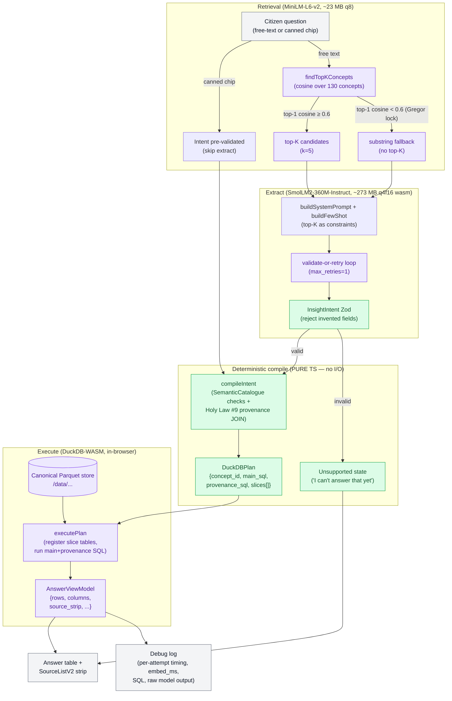

# YENASK browser governance insight assistant — plan-doc (lean handoff)

**Last Updated**: 2026-05-25
**Status**: **DECOMPOSED**. Phase 1 (compile pipeline + 4 canned intents) shipped; Phase 2 (chat surface + real model load + Debug log) shipped; Sprint ABCDE (per-attempt observability + per-row picker + graduated download friction + default-model upgrade + Slice E retrieval-augmented intent extraction) shipped; ADR-0040 brand-mark "Yen-Ask" + lab route `/lab/yenask` shipped; PR F cache-hit UX fix shipped (PR #243, `6c9f3021`, 2026-05-24); **PR-G1 OrtRun OOM fix shipped (2026-05-25, cap + catalogue trim per Andre's revised verdict — prefill `std::bad_alloc` resolved; first decode token now surfaces a separate `safeint.h` int32 overflow in ORT WASM's attention kernel, tracked as PR-G2).** **PR-G2 SafeInt overflow on decode step 1 queued** (3 levers: q4f16→fp16 LM head; wasm→webgpu; or model swap). **Slice E.3 (deterministic intent-router) deferred pending `attempts_log` evidence.** Everything else lives in [`docs/architecture/frontend/yenask.md`](../docs/architecture/frontend/yenask.md), [ADR-0038](../docs/architecture/decisions/0038-yenask-two-stage-llm-pipeline-rejected.md), [ADR-0039](../docs/architecture/decisions/0039-yenask-retrieval-augmented-intent-extraction.md), and [ADR-0040](../docs/architecture/decisions/0040-yenask-brand-and-lab-route.md).

This file is now a **lean handoff stub** per CLAUDE.md §5 doc-class routing: plan-docs cite ADR + subsystem doc and carry no rationale once decomposition is complete. The pre-decomposition history (~913 lines of D-01..D-33 entries, Sprint status tables, contracts, directory layout, phases, test plan, public references) is in `git log -p` against this file's prior revisions if a future agent needs it.

## One-line summary

Yen-Ask is a dev-only browser lab mounted at `/lab/yenask` that turns a citizen governance question into a validated `InsightIntent` via a retrieval-augmented LLM-OS pipeline (MiniLM-L6-v2 embeddings → SmolLM2-360M-Instruct extraction → deterministic compile → DuckDB-WASM over canonical Parquet → `AnswerViewModel`). No backend at runtime — Holy Law #1.

## Architecture (Slice E, locked per ADR-0039)

```mermaid
flowchart TD
  Q["Citizen question<br/>(free-text or canned chip)"]

  subgraph cmp_retrieve["Retrieval (MiniLM-L6-v2, ~23 MB q8)"]
    Q -- "canned chip" --> CannedSkip["Intent pre-validated<br/>(skip extract)"]
    Q -- "free text" --> Embed["findTopKConcepts<br/>(cosine over 130 concepts)"]
    Embed -- "top-1 cosine ≥ 0.6" --> TopK["top-K candidates<br/>(k=5)"]
    Embed -- "top-1 cosine &lt; 0.6 (Gregor lock)" --> Fallback["substring fallback<br/>(no top-K)"]
  end

  subgraph cmp_extract["Extract (SmolLM2-360M-Instruct, ~273 MB q4f16 wasm)"]
    TopK --> Prompt["buildSystemPrompt + buildFewShot<br/>(top-K as constraints)"]
    Fallback --> Prompt
    Prompt --> LLM["validate-or-retry loop<br/>(max_retries=1)"]
    LLM --> Zod["InsightIntent Zod<br/>(reject invented fields)"]
  end

  CannedSkip --> Compile

  subgraph cmp_pure["Deterministic compile (PURE TS — no I/O)"]
    Zod -- "valid" --> Compile["compileIntent<br/>(SemanticCatalogue checks +<br/>Holy Law #9 provenance JOIN)"]
    Zod -- "invalid" --> Clarify["Unsupported state<br/>('I can't answer that yet')"]
    Compile --> Plan["DuckDBPlan<br/>{concept_id, main_sql,<br/>provenance_sql, slices[]}"]
  end

  subgraph cmp_execute["Execute (DuckDB-WASM, in-browser)"]
    Plan --> Exec["executePlan<br/>(register slice tables,<br/>run main+provenance SQL)"]
    Store[("Canonical Parquet store<br/>/data/...")] --> Exec
    Exec --> VM["AnswerViewModel<br/>{rows, columns,<br/>source_strip, ...}"]
  end

  VM --> UI_Answer["Answer table +<br/>SourceListV2 strip"]
  Clarify --> UI_Answer
  VM --> UI_Debug["Debug log<br/>(per-attempt timing, embed_ms,<br/>SQL, raw model output)"]

  classDef external fill:#f3f4f6,stroke:#6b7280,color:#111827
  classDef tool fill:#ede9fe,stroke:#7c3aed,color:#4c1d95
  classDef pure fill:#dcfce7,stroke:#16a34a,color:#14532d
  classDef ui fill:#fef3c7,stroke:#d97706,color:#78350f
  class Q,UI_Answer,UI_Debug external
  class Embed,LLM,Fallback,TopK tool
  class Compile,Zod,Plan,Clarify pure
  class Exec,Store,VM tool
```

Andre + six-persona panel verdict (2026-05-24): ACCEPTED with two locks — (i) `cosine < 0.6 → substring fallback`, (ii) 20-question labelled eval set ships in Slice E.2 PR. See [ADR-0039](../docs/architecture/decisions/0039-yenask-retrieval-augmented-intent-extraction.md) for the full panel record + 3 rejected alternatives (E-Alt 1 embeddings-replace-LLM; E-Alt 2 defer until 100+ failure logs; E-Alt 3 hosted API). The shape is **structurally distinct** from what ADR-0038 rejected (two LLMs in sequence) — embeddings produce similarity scores, not generated text.

## What's shipped

Pointer-only — full state lives in [`docs/architecture/frontend/yenask.md`](../docs/architecture/frontend/yenask.md):

- Phase 1 (PR #209..#216) — `compileIntent` pure function, `executePlan`, Zod contracts, semantic-catalogue loader, 4 canned intents
- Phase 2 (PR-2 / PR-3) — `/lab/yenask` chat surface, transformers.js adapter, validate-or-retry loop, Debug log, per-attempt token + wall_ms observability
- Slice A (PR #225, `04cbbad2`) — per-attempt phase-timing fields (encode/generate/decode/TTFT) plumbed through `GenerateResult` + `ExtractAttempt`
- Slice B (PR #227) — per-row picker + Cache Storage API cleanup with two-step inline confirm
- Slice C (PR #228) — graduated download friction by size tier (Small <500 MB silent; Medium ≥500 MB confirm; Large ≥1024 MB two-step) + registry expansion to 5 entries
- Slice D-1 (PR #229, `4f7c909c`) — default model upgrade SmolLM2-135M → SmolLM2-360M (+60% IFEval lift)
- Slice E.1 (PR #238, `e5591543`) — MiniLM-L6-v2 embeddings entry + `catalogue-embed.ts` + `intent-eval.json` 20-question labelled fixture
- Slice E.2 (PR #240, `8a216f8b`) — `extract-intent.ts` wires retrieval seam; `embed_ms` Debug-log row; cosine-threshold fallback enforced; substring fallback measured at 19/20 = 95% on intent-eval baseline
- Brand + lab route (PR #241, `e4b01b0c`) — `Yen-Ask` display + `/lab/yenask` route + [ADR-0040](../docs/architecture/decisions/0040-yenask-brand-and-lab-route.md)
- Plan-doc decomposition (PR #242, `919093f7`) — this file 913→158 lines; Andre-shaped Slice-E mermaid + D-NN anchor appendix
- Cache-hit UX fix (PR #243, `6c9f3021`) — `loading-from-cache` ReadinessStatus discriminant + `_sawRealDownload` latch in `TransformersJsAdapter.prepare()` + `navigator.storage.persist()` call in `prepareModel()`; 4 files / +209 / -34; gates green; live browser smoke pending (see next-agent handoff below)
- OrtRun OOM cap + catalogue trim (PR-G1, 2026-05-25) — `extract-intent.ts` two-part fix for `OrtRun() std::bad_alloc` on free-text questions ("who won most seats tamil nadu 2026" / "india capital"): (a) `max_new_tokens` cap 256 → 96 as decode-loop guardrail; (b) `buildSystemPrompt` catalogue serialization rewritten from JSON-object dump (states + periods, each with `display_name`, full braces / quotes) to bare partition_id-only comma-separated listing. Empirical evidence path: Andre's first verdict (cap alone, rank-1 fix) was REFUTED by browser smoke — both 360M AND 135M models 0ms-bad_alloc'd identically at cap=96. The 0ms wall time proved failure was in ORT WASM kernel-planner PREFILL scratch allocation (proportional to `seq_len^2`), not in decode-loop KV growth. Re-consulted Andre with the new evidence; revised verdict (H2 trim, 75% confidence on primary unblock) is what shipped. Drops prompt from ~1500 → ~250-300 tokens; attention scratch shrinks ~25x (quadratic in seq_len). 3 new tests added: "caps max_new_tokens at 96", "preserves the 96 cap on retry attempts", "omits state display_names to keep prompt size below ORT prefill ceiling", "stays under a 4000-char prompt budget on a realistic 28-state catalogue". **PARTIAL UNBLOCK**: prefill `std::bad_alloc` (ERROR_CODE 6, 0ms wall) resolved as designed — browser smoke confirmed prefill now completes and KV cache is populated (console "Inputs given to model" shows `past_key_values.0.key/value` present). The FIRST DECODE TOKEN then surfaces a SEPARATE failure: `ERROR_CODE 1` / `SafeIntExceptionHandler::SafeIntOnOverflow()` in ORT's `safeint.h:17` — Andre's H~50% triage: static KV-cache stride arithmetic across 30 layers × 2 × 9 × 8192 × 64 × `sizeof(fp16)` trips int32 even though no single tensor approaches 2 GB. Independent of prompt size (further trimming will NOT help). Tracked as PR-G2 below. Sub-lesson: when the first diagnostic verdict fails empirically, RE-CONSULT the subagent with the new evidence rather than improvising — Andre's third verdict (ship partial fix; SafeInt is structurally different) is what closed the session honestly.

## Next-agent handoff (pick this up first)

**Verification step that did NOT run in the PR F session** (gates passed, but the live cold/warm cache behaviour was not eyeballed against a real browser by the author):

1. Start dev server in a free worker (`bun run dev -- --port 5186` from a sibling worktree to avoid colliding with parallel-agent servers on 5180-5185), open `/lab/yenask`.
2. **Cold-cache pass**: DevTools → Application → Storage → Clear site data → reload page → click model load. Expect status pill `Downloading… 17% … 100%` → `Compiling…` → `Ready`. Capture timeline.
3. **Warm-cache pass**: reload page (do NOT clear storage) → click model load. Expect status pill `Loading from cache (no network)…` per asset (briefly) → `Compiling…` → `Ready`. **No `Downloading…` pill at all.** This is the bug fix being verified.
4. **Persisted probe**: in DevTools console run `await navigator.storage.persisted()` — should return `true` on Chrome/Edge desktop on the deployed origin. Returns `false` on http://localhost in some configurations (browser policy); not a regression — only block if it returns `false` on a `https://` origin.
5. If anything diverges from expected, file a follow-up PR-G with the diagnostic — do NOT revert PR F (it shipped 18/18 unit tests + 46/46 boundaries-in-isolation green, so any divergence is a live-browser issue the unit tests didn't capture).

**Parallel cleanup tasks** (low priority, can be batched):

- Sibling worktree `..\yen-gov-yenask-brand` (PR F worker, branch `fix/yenask-cache-hit-ux-and-persist`) is now stale — `git worktree remove ..\yen-gov-yenask-brand` from master after killing any node/bun processes (`Get-Process node, bun, esbuild | Stop-Process -Force` IF none are owned by parallel agents). Branch was deleted remote-side post-merge.
- Sibling worktree `..\yen-gov-slice-e-docs` — verify with `git worktree list` whether the slice-E parallel agent has wrapped (HEAD = `af054341` on `feat/yenask-slice-e2-wire-extract` per last list). If owner has shipped + cleaned, remove; if not, leave alone.

## What's queued

| Item | Why it's queued (not shipped) | Unblock condition |
|---|---|---|
| **PR-G2 — `safeint.h` integer-overflow on decode step 1** (surfaced by PR-G1 browser smoke 2026-05-25) | Once PR-G1's catalogue trim unblocks the prefill `std::bad_alloc`, the next failure is `ERROR_CODE 1` / `SafeIntExceptionHandler::SafeIntOnOverflow` on the FIRST decode token (console "Inputs given to model" log shows `past_key_values.0.key/value` present, so prefill ran and KV cache was populated). Andre's H~50% triage: transformers.js v3 + ORT WASM pre-allocates the KV cache to static `[1, num_kv_heads, max_position_embeddings=8192, head_dim=64]` per layer, and on decode step 1 a fused attention kernel computes byte-offset arithmetic across 30 layers × 2 × 9 × 8192 × 64 × `sizeof(fp16)` that trips int32 even though no single tensor approaches 2 GB. Secondary 30%: q4f16 LM-head dequant on the `[576, 49152]` weight produces an intermediate buffer whose stride chain overflows. Either way the failure is in static-cache / weight geometry — NOT prompt size — so no amount of further trimming will help. | Open PR-G2 — three levers, each needs its own eval pass + bundle-size + cold-start measurement before merge: (a) swap `dtype: "q4f16"` → `"fp16"` on the LM head only (keeps body quantised; tests whether q4f16 dequant is the trigger); (b) swap `device: "wasm"` → `"webgpu"` for SmolLM2 (D-19 currently pins wasm because of an unrelated q4f16-WebGPU crash; verify whether fp16 on WebGPU is stable and whether SafeInt persists); (c) swap default model SmolLM2-360M → Qwen2.5-0.5B-Instruct or similar that already ships in transformers.js-examples WebGPU gallery (different attention kernel path, may sidestep the SafeInt entirely). Prereq for filing an upstream `onnxruntime-web` issue: build a 20-line min-repro pinning transformers.js + ORT versions + model id + the input shapes that trigger. |
| **PR-G3 — wire Slice E.2 retrieval into `Yenask.svelte`** | `catalogue-embed.ts` + `extract-intent.ts` `opts.embed` parameter shipped in PR #240 (Slice E.2), but `Yenask.svelte:328` still calls `extractIntent(text, catalogue, adapter)` with no `embed` — so MiniLM is NEVER loaded in the live path and the full 4-concept catalogue always goes to the LLM. PR-G1's catalogue trim makes this less urgent (prompt size is no longer the binding OOM constraint), but wiring retrieval will (a) further shrink the prompt to the top-K concepts only, (b) light up the substring-fallback path the eval-set measured at 19/20 = 95%, (c) unblock multilingual / Indic transliteration follow-ups. | Open PR-G3: in `Yenask.svelte`, load MiniLM via `getOrCreateEmbedder()` after model load completes; wrap as an `EmbedFn` adapter; pass as `extractIntent(text, catalogue, adapter, { embed })`. ≤ 30 LoC + 1 contract test asserting the live call site passes `opts.embed`. |
| **PR-G — cold-cache asset-level timing pill** (Andre §D.4 nice-to-have) | Cold-cache pill currently shows ONE "Downloading…" progress with a single total — doesn't surface which of the ~6 model assets is currently flowing. Low-priority polish; Andre flagged as §D.4 (not §D.1/D.2 which were the actual bugs PR F fixed). | Open PR-G: change `ReadinessStatus.downloading` to optionally surface `file` + `assets_total` + `asset_index`; thread through `progress_callback` (transformers.js v3 fires `file` field already). Status pill renders `Downloading model.onnx (3 of 6)…`. Pure cosmetic — no test-tier change. |
| **Slice E.3 — deterministic intent-router** ([ADR-0038 D-27](../docs/architecture/decisions/0038-yenask-two-stage-llm-pipeline-rejected.md) preserved option) | Rule-of-three not fired. Single-stage extraction has zero published `attempts_log` failures on the canned-chip + 4-concept surface. Building the router pre-emptively is the same speculative abstraction Fowler warned against in Slice D rejection. | Publish ≥3 distinct `attempts_log` failure modes on free-text questions that a deterministic router would have caught. Cite the evidence in a new ADR amending ADR-0038, then implement. |

## What's parked (preserved future options)

| Item | Why parked | Unblock condition |
|---|---|---|
| WebGPU runtime (vs wasm-pin on q4f16) | Upstream `onnxruntime-web` crashes on q4f16 SmolLM2 with `Mapping WebGPU buffer failed: Invalid buffer`. D-19 captures the wasm-pin contract. | Upstream fix; flip `device: "auto"` per model entry on a one-line change. |
| Multilingual embeddings (`multilingual-e5-small`, ~118 MB) for Indic transliteration | `attempts_log` has no Indic failure-mode evidence yet. Substring fallback covers misses. | ≥3 `attempts_log` entries showing Indic transliteration misses that MiniLM-EN missed AND fallback got wrong. Parametric swap — single registry entry change. |
| LiteRT / MediaPipe provider (alternative ONNX runtime) | YAGNI. transformers.js working. Adding a second provider before the first shows a measurable bottleneck is a rule-of-three violation. | Verified ≥50% TTFT reduction on representative free-text on q4 quantisation. `createAdapter()` already dispatches by provider — add arm + registry entry. |
| Multi-turn context awareness ("what about Kerala?") | D-18 locks per-turn extraction as STATELESS in v0. State management adds latent failure modes (which prior turn shadows the new one?) before the stateless surface is even validated. | ≥3 `attempts_log` entries where a user clearly tried a follow-up question that failed extraction because state was missing. |

## Where the rationale lives (CLAUDE.md §5 doc-class routing)

| Topic | Lives in |
|---|---|
| Current shape: module layout, contracts, readiness state machine, observability surface, per-row picker, graduated friction, test seams | [`docs/architecture/frontend/yenask.md`](../docs/architecture/frontend/yenask.md) |
| Two-LLM pipeline rejection (Cut 1 / Cut 2 / Cut 3) + 4 rejected alternatives + reversal cost | [ADR-0038](../docs/architecture/decisions/0038-yenask-two-stage-llm-pipeline-rejected.md) |
| Slice E retrieval-augmented intent extraction (LLM-OS) + 6-persona panel + 3 rejected alternatives + Gregor cosine-threshold lock + Hamel/Fowler eval-set-as-contract lock | [ADR-0039](../docs/architecture/decisions/0039-yenask-retrieval-augmented-intent-extraction.md) |
| Brand "Yen-Ask" + `/lab/yenask` route + brand-vs-identifier separation doctrine + 5 rejected name/route alternatives | [ADR-0040](../docs/architecture/decisions/0040-yenask-brand-and-lab-route.md) |
| Per-D-NN trace (D-01..D-33) — in-the-moment rationale | `git log -p TODO/20260518-browser-governance-insight-assistant-plan.md` against pre-2026-05-24 revisions |
| Lab internals + removal contract + brand-vs-identifier reminders | [`frontend/src/lib/yenask/AGENTS.md`](../frontend/src/lib/yenask/AGENTS.md) |

## Notes on the rewrite (2026-05-24)

This file was hard-pruned from ~913 lines to its current shape per user direction: *"hard clean up of the attached plan — the new mermaid architecture diagram from Andre is it there in the plan — can remove all the old stuff it is 2000 lines, quite a lot of them are old or delivered or invalidated. — can we have only what needs to be done — when we have moved what is done to /docs appropriate location."*

What was removed:
- §§1–6 (old framing, Gemma 4 model facts, runtime spike) — Gemma 4 was replaced by SmolLM2-360M; the pipeline shape changed structurally per ADR-0039; the old framing is no longer accurate. All of §6's "Gemma 4 E2B IT" facts are dead.
- §7 (canonical data substrate) + §9 (contracts) + §10 (directory layout) — promoted to subsystem doc.
- §8 (architecture flow with Gemma 4 mermaid) — replaced by the Slice-E mermaid above (this is the "new Andre mermaid" the user asked about; the prior Gemma 4 mermaid was stale).
- §11 (phases 0–4) — all delivered; tracked in "What's shipped" pointer table.
- §§12–13 (tracking process, test plan) — process absorbed into commit/PR conventions + tests themselves.
- §14 (public references) — useful but doesn't belong in a plan-doc; the few still relevant URLs live inline in ADR-0039 panel record.
- §§15–16 (open questions, recommendation before code) — pre-implementation; obsolete.
- §17 D-01..D-33 entries — all decomposed into subsystem doc or ADR per D-09 contract; pre-decomposition log preserved in `git log -p`.

Net result: a planner reading this file in 2026-07 sees what's left to do (PR F cache fix + Slice E.3 deferred), what shipped (table of PRs + merge SHAs), what's parked (with unblock conditions), and where to find the rationale-as-it-was-made (subsystem doc + 3 ADRs + git log). One mermaid + 7 short sections + 4 pointer tables. Per Holy Law #4 + CLAUDE.md §5, that IS the shape a plan-doc takes after decomposition.

## Appendix — D-NN anchor index (preserved for cross-references)

The subsystem doc + AGENTS.md + several code comments cite `D-NN` anchors in this file (e.g. `[D-23](...#d-23--...)`). The full text of each entry has been pruned per the decomposition contract above; this appendix keeps the anchors resolvable so existing links continue to land. For the full original rationale of each `D-NN`, run `git log -p TODO/20260518-browser-governance-insight-assistant-plan.md` against revisions before commit `e4b01b0c` (2026-05-24), or follow the per-D-NN pointer below.

### D-01 — Lab lives INSIDE `frontend/` as a dev route, NOT as a standalone `labs/yenask/` Vite app

Decomposed → [`docs/architecture/frontend/yenask.md`](../docs/architecture/frontend/yenask.md) §"Why it lives inside `frontend/`".

### D-02 — Reuse existing `frontend/` primitives instead of rebuilding

Decomposed → [`docs/architecture/frontend/yenask.md`](../docs/architecture/frontend/yenask.md) §"Why it lives inside `frontend/`" + [`frontend/src/lib/yenask/AGENTS.md`](../frontend/src/lib/yenask/AGENTS.md) §"Permitted imports".

### D-03 — InsightIntent contract is TS-Zod only; no `datasets/schemas/` JSON Schema mirror

Decomposed → [`docs/architecture/frontend/yenask.md`](../docs/architecture/frontend/yenask.md) §"Contracts".

### D-04 — SemanticCatalogue derived from manifest + taxonomy parquets at startup; concepts hand-authored

Decomposed → [`docs/architecture/frontend/yenask.md`](../docs/architecture/frontend/yenask.md) §"Contracts" + code comments in [`frontend/src/lib/yenask/concepts.ts`](../frontend/src/lib/yenask/concepts.ts) + [`frontend/src/lib/yenask/semantic-catalogue.ts`](../frontend/src/lib/yenask/semantic-catalogue.ts).

### D-05 — Compiler is a pure function; reuses `lib/duckdb.ts` directly (user override of Gregor Q4)

Decomposed → [`docs/architecture/frontend/yenask.md`](../docs/architecture/frontend/yenask.md) §"Pipeline" + module docstring on [`frontend/src/lib/yenask/compile-intent.ts`](../frontend/src/lib/yenask/compile-intent.ts).

### D-06 — Provenance is REQUIRED non-empty at the Zod type level; 3 test cases enforce

Decomposed → [`docs/architecture/frontend/yenask.md`](../docs/architecture/frontend/yenask.md) §"Pipeline" + the 3-case matrix in [`frontend/src/lib/yenask/execute-plan.provenance.test.ts`](../frontend/src/lib/yenask/execute-plan.provenance.test.ts).

### D-07 — Phase 1 ships as ONE PR with two commits inside

History only — see git log against PRs #209..#216.

### D-08 — Test seam: `vi.mock("../duckdb")` for vitest; Playwright e2e owns real DuckDB-WASM round-trip

Decomposed → [`docs/architecture/frontend/yenask.md`](../docs/architecture/frontend/yenask.md) §"Test seams" + [`frontend/src/lib/yenask/AGENTS.md`](../frontend/src/lib/yenask/AGENTS.md) §"Test seams".

### D-09 — Plan-doc design-log is the source of truth until decomposition

This appendix IS the application of D-09's retirement policy — decomposition is now complete and the plan-doc is a lean handoff stub.

### D-10 — Smallest-first SLM picked at PR-2 boundary; PR-1 ships zero model code

History only.

### D-11 — Model registry is config-driven; multiple models are first-class

Decomposed → [`docs/architecture/frontend/yenask.md`](../docs/architecture/frontend/yenask.md) §"Model registry" + module docstring on [`frontend/src/lib/yenask/model-registry.ts`](../frontend/src/lib/yenask/model-registry.ts).

### D-12 — `DuckDBPlan.concept_id` is a REQUIRED first field; executor reads it directly

Decomposed → [`docs/architecture/frontend/yenask.md`](../docs/architecture/frontend/yenask.md) §"Pipeline".

### D-13 — 4 concept handlers cover the canned-intent surface; single-quote SQL escaping via `sqlString()`

Decomposed → [`docs/architecture/frontend/yenask.md`](../docs/architecture/frontend/yenask.md) §"Pipeline" + handler dispatch in [`frontend/src/lib/yenask/concepts.ts`](../frontend/src/lib/yenask/concepts.ts).

### D-14 — Catalogue loader registers ONLY dim/taxonomy tables; fact-table registration is per-plan

Decomposed → [`docs/architecture/frontend/yenask.md`](../docs/architecture/frontend/yenask.md) §"Pipeline".

### D-15 — Transformers.js provider locked; model is config-driven and swappable

Decomposed → [`docs/architecture/frontend/yenask.md`](../docs/architecture/frontend/yenask.md) §"Model registry" + [`frontend/src/lib/yenask/AGENTS.md`](../frontend/src/lib/yenask/AGENTS.md).

### D-16 — `SmolLM2-135M-Instruct` seeds the registry; not a locked choice

Superseded by D-26 (default model upgraded to SmolLM2-360M).

### D-17 — Intent extractor uses validate-or-retry with one retry; stateless per-question

Decomposed → [`docs/architecture/frontend/yenask.md`](../docs/architecture/frontend/yenask.md) §"Pipeline" + module docstring on [`frontend/src/lib/yenask/extract-intent.ts`](../frontend/src/lib/yenask/extract-intent.ts).

### D-18 — PR-2 ships a multi-turn CHAT surface; per-turn extraction is STATELESS in v0

Decomposed → [`docs/architecture/frontend/yenask.md`](../docs/architecture/frontend/yenask.md) §"What ships today" + "What's parked" above.

### D-19 — Seed model device pinned to `wasm`; WebGPU stays opt-in until upstream is stable

Decomposed → [`docs/architecture/frontend/yenask.md`](../docs/architecture/frontend/yenask.md) §"Model registry" + module docstring on [`frontend/src/lib/yenask/model-registry.ts`](../frontend/src/lib/yenask/model-registry.ts).

### D-20 — Generate exposes tokens-in/out + wall_ms; per-attempt diagnostics surface as first-class observability

Decomposed → [`docs/architecture/frontend/yenask.md`](../docs/architecture/frontend/yenask.md) §"Observability surface".

### D-21 — SQL + raw model output move OUT of the citizen turn and INTO a bottom "Debug log" section (per Jony)

Decomposed → [`docs/architecture/frontend/yenask.md`](../docs/architecture/frontend/yenask.md) §"Observability surface".

### D-22 — Granular timing breakdown lives in Debug log only; TTFT descoped until streaming exists (per Jony, Slice A)

Decomposed → [`docs/architecture/frontend/yenask.md`](../docs/architecture/frontend/yenask.md) §"Observability surface" + "What is NOT exposed" callout.

### D-23 — Model picker is a list with per-row actions; "Remove from dropdown" REJECTED; cache clear is per-`repo_id` with inline two-step confirm (per Jony, Slice B)

Decomposed → [`docs/architecture/frontend/yenask.md`](../docs/architecture/frontend/yenask.md) §"Model registry" + [`frontend/src/lib/yenask/model-cache.ts`](../frontend/src/lib/yenask/model-cache.ts).

### D-24 — Graduated download friction by size tier; `recommended` rejected; size-driven row tinting rejected (per Jony, Slice C)

Decomposed → [`docs/architecture/frontend/yenask.md`](../docs/architecture/frontend/yenask.md) §"Slice C registry expansion" paragraph + [`frontend/src/lib/yenask/size-tier.ts`](../frontend/src/lib/yenask/size-tier.ts).

### D-25 — Two-stage LLM pipeline (Cut 1 / Cut 2 / Cut 3) REJECTED by panel; deferred pending attempts_log evidence (per Gregor + Fowler + Max, Slice D)

Promoted to [ADR-0038](../docs/architecture/decisions/0038-yenask-two-stage-llm-pipeline-rejected.md) (the locked ADR with 4 rejected alternatives + reversal cost).

### D-26 — Default model upgrade SmolLM2-135M → SmolLM2-360M; SmolLM2-135M size corrected 88 → 118 MB (per Max, Slice D-1)

Decomposed → [`docs/architecture/frontend/yenask.md`](../docs/architecture/frontend/yenask.md) §"Today's seed" callout.

### D-27 — Slice A SHIPPED (PR #225, merge `04cbbad2`): per-attempt timing observability landed; transformers.js returns null for all 4 phases (black-box round-trip)

Decomposed → [`docs/architecture/frontend/yenask.md`](../docs/architecture/frontend/yenask.md) §"Observability surface".

### D-28 — Slice B SHIPPED (PR #227): per-row model picker + Cache Storage API cleanup with two-step inline confirm

Decomposed → [`docs/architecture/frontend/yenask.md`](../docs/architecture/frontend/yenask.md) §"Model registry".

### D-29 — Slice C SHIPPED (PR #228): graduated download friction by size tier + registry expansion to 5 entries

Decomposed → [`docs/architecture/frontend/yenask.md`](../docs/architecture/frontend/yenask.md) §"Slice C registry expansion".

### D-30 — Slice D-1 SHIPPED (PR #229, merge `4f7c909c`): default-model strict upgrade SmolLM2-135M → SmolLM2-360M

Decomposed → [`docs/architecture/frontend/yenask.md`](../docs/architecture/frontend/yenask.md) §"Today's seed".

### D-31 — User reframe: "different model capabilities in the same model" — opens the embeddings-as-tool architectural space

Promoted to [ADR-0039 Context section](../docs/architecture/decisions/0039-yenask-retrieval-augmented-intent-extraction.md#context).

### D-32 — Slice E architecture lock: retrieval-augmented intent extraction (LLM-OS pattern) APPROVED

Promoted to [ADR-0039](../docs/architecture/decisions/0039-yenask-retrieval-augmented-intent-extraction.md) (Decision + Consequences + Andre panel verdict + 3 rejected alternatives).

### D-33 — Y-Ask brand-mark refresh (LOGO ONLY, library / route / class identifiers unchanged)

Partially superseded by [ADR-0040](../docs/architecture/decisions/0040-yenask-brand-and-lab-route.md) (brand label refreshed Y-Ask → Yen-Ask + route moved `/dev/yenask` → `/lab/yenask`; the brand-vs-identifier separation doctrine itself preserved verbatim in ADR-0040).
