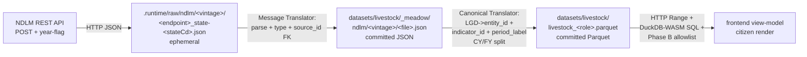

# Livestock NDLM ingest — Phase-0-through-3 handover plan

**Last Updated**: 2026-05-26
**Status**: ◐ CLOSED 2026-05-26 — all viable phases shipped on the FY 2024-25 single-vintage cut (Phase 0 family seed + Phase 1.A/B/C meadow + Phase 2.A/B/C canonical + Phase 3.A/B/C frontend mount). Phase 1.D/2.D (NADCP) + Phase 1.E/2.E (Breeding) CLOSED as upstream-publisher gaps with empirical evidence — see [docs/research/livestock-ndlm-source-availability.md](../docs/research/livestock-ndlm-source-availability.md). Multi-vintage backfill carried over to [TODO/20260526-livestock-multi-vintage-backfill-plan.md](20260526-livestock-multi-vintage-backfill-plan.md); 32-vintage snapshot corpus already on disk at `.runtime/raw/ndlm/` (4519 cells, 18.36 MB, ephemeral). See [§13 Closing](#13-closing) for the post-mortem trail. Original status: QUEUED — Phase 0 (taxonomy + topic + family seed) was the next PR; Phase 1 (snapshot + meadow lift) followed. LGD-district FK risk FORECLOSED by recon (2026-05-25; see [§7](#7-lgd-district-recon-result-gregors-1-risk-foreclosed)).
**Spec**: this doc, plus [docs/architecture/data/canonical-store.md](../docs/architecture/data/canonical-store.md) §2a + §2b (livestock added to future tree by Phase 0), §3 (observation row), §5 (sources schema v2.0).
**Decision rationale (binding)**: Hans + Max persona report (2026-05-25, this session — see [§3](#3-indicator-ids-16-slugs-from-max)); Gregor persona report (2026-05-25, this session — see [§5](#5-meadow-path-and-canonical-parquet-layout) and [§6](#6-pipes-and-filters-topology)); user mandate "carry both CY and FY, decide at render time" (2026-05-25). A formal ADR is NOT minted by Phase 0 — this plan-doc carries the decisions per [ADR-0034](../docs/architecture/decisions/0034-documentation-routing-contract.md) routing (no rejected alternatives of cross-cutting consequence; livestock is a new family, not a cross-cutting design change).
**Doc-class routing**: **plan-doc** per [ADR-0034](../docs/architecture/decisions/0034-documentation-routing-contract.md). Carries phase status + active PRs + TBD only; rationale lives in the persona reports cited inline; how-to recipe lives at [docs/how-to/ndlm-data-download.md](../docs/how-to/ndlm-data-download.md).
**Personas**: Max (Indicator Scout — family + 16 IDs + 5 fact tables + topic); Hans (Governance — pinned for Pashu Aadhaar honest-renderer call, see [TODO/20260525-pashu-aadhaar-ingest-plan.md](20260525-pashu-aadhaar-ingest-plan.md)); Gregor (Architect — meadow path + LGD resolver + CY/FY duality on PK); Fowler (engineering craft — adapter module split, two-hat commits per Phase); Jony (orthogonal — TopoJSON adoption plan at [TODO/20260525-topojson-frontend-perf-plan.md](20260525-topojson-frontend-perf-plan.md) is independent but motivated by the district-grain NDLM map).

---

## 1. The One Rule (pointer)

OWID is the canonical reference for socio-economic data modelling (CLAUDE.md §0a). OWID precedent for this family: *Livestock Counts and Production* (under *Food and Agriculture*). yen-gov family name `livestock` adopts OWID verbatim. Pashu Aadhaar has NO OWID precedent (UID-issuance ledger, not a census) — see [§8](#8-open-questions) for the framing call.

## 2. Family + topic

| Field | Value | Source of truth |
| --- | --- | --- |
| Family | `livestock` | Max persona, A |
| Topic (NEW) | `agriculture` — title `"Farming & livestock"` — summary `"How Indian farms, herds, and rural enterprises are counted — animals registered, vaccinated, bred."` — icon `wheat` | Max persona, B |
| Scope prefix used in slugs | `agriculture/` (matches topic-id per [indicator-naming.md](../docs/concepts/indicator-naming.md) §2.2) | Max persona, B |
| Default cadence on all 16 indicators | `annual_fy` (Indian govt convention; CY rows still emit, discriminated by `period_label`) | Max persona, E |
| Carries CY and FY both | Yes — single carve-out, see [§4](#4-cy--fy-carve-out--operational-rule) | User mandate 2026-05-25 |

## 3. Indicator IDs (16 slugs from Max)

All slugs honour [indicator-naming.md](../docs/concepts/indicator-naming.md) §2.2 shape `<scope>/<entity_prefix>_<noun>_<aggregate>_<unit>`. Entity prefix is leading (avoids §8 anti-pattern 1). `_count` unit suffix per §2.3 (the noun "vaccinations" could read as a rate; explicit `_count` removes ambiguity). No bare `_pct`. No methodology in slug. Longest is 60 chars (`agriculture/district_livestock_vaccinations_administered_count`) — at the §2.5 soft cap; acceptable.

| # | indicator_id | title (sentence case) | unit | grain | facet axis | source dataset |
|---|---|---|---|---|---|---|
| 1 | `agriculture/state_livestock_owners_registered_count` | Registered livestock owners (count) | count | state | landholding x gender | Owner Reg |
| 2 | `agriculture/district_livestock_owners_registered_count` | Registered livestock owners (count) | count | district | landholding x gender | Owner Reg |
| 3 | `agriculture/state_pashu_aadhaar_animals_tagged_count` | Animals issued Pashu Aadhaar (count) | count | state | species x gender | Pashu Aadhaar |
| 4 | `agriculture/district_pashu_aadhaar_animals_tagged_count` | Animals issued Pashu Aadhaar (count) | count | district | species x gender | Pashu Aadhaar |
| 5 | `agriculture/state_livestock_vaccinations_administered_count` | Animal vaccinations administered (count) | count | state | disease x round x species | NADCP |
| 6 | `agriculture/district_livestock_vaccinations_administered_count` | Animal vaccinations administered (count) | count | district | disease x round x species | NADCP |
| 7 | `agriculture/state_livestock_breeding_interventions_count` | Breeding interventions delivered (count) | count | state | programme x intervention_type | Breeding |
| 8 | `agriculture/district_livestock_breeding_interventions_count` | Breeding interventions delivered (count) | count | district | programme x intervention_type | Breeding |
| 9 | `agriculture/state_naip_iv_inseminations_done_count` | NAIP IV — inseminations done (count) | count | state | none | NAIP IV |
| 10 | `agriculture/district_naip_iv_inseminations_done_count` | NAIP IV — inseminations done (count) | count | district | none | NAIP IV |
| 11 | `agriculture/state_naip_iv_pregnancy_diagnoses_count` | NAIP IV — pregnancy diagnoses (count) | count | state | none | NAIP IV |
| 12 | `agriculture/district_naip_iv_pregnancy_diagnoses_count` | NAIP IV — pregnancy diagnoses (count) | count | district | none | NAIP IV |
| 13 | `agriculture/state_naip_iv_calves_born_count` | NAIP IV — calves born (count) | count | state | sex | NAIP IV |
| 14 | `agriculture/district_naip_iv_calves_born_count` | NAIP IV — calves born (count) | count | district | sex | NAIP IV |
| 15 | `agriculture/state_naip_iv_farmers_benefitted_count` | NAIP IV — farmers benefitted (count) | count | state | none | NAIP IV |
| 16 | `agriculture/district_naip_iv_farmers_benefitted_count` | NAIP IV — farmers benefitted (count) | count | district | none | NAIP IV |

**Dropped**: `totalAiUnderNaip` (redundant with #9/10; cite as national cross-check); `noOfAnimalsInseminated` (duplicates #9/10 minus repeat-AIs — revisit only if Hans wants the repeat-AI ratio surfaced). `getNaipHeaderCount?year=YYYY` is cumulative national totals (verified static across 2022-2025); not mapped to an indicator id; cite as a sanity check.

## 4. CY + FY carve-out — operational rule

**Verdict (Max E, schema-confirmed)**: `period_label` alone discriminates. **No schema bump needed.** The writer's PK `(entity_id, year, period_label, indicator_id)` per [canonical-store.md §3](../docs/architecture/data/canonical-store.md) natively accepts:

- CY 2024 row: `year=2024, period_label="2024", period_seq=1`
- FY 2024-25 row: `year=2025` (end-year convention), `period_label="2024-25", period_seq=1`

Both rows carry the **same** `indicator_id`. Different `source_id` (CY vs FY are distinct citation triples per [ADR-0032](../docs/architecture/decisions/0032-sources-citation-ledger.md); `vintage` field differs: `"2024"` vs `"2024-25"`). The catalogue field `cadence: "annual_fy"` is the **citizen-default** the renderer picks first; URL toggle `?period_basis=cy` filters rows to CY. No new `indicator.period_basis_default` field needed — `cadence` already encodes it.

**Verified**: live probe 2026-05-25 — CY 2024 TN NAIP IV `totalAIs=1,396,453`; FY 2024-25 TN `totalAIs=1,529,434`. Two distinct facts; the user's "carry both" mandate is honoured cell-by-cell. Evidence at `.runtime/raw/ndlm/_recon/tn-proof-summary.json` (ephemeral).

## 5. Meadow path and canonical Parquet layout

### 5.1 Meadow path (per [ADR-0041](../docs/architecture/decisions/0041-meadow-tier.md) — Gregor verdict A)

```text
datasets/livestock/_meadow/ndlm/<vintage>/<endpoint>_district.json
```

`<vintage>` is the publisher's own period label verbatim per [ADR-0032](../docs/architecture/decisions/0032-sources-citation-ledger.md): `"2024"` for CY, `"2024-25"` for FY. Do NOT invent `-cy`/`-fy` suffixes (deviates from OWID `origin.vintage` verbatim convention).

| dataset | meadow path template |
| --- | --- |
| Owner Reg + Land Holding | `datasets/livestock/_meadow/ndlm/<vintage>/owner_reg_land_holding_district.json` |
| Animal Registration (Pashu Aadhaar) | `datasets/livestock/_meadow/ndlm/<vintage>/animal_registration_district.json` |
| NADCP Vaccinations | `datasets/livestock/_meadow/ndlm/<vintage>/nadcp_vaccination_district.json` |
| Breeding (composite — ABIP + RGM) | `datasets/livestock/_meadow/ndlm/<vintage>/breeding_district.json` |
| NAIP IV | `datasets/livestock/_meadow/ndlm/<vintage>/naip_iv_district.json` + `datasets/livestock/_meadow/ndlm/<vintage>/naip_header_count_national.json` |

Each file's `rows[]` aggregates all 36 states (one shard per dataset per vintage, not per-state shards — keeps file count manageable; row count per shard stays under 10k).

### 5.2 Snapshot tier (Gregor verdict B)

`.runtime/raw/ndlm/<vintage>/<endpoint>_state-<stateCd>.json`. **Gitignored, ephemeral** (verified: `.gitignore` line 2 is `.runtime/`). Per CLAUDE.md §2 ".runtime is ephemeral; agents MUST NOT reference .runtime paths from committed artifacts" and ADR-0041 non-negotiable #3.

### 5.3 Canonical Parquet (5 tables — Max verdict D, Hans's 4 fact-table-split rules)

| # | parquet filename | row contract | indicators | rows / vintage |
|---|---|---|---|---|
| 1 | `datasets/livestock/livestock_owner_registrations.parquet` | one row per (entity x period_label x indicator x landholding x gender) | 1, 2 | ~80k |
| 2 | `datasets/livestock/livestock_pashu_aadhaar.parquet` | one row per (entity x period_label x indicator x species x gender) | 3, 4 | ~100k |
| 3 | `datasets/livestock/livestock_disease_control.parquet` | one row per (entity x period_label x indicator x disease x round x species) | 5, 6 | ~500k |
| 4 | `datasets/livestock/livestock_breeding_interventions.parquet` | one row per (entity x period_label x indicator x programme x intervention_type) | 7, 8 | ~60k |
| 5 | `datasets/livestock/livestock_naip_iv_outcomes.parquet` | one row per (entity x period_label x indicator x sex?) | 9-16 | ~30k |

**Partitioning**: start UNPARTITIONED (Gregor verdict C). Promote to `state=in_<S>/` Hive shards only when a file crosses the [canonical-store.md §10](../docs/architecture/data/canonical-store.md) 15 MB threshold. Don't pre-shard.

### 5.4 Sources ledger (Gregor verdict D)

**Identity = `(producer, title, vintage)` per [ADR-0032](../docs/architecture/decisions/0032-sources-citation-ledger.md). One row per (dataset x vintage triple).** Build via `backend.yen_gov.canonical.citation.derive_source_id(producer, title, vintage)`. Never hand-author the hash.

- Producer (constant): `"Department of Animal Husbandry and Dairying, Ministry of Fisheries, Animal Husbandry and Dairying, Government of India"`
- License: `OGL-IN-1.0` (verify against NDLM portal footer; pin in Phase 1 PR)
- Title per dataset (verbatim from NDLM portal): e.g. `"Bharat Pashudhan — NADCP Vaccination Programme — District-wise Returns"`, `"Bharat Pashudhan — Pashu Aadhaar Animal Registrations — District-wise"`, etc.
- Vintage: per (year, CY/FY axis)

Estimate: 1 vintage x 5 datasets = **5 rows**; 3 vintages x {CY, FY} x 5 = **30 rows**. Ledger grows ~10 rows per ingest year going forward.

## 6. Pipes-and-filters topology



Patterns: Pipes-and-Filters (every arrow is a uni-directional contract); Canonical Data Model (the Parquet step erases NDLM-specific shape); Message Translator at every tier transition.

## 7. LGD-district recon result (Gregor's #1 risk — FORECLOSED)

Recon ran 2026-05-25 (script: [tools/ndlm_recon_lgd_districts.py](../tools/ndlm_recon_lgd_districts.py); ephemeral summary at `.runtime/raw/ndlm/_recon/lgd-district-alignment.json`):

| Metric | Value | Reading |
| --- | --- | --- |
| NDLM district codes returned (union over 36 states, NAIP IV 2024 CY) | **588** | what NDLM exposes |
| yen-gov district `lgd_code` count (PR #267 backfill) | **784** | what yen-gov knows |
| Intersection (joinable rows) | **588** | every NDLM row resolves |
| NDLM-only (would FK-drop in writer) | **0** | risk foreclosed |
| yen-gov-only (NDLM has no data) | 196 | not a defect — NAIP IV is a select-district programme (Kerala=0, Punjab=0, Puducherry=0; many UTs=0; some states like TN return only 13 of 38 districts because NAIP IV runs in a subset). |

**Verdict**: NDLM `stateCd` AND district `code` ARE LGD MoHA codes. Direct integer join via `taxonomy/entities.parquet.lgd_code`. No alias table needed.

## 8. Open questions

| # | Question | Owner | Resolves in |
| --- | --- | --- | --- |
| 1 | Pashu Aadhaar honest-renderer call: `comparability: directional_only` + `renderer_rules: ["no_rank_table"]` vs ranked-with-`excludes`-note. Max's read = directional_only. | Hans | PR for Pashu Aadhaar adapter (see [pashu-aadhaar plan](20260525-pashu-aadhaar-ingest-plan.md) §2) |
| 2 | NADCP disease enumeration: live probe returned 0 rows for `diseaseCd in {1, 200..225}`. Need the disease-code enum (FMD, Brucellosis, PPR, HS, BQ) before NADCP can ingest. Likely sourced from a separate `/getDiseases` endpoint or from NDLM Angular bundle constants. | Max + Andre | Phase 1 NADCP sub-PR (block on disease enum first) |
| 3 | Breeding endpoint structure: NDLM exposes ABIP / RGM / NAIP IV as separate dashboards rather than one composite endpoint. Indicators 7-8 may need 2-3 sub-source endpoints, each with its own `source_id`. | Max + Gregor | Phase 1 Breeding sub-PR (sub-endpoint discovery first) |
| 4 | RESOLVED 2026-05-25 (PR #303, Phase 2.A): bundled `backend/yen_gov/canonical/lgd.py` cross-family helper in the same PR as the Owner Reg canonical adapter per Gregor verdict E. Tools-side first user (`tools/livestock_meadow_pashu_aadhaar.py`) kept a local copy to stay standalone-runnable; canonical module is the authority for in-backend resolution and docstring-flagged for the rule-of-three trigger on the next meadow tool author. | Fowler | RESOLVED |

## 9. Phase plan

### Phase 0 — taxonomy + family seed (1 PR, structural-only)

1. `datasets/taxonomy/topics.json`: add `agriculture` topic per [§2](#2-family--topic). Schema v1.3 already supports `artifacts: []` (empty placeholder).
2. `datasets/taxonomy/indicators.json`: NOT yet — indicator IDs are added in Phase 2's per-dataset PRs as each fact-table lands.
3. `docs/architecture/data/canonical-store.md` §2b: add `livestock/` row to the future-tree, citing this plan.
4. `backend/yen_gov/canonical/families.py` (or equivalent registry): register `livestock` family.
5. Tier-A test: family is registered + topic exists.

### Phase 1 — snapshot + meadow lift (5 sub-PRs, one per dataset)

Each sub-PR:

1. Pulls live snapshots into `.runtime/raw/ndlm/<vintage>/<endpoint>_state-<stateCd>.json` using [tools/ndlm_download.py](../tools/ndlm_download.py) (shipped 2026-05-25 via PR 2; covers all states x both vintages x 4 endpoints with retry + idempotent skip).
2. Adds the `derive_source_id()` row(s) to `datasets/taxonomy/sources.parquet`.
3. Writes the meadow file at `datasets/livestock/_meadow/ndlm/<vintage>/<endpoint>_district.json` per [§5.1](#51-meadow-path-per-adr-0041--gregor-verdict-a). Meadow JSON shape: `{rows: [{entity_id, time, value, ...facet keys}], source_id, ...}` mirroring energy meadow shape.
4. Tier-A test: meadow path grammar (`livestock_meadow_path_grammar`); sources ledger closure (existing).

Sub-PR order: Owner Reg -> Pashu Aadhaar -> NAIP IV -> NADCP (after disease enum resolved) -> Breeding (after sub-endpoint discovery).

### Phase 2 — canonical adapters (1 PR per fact-table, 5 total)

Each PR:

1. Adds `backend/yen_gov/canonical/adapters/livestock/<role>.py` mirroring `backend/yen_gov/canonical/adapters/energy/generation.py` pattern.
2. Adds shared helpers at `backend/yen_gov/canonical/adapters/livestock/_shared.py` (SOURCE_IDS, LGD resolver).
3. Adds the LGD->entity_id helper at `backend/yen_gov/canonical/lgd.py` (NEW, cross-family — first user is livestock; future-canonical reuse for health, education, etc.). Lift in Phase 2 PR 1.
4. Adds `agriculture/<scope>_<noun>_count` rows to `datasets/taxonomy/indicators.json`.
5. Writes `datasets/livestock/livestock_<role>.parquet` via the canonical writer.
6. Tier-A test: `livestock_lgd_district_resolution_completeness` (every observation row's `entity_id` resolves to an entity row); writer-level FK closure (existing).

### Phase 3 — frontend allowlist + UI (1 PR per indicator family that surfaces)

1. `frontend/src/lib/canonical/indicator-allowlist.ts`: route the 16 livestock indicators to canonical reader.
2. `datasets/taxonomy/topics.json`: populate `agriculture` topic's `artifacts[]` with the indicator IDs.
3. New `/t/agriculture` topic landing page (re-uses existing TopicLanding.svelte renderer).
4. §13 browser smoke on `/t/agriculture` + one state route `/s/tamil-nadu/t/agriculture`.

## 10. Tier-A tests to add

| # | Symbol | What it asserts | Lands in |
| --- | --- | --- | --- |
| 1 | `livestock_meadow_path_grammar` | Every file under `datasets/livestock/_meadow/` matches `_meadow/ndlm/<vintage>/<snake_case>.json`; vintage matches `^\d{4}(-\d{2})?$`. | Phase 1 PR 1 |
| 2 | `livestock_lgd_district_resolution_completeness` | Every observation row's district `entity_id` resolves to a row in `entities.parquet WHERE entity_type='district'`. Foreclose silent FK-drop. | Phase 2 PR 1 |
| 3 | `livestock_cy_fy_period_label_grammar` | Every row's `period_label` matches `^\d{4}$` (CY) OR `^\d{4}-\d{2}$` (FY); never both empty. | Phase 2 PR 1 |
| 4 | `livestock_sources_ledger_closure` (covered by existing writer-level FK gate; no new test) | -- | -- |

## 11. Status table

> **Forward-pointer (PR-Z2 of [docs/archive/plans/20260526-grain-over-entity-and-storage-decoupling-plan.md](20260526-grain-over-entity-and-storage-decoupling-plan.md), 2026-05-26)** — Phase 2.A (Owner Reg), Phase 2.B (Pashu Aadhaar), and Phase 2.E (Breeding, when upstream re-opens) all currently mint per-species / per-grain sibling indicator ids (`state-pashu-aadhaar-animals-tagged-count-<species>`, `district-pashu-aadhaar-count-<species>`, etc.). **PR-B5 of the grain-rip plan collapses these into one id per measure** (e.g. `livestock/pashu-aadhaar-count` with `species` facet + `entity_kinds: ["country","state","district"]` per ADR-0044), dispatching grain on the row's `entity_kind` rather than the id prefix. Phases 1.D (NADCP) + 1.E (Breeding) upstream-publisher work continues UNCHANGED under this plan; only the catalogue grammar is touched by PR-B5. The shipped Owner Reg + Pashu Aadhaar + NAIP IV ids stay live until PR-B5 ships the CTAS migration.

| Slice | Status | Notes |
| --- | :-: | --- |
| Phase 0 (topic + family seed) | ◐ DONE | `agriculture` topic registered in `datasets/taxonomy/topics.json`; `datasets/livestock/` family dir exists with `_meadow/` sub-tree; `backend/yen_gov/canonical/adapters/livestock/` package registered (`__init__.py`, `_shared.py`, `pashu_aadhaar.py`). Shipped incidentally via the parallel pashu-aadhaar sprint - no standalone Phase 0 PR was needed. |
| Phase 1.A (Owner Reg snapshot + meadow) | ◐ MERGED | PR #298 (merge SHA `81b5a60b`, 2026-05-25T17:48). Meadow lift `datasets/livestock/_meadow/ndlm/2024-25/owner_reg_land_holding_district.json` (35 states / 741 districts / 4986 rows; FY 2024-25 only). CY 2024 deferred (would break FROZEN 5-row sources seed); Uttarakhand state-5 absent (upstream HTTP 500); per-row `source_id` deferred to Phase 2.A canonical adapter per ADR-0032 (schema `additionalProperties: false`). Composite `facet = "<landholding>|<gender>"` encoding (12 facets) - Phase 2.A adapter will split. |
| Phase 1.B (Pashu Aadhaar snapshot + meadow) | ◐ DONE | Shipped pre-sprint via the parallel pashu-aadhaar plan. 10 species x district meadow files at `datasets/livestock/_meadow/ndlm/2024-25/district-pashu-aadhaar-count-<species>.json` (buffalo, cattle, donkey, goat, horse, mithun, mule, pig, sheep, yak). State grain emerges via canonical adapter rollup (Phase 2.B), not as separate meadow shards. |
| Phase 1.C (NAIP IV snapshot + meadow) | ◐ MERGED | PR #299 (merge SHA `5390f796`, 2026-05-25T18:07). Meadow lifts `datasets/livestock/_meadow/ndlm/2024-25/naip_iv_district.json` (28 states/UTs / 588 districts / 2940 rows; FY 2024-25 only) + `datasets/livestock/_meadow/ndlm/2024-25/naip_header_count_national.json` (3 programme rollups: NAIP IV / ABIP / Others; country-grain sanity-check). 588/588 NDLM districts resolve to yen-gov entities (zero FK-drops). CY 2024 deferred (would break FROZEN 5-row sources seed); 8 states/UTs report zero NAIP IV coverage upstream (Kerala, Punjab, Puducherry, Chandigarh, Delhi, Lakshadweep, A&N, D&NH+D&D - NOT a defect, NAIP IV is select-district). Per-row `source_id` deferred to Phase 2.C canonical adapter per ADR-0032. Composite `facet = "<metric_family>|<sex>"` encoding (5 facets: `inseminations|none`, `pregnancy_diagnoses|none`, `calves_born|m`, `calves_born|f`, `farmers_benefitted|none`) - Phase 2.C adapter splits onto the 8 catalogue indicators (4 metric families x state+district grain). |
| Phase 1.D (NADCP snapshot + meadow) | ⛔ CLOSED 2026-05-26 — TRUE GAP | 2026-05-26 bulk-download evidence (32 vintages × 36 states × `diseaseCd in {1,2}` = 1152 cells via `getNADCPVaccinationDistrictWise`) confirms every cell returns `{totalVaccinations:0, totalOutput:{}}` (130 bytes). Plus 20+ alternate NADCP endpoint name variants (e.g. `getNADCPStateWise`, `getFMDVaccinationDistrictWise`) all HTTP 404. No Swagger / OpenAPI. Indicators 5 + 6 remain CATALOGUE-DECLARED + UNFILLED on `/t/agriculture`. Full evidence + re-evaluation cadence + 4 open follow-ups (DAHD PDF scrape, DevTools capture, RTI, DAHD outreach) at [docs/research/livestock-ndlm-source-availability.md](../docs/research/livestock-ndlm-source-availability.md). Original escalation notes preserved below for trail: Open question #2 RESOLVED on enum (Max recon, 2026-05-25): NADCP scope = exactly FMD + Brucellosis per DAHD authoritative scheme page `https://dahd.gov.in/schemes/programmes/nadcp`. Probe map: diseaseCd 1 = FMD, diseaseCd 2 = Brucellosis. Live POST-probe matrix of 60 cells (5 years 2019-2023 x CY+FY x diseaseCd {1,2} x states {TN/33, KA/29, UP/9}) ALL returned empty. `isRoundWise=True` returns HTTP 400 with empty body. The 2026-05-26 bulk run confirmed this across the full publisher vintage range. |
| Phase 1.E (Breeding snapshot + meadow) | ⛔ CLOSED 2026-05-26 — NO PUBLIC API | Open question #3 PRE-RESOLVED via `tools/ndlm_download.py` design notes (line 43-46): "Breeding (ABIP/RGM) endpoints are dashboard-level not per-state-endpoint - out of scope for this tool; covered by a separate discovery PR." Confirmed by 14-endpoint probe matrix (2026-05-25): `getABIPHeaderCount`, `getABIPStateWise`, `getABIPDistrictWise`, `getRGMHeaderCount`, `getRGMStateWise`, `getRGMDistrictWise`, `getRashtriyaGokulMissionStateWise`, `getBreedingStateWise`, `getCattleBreedingStateWise` all return HTTP 404 on `https://bharatpashudhan-api.ndlm.co.in/epashu/v1/homepage/`. NDLM publisher exposes NO per-state Breeding API endpoint. **ESCALATION OPTIONS**: (a) DAHD/NDDB direct-publication outreach (ABIP and RGM both produce official annual reports - PDF tabular data can be extracted); (b) human DevTools capture of Breeding-dashboard SPA XHR if such a dashboard exists; (c) defer indefinitely (indicators #7 + #8 stay UNFILLED on `/t/agriculture`; not a critical-path blocker for the rest of the plan). |
| Phase 2.A (Owner Reg canonical adapter + Parquet) | ◐ MERGED | PR #303. Bundled per Q#4 verdict E: `backend/yen_gov/canonical/lgd.py` (memoized LGD->entity_id resolver, 3 unit tests) + `landholding` FacetAxis (6 brackets: landless_marginal / small / semi_medium / medium / large / not_specified; closed enum aligned with Agriculture Census 2015-16) + `backend/yen_gov/canonical/adapters/livestock/owner_reg.py` (two-pass: first SUMs over gender to collapse the publisher's composite facet, second SUMs district children to state-grain per ADR-0043; derivation=`sum` on both grains) + 14 catalogue rows (1 district parent compute-on-read + 6 district facet children + 1 state parent compute-on-read + 6 state facet children) + 12 Tier-A contract tests. Source `src-d98dc531ef7e`; target table `livestock_owner_registration`. 3055 district rows + 168 state rows = 3223 total. Gender axis lift deferred (would need a separate sex-stratified registration indicator family; Phase 1.A meadow preserves gender on every cell for that future PR). |
| Phase 2.B (Pashu Aadhaar canonical adapter + Parquet) | ◐ DONE | Shipped pre-sprint. `backend/yen_gov/canonical/adapters/livestock/pashu_aadhaar.py` emits `datasets/livestock/livestock_pashu_aadhaar.parquet` (10-species facet-child fact-table; state grain auto-rolled from district meadow). |
| Phase 2.C (NAIP IV canonical adapter + Parquet) | ◐ MERGED | PR #306. `backend/yen_gov/canonical/adapters/livestock/naip_iv.py` (two-pass: first SUMs over sex axis for `calves_born` to collapse the publisher's `<metric_family>|<sex>` composite facet, second auto-rolls district children to state-grain per ADR-0043; derivation=`sum` on both grains). Extracts `state_prefix(district_entity_id)` to `_shared.py` per Fowler rule-of-three (owner_reg + pashu_aadhaar + naip_iv all needed it; owner_reg.py and pashu_aadhaar.py migrate to the shared helper in the same PR). 8 catalogue rows: 4 district + 4 state, one per metric family (`inseminations` / `pregnancy_diagnoses` / `calves_born` / `farmers_benefitted`). No parent indicator (units differ across families: events vs calves vs farmers). Source `src-93a2a72db482`; target table `livestock_naip_iv`. 12 Tier-A contract tests including the calves-born sex-collapse invariant (district value = meadow male + female sum) + ADR-0043 state rollup parity. Mounting on `/t/agriculture` deferred to Phase 3.C per the user-mandated PR sequencing. |
| Phase 2.D (NADCP canonical adapter + Parquet) | ⛔ CLOSED 2026-05-26 — no upstream | Depends on Phase 1.D; closed in lockstep. No-op until upstream resolves; see [docs/research/livestock-ndlm-source-availability.md](../docs/research/livestock-ndlm-source-availability.md). |
| Phase 2.E (Breeding canonical adapter + Parquet) | ⛔ CLOSED 2026-05-26 — no upstream | Depends on Phase 1.E; closed in lockstep. No-op until upstream resolves; see [docs/research/livestock-ndlm-source-availability.md](../docs/research/livestock-ndlm-source-availability.md). |
| Phase 3.A (`/t/agriculture` headline + Pashu Aadhaar state cards) | ◐ DONE | PR #295 (merge SHA `61849c26`, B.05.f). District-cattle headline (640 districts) + 10 state-species grid cards on `/t/agriculture`. |
| Phase 3.B (`/t/agriculture` extend district-grain to 9 other species) | ◐ MERGED | PR #311 (merge SHA `68123c9e`). 9 district-grain Pashu Aadhaar species cards mounted on `/t/agriculture` (buffalo / goat / sheep / pig / mithun / yak / horse / donkey / mule). Each is a `single` canonical descriptor on `livestock.livestock_pashu_aadhaar`. Sparse-coverage species (horse 6, donkey 1, mule 1 districts) carry an explicit honesty note: the choropleth is mostly grey because tagging has barely begun for these animals, not because the animals are absent. Hans `comparability="directional_only"` + `renderer_rules=["no_rank_table"]` on all 9. |
| Phase 3.C (`/t/agriculture` mount Owner Reg / NAIP IV / NADCP / Breeding) | ◐ MERGED (partial) | PR #311 (merge SHA `68123c9e`). Owner Reg (2 facet-multiplexed parents on `landholding` axis with 6 brackets each, fanning to 12 children for deep-link routability) + NAIP IV (8 single descriptors across 4 metric families x 2 grains: inseminations / pregnancy_diagnoses / calves_born / farmers_benefitted) mounted on `/t/agriculture`. NADCP + Breeding remain CLOSED as upstream-publisher gaps (Phase 1.D / 1.E / 2.D / 2.E; see [docs/research/livestock-ndlm-source-availability.md](../docs/research/livestock-ndlm-source-availability.md)). Partial-coverage chapter is honest per Hans (NAIP IV is SELECT-DISTRICT; 8 states/UTs grey upstream is signal, not defect). |

## 12. Pointer to umbrella

This plan registers a new family on the **canonical long-format pivot** umbrella at [docs/archive/plans/20260517-canonical-long-format-pivot.md](../docs/archive/plans/20260517-canonical-long-format-pivot.md) §0e.8a pending-work tracker. Add a row there once Phase 0 PR opens.

## 13. Closing

**Closed 2026-05-26** — single-vintage (FY 2024-25) cut is fully shipped; upstream-gap phases (NADCP + Breeding) have empirical TRUE-GAP / NO-PUBLIC-API verdicts; multi-vintage backfill is queued as a separate sprint with its own pre-conditions.

**Re-opened + closed 2026-05-26** (later same day) — multi-vintage FY backfill SHIPPED via PR #337 (16 FY vintages 2010-11..2025-26 lifted into committed meadow + canonical regenerated to 65,024 obs rows + 44 indicator catalogue rows reframed to citizen-honest multi-vintage methodology); pre-conditions in [TODO/20260526-livestock-multi-vintage-backfill-plan.md](20260526-livestock-multi-vintage-backfill-plan.md) §2 RESOLVED with verdict "no seed unfreeze needed; OWID + ADR-0042 binding". CY-vintage lift and frontend Phase E (sparkline + year picker) carried forward as separate PRs.

**Decomposed rationale homes**:

- NADCP + Breeding upstream-gap evidence + 4 open follow-ups → [docs/research/livestock-ndlm-source-availability.md](../docs/research/livestock-ndlm-source-availability.md).
- The 32-vintage bulk-download recipe + corpus inventory → [docs/how-to/ndlm-data-download.md](../docs/how-to/ndlm-data-download.md) (Recipe 3 + NADCP closure note).
- Multi-vintage time-series backfill (lift the 4519 on-disk snapshots into committed meadow + adapter time-series emit + frontend sparkline) → [TODO/20260526-livestock-multi-vintage-backfill-plan.md](20260526-livestock-multi-vintage-backfill-plan.md).
- Per-phase ship rationale stays inline in [§11 status table](#11-status-table).

**What is DONE on `/t/agriculture` as of 2026-05-26**:

| Indicator family | PR(s) | Grain | Vintage | Status |
| --- | --- | --- | --- | --- |
| Owner Reg + Land Holding (12 facet children + 2 parents) | #298 + #303 + #311 + #337 | district + state | FY 2010-11..2025-26 (16) | LIVE |
| Pashu Aadhaar (10 species, district + state) | #295 + #311 + #312 + #313 + #337 | district + state | FY 2010-11..2025-26 (16) | LIVE |
| NAIP IV (4 metric families × 2 grains) | #299 + #306 + #311 + #337 | district + state | FY 2023-24..2025-26 (3 active) | LIVE |
| NADCP (vaccinations) | (none) | n/a | n/a | CLOSED — upstream gap |
| Breeding (interventions) | (none) | n/a | n/a | CLOSED — upstream gap |
| 32-vintage snapshot tool extension | #334 | n/a | 2010-2025 CY + 2010-11..2025-26 FY | TOOL LIVE; FY meadow lifted in #337 |

**What is NEXT** (in priority order, picked up by the next agent):

1. Frontend Phase E (sparkline primitive + year-picker dropdown) so citizens can see the 16-vintage time-series per [TODO/20260526-livestock-multi-vintage-backfill-plan.md](20260526-livestock-multi-vintage-backfill-plan.md) §6.
2. CY-vintage lift (separate `*-cy-*` indicator slugs OR vintage-type CLI flag on the meadow tools).
3. Hans-flagged `renderer_rules += ["annotate_programme_launch_year"]` band-annotation primitive for pre-2018 NDLM rollout (separate Jony PR).
4. Optional Tier 3 (DAHD Annual Report PDF scrape) if NADCP historical numbers become required for a partner data card.
