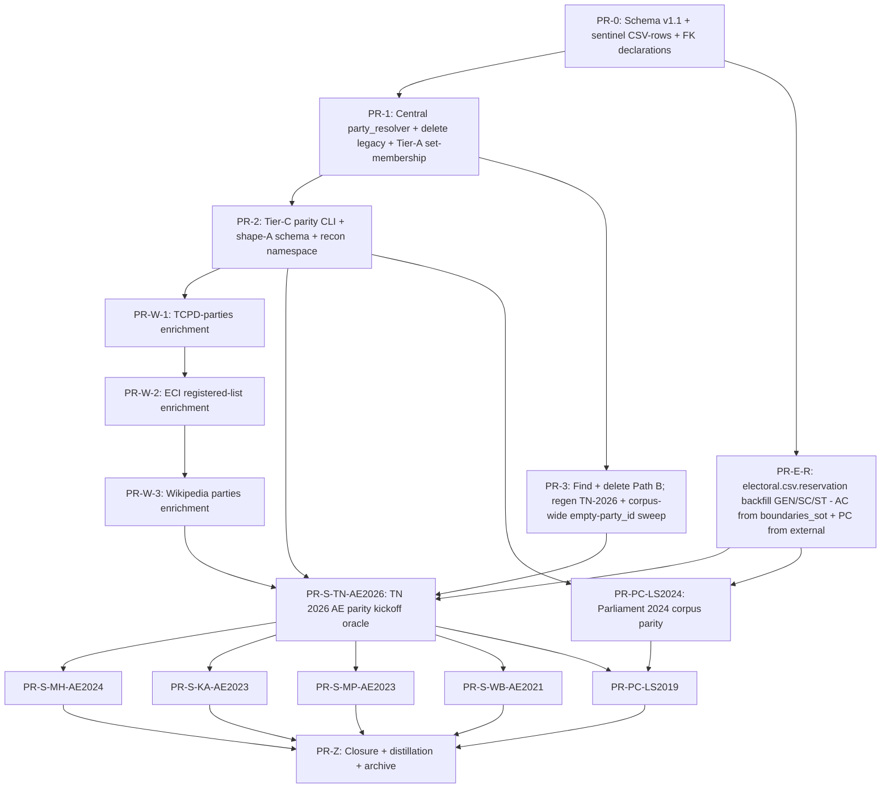

# Electoral-data quality + party-catalogue enrichment + cross-source parity sweep

**Last Updated**: 2026-06-10
**Level**: 4 (structural, multi-file, cross-cutting; CLAUDE.md section 6)
**Authority spine**: Hans + Max (data shape), Gregor (integration / versioning), Fowler (deletion discipline). Andre, Jony, Citizen not in scope (backend-only).
**Status**: READY-FOR-DISPATCH (2026-06-10). Q1 + Q6 + Q7 signed off; SCL-01 in scope; Gregor + Fowler + Andre debate panel converged 2026-06-10 with all 4 gaps closed (DAG edge PR-2 -> PR-W-1; PR-3 cli.py collision guard; Wave D 3-concurrent throttle + ESCALATE #6 resolver-empty trigger; Fowler machine-decidable VERIFIED rule). Plan SHA at READY: `fa3f7c42`. Wave A (PR-0) can dispatch.

---

## Preamble - binding doctrine the plan cannot re-litigate

This plan is the engineering response to two intertwined user-named pains:

1. **"2026 TN - AIADMK shows up as unknown and many other parties across india showing as unknown"** - the symptom is a publisher-string-to-canonical-id resolution failure that escaped the canonical resolver; root cause confirmed in section 1.
2. **"verify the list of parties csv is fully enriched - canonical, short, long description etc."** - the symptom is `datasets/data/entities/parties.csv` at v1.0 has 8 sparse columns; most non-anchor rows have `short == full == slug-tail`, missing identity metadata (recognition_scope, lineage, founded_year) that the X1a-fu2 transcode (2026-06-07) silently dropped from the richer `datasets/taxonomy/parties.json` source.

The plan executes purely backend, "mechanical {src} compare/ingest to {csv}" per user constraint. No frontend touches. No new agent doctrine - this plan binds only the data + adapter + validator layers.

Binding documents (read these before any PR):

- [CLAUDE.md](../CLAUDE.md) - engineering contract; Holy Laws #3 (contracts), #5 (structural-only), #6 (no hardcoding), #9 (provenance), #10 (tests ship); section 0a authority table; section 10 STOP-AND-SURFACE rule for user-named sources.
- [docs/concepts/owid-alignment.md](../docs/concepts/owid-alignment.md) - The One Rule. OWID-precedent breaks ties on identity questions.
- [docs/concepts/data-provenance.md](../docs/concepts/data-provenance.md) - ADR-0032 citation ledger; ADR-0042 vintage = operator snapshot window.
- [docs/concepts/indicator-naming.md](../docs/concepts/indicator-naming.md) - ADR-0044 grain-over-entity (party-split = methodology break, never new id mint for vintage).
- [docs/architecture/data/indicator-catalogue.md](../docs/architecture/data/indicator-catalogue.md) - ADR-0045 grapher catalogue split (render hints out of canonical catalogue).
- [docs/architecture/data/canonical-store.md](../docs/architecture/data/canonical-store.md) - long-format CSV under `datasets/data/`; section 5 sources schema.
- [docs/concepts/electoral-hierarchy.md](../docs/concepts/electoral-hierarchy.md) - AC <-> PC 1:1, AC <-> district 1:M via LGD membership.
- [docs/architecture/backend/validator.md](../docs/architecture/backend/validator.md) - Tier-A / Tier-B / new Tier-C split.
- [TODO/20260603-data-and-charting-platform-reset-plan.md](20260603-data-and-charting-platform-reset-plan.md) - the umbrella Level-5 plan; this plan slots beneath as a follow-on row.

Wave 0 framing reports (read before any PR; cited verbatim in section 1):

- Diagnostic (Explore-thorough, root-cause survey of AIADMK 2026 TN): chat-session artifact `toolu_vrtx_01KzEZQjgiT2m7GM9SmPEPpM`.
- Hans (Governance, 33-case identity catalogue + 16-col shape recommendation + 3 STOP items): chat-session artifact `toolu_vrtx_01Nv4toEpybV86A88H8eatLY`.
- Gregor (Architect, 8-contract enumeration + 4 collision classes + Tier-C verdict + 5 STOP items): chat-session artifact `toolu_vrtx_015aVdkJMuHAwmAAX39JCvRx`.

Quoted verdicts that bind this plan (verbatim from Wave 0):

> **Hans**: "`short` is a DISPLAY field, never a key. Allowed to collide. `party_id` MUST NOT collide." (Wave 0 / Hans section 3.)
> **Hans**: "Splits mint NEW ids; parent is NEVER retired. Pre-split vote rows keep parent's id forever. Rebrandings keep SAME id with a `name_history[]` blob." (Wave 0 / Hans section 2 verdict.)
> **Hans**: "Hand-curation is the only path - secondary sources disagree on edge cases. Auto-correct is BANNED. Every disagreement is hand-stepped with a curator's `source_id` + freeform `note`." (Wave 0 / Hans section 10.)
> **Gregor**: "Resolver topology B (central resolver service) via strangler-fig - extract `assembly_results.party_lookup_from_parties_csv` into `backend/yen_gov/canonical/party_resolver.py`, repoint 4+ call-sites, delete legacy `eci/party_lookup.py`." (Wave 0 / Gregor section 4 verdict.)
> **Gregor**: "Keep B as the always-runnable FK closure gate (mechanical); add a NEW Tier-C `parity` CLI for the per-source comparison. Tier-C never runs in CI." (Wave 0 / Gregor section 6 verdict.)
> **Gregor**: "Pure-additive minor bump (1.0 -> 1.1) is the right shape for ALL the columns I expect to land." (Wave 0 / Gregor section 7 verdict.)

---

## Scope-change ledger

Per CLAUDE.md section 10, any agent that proposes to silently downgrade a user-named source, instruction, or recommended-default MUST add a row here before merging the row's PR. Capture INTENT in neutral prose; never paste user chat verbatim.

| Row | Date | Intent (what changed, why, what it overrode) | signoff |
|---|---|---|---|
| SCL-01 | 2026-06-10 | Reservation backfill (`electoral.csv.reservation` GEN/SC/ST) promoted from out-of-scope to in-scope as new PR-E-R. Overrides Gregor's contract row C7 which deferred the column on the grounds that all rows are currently null; user clarified that publisher-stated SC/ST labelling is a citizen-trust contract and must ship in this campaign. Source data confirmed on-disk: AC from `datasets/data/entities/boundaries_sot/<S>/constituencies.json` (4113 rows, 31 of 31 entities with assemblies = no gap); PC from `datasets/ephemeral/2024_india_loksabha_33-Constituency-Wise-Detailed-Result.csv` + 2019 sibling (ECI Statement 33, `Category` column); AE cross-check from TCPD `All_States_AE.csv` `Constituency_Type` column. Zero external fetch needed. | user (2026-06-10) |

---

## Section 0 - Operating contract

### 0.1 Strategy (one sentence)

Lift the rich identity metadata back into `parties.csv` (v1.1 additive), centralise the publisher-string-to-`party_id` resolver, add a Tier-C parity CLI as the cross-source validation seam, then sweep state-by-state and event-by-event accepting only operator-curated enrichments - never auto-merging publisher claims.

### 0.2 Hard-coded scope

- **IN**: backend Python under `backend/yen_gov/canonical/`, CLI under `backend/yen_gov/cli.py`, schema under `datasets/data/_schema/columns.json`, parties data under `datasets/data/entities/parties.csv`, per-event candidacies + summary under `datasets/elections/{assembly,parliament}/`, per-state long-format under `datasets/data/datapoints/electoral/`, parity adapters + scratch scripts under new namespace `backend/yen_gov/canonical/recon/` and `tools/recon/`.
- **IN**: pytest tier-A / tier-B / new tier-C validator extensions.
- **OUT**: `frontend/`, `admin/`, citizen UI copy, URL grammar, chart renderer, party-colour resolver in frontend (already correct per Wave 0 / Gregor section 9). Any frontend-side regression revealed by a backend fix is filed as a separate plan-doc row, not absorbed here.
- **OUT**: re-litigation of `party_id` opaque-slug verdict, of one-indicator-per-concept doctrine, of provenance ledger shape, or of the 5 binding doctrine points in Wave 0 / Doctrine inventory section "Synthesis".
- **OUT**: full `party_alliances.csv` curation backfill - section 0.3 Q6 below scopes this; the plan ships the validation lane with the "alliance not yet curated" badge in citizen UI as a separate workstream OWNED by Hans + a curator (not this plan).

### 0.3 BLOCKED-NEEDS-SIGNOFF (front-loaded per CLAUDE.md section 10)

Three contract decisions that the plan-author refuses to settle without explicit user sign-off. Each PR row that depends on a BLOCKED item names it in the row brief; that row stays `[ ] BLOCKED` until the `signoff:` field is non-empty.

#### Q1 - Authoritative external-source ordering + tie-break rule

The user named ten external sources (section 6 below). When two disagree on the same fact (e.g. TCPD says `parties.IN.AIADMK` short = "AIADMK" but the Wikipedia infobox says "ADMK"), which wins?

**Hans + Gregor joint recommendation** (Wave 0 / Hans section 10 + Gregor Q1):

| Fact class | Authoritative source | Tie-break order if primary missing |
|-----------|---------------------|-----------------------------------|
| `full_name`, `short`, `aliases`, lineage (`predecessor_party_ids`, `successor_party_ids`, founded/dissolved year) | TCPD-PoliticalPartiesIndia_1962_2021.csv (already on disk) | (1) Wikipedia List of political parties in India; (2) Wikipedia per-party infobox; (3) MyNeta party page |
| `eci_codes` (numeric ECI registration code, per-vintage) | ECI registered-parties list (per snapshot) | (1) TCPD's eci_code field; (2) thecont1/india-votes-data parties review CSV |
| `brand_colour`, `symbol_asset` URL, `wikipedia` URL | Wikipedia per-party infobox | (1) thecont1/india-votes-data; (2) hand-curated existing rows in parties.csv |
| `recognition_scope`, `recognition_history` | ECI registered-parties list (per snapshot) | (1) Wikipedia List of political parties in India; (2) TCPD `recognition` column |
| `winner_party_id` per constituency per event | ECI Results Portal (Holy Law #9, issuing authority always wins) | NEVER falls back; if ECI disagrees, citizen UI shows ECI + flags DISPUTED |
| `vote_count`, `vote_share` per candidate per constituency | ECI Statistical Report | (1) TCPD All_States_AE.csv / All_States_GE.csv (peer); (2) thecont1/india-votes-data per-year per-state CSV; (3) bhukyavenkatamahesh PC datasets; (4) IndiaVotes |

**User to confirm or override.** A row brief depending on Q1 cannot run on day 1 if `signoff:` is empty.

`signoff:` user (2026-06-10) -- confirmed

#### Q6 - `party_alliances.csv` backfill scope

Current state: 10 rows for TN AcGenMay2026 only. The remaining ~700 historical election events (state assemblies 1962-2026 x 36 states + LS 1952-2024) are unlabelled. Curation is hand-work; not in scope of this plan but a citizen-facing decision.

**Hans + Gregor joint recommendation** (Wave 0 / Hans STOP #1):

- Ship the Stream X validation lane NOW with "alliance not yet curated for this event" surfacing in the verdict.csv for every event row that lacks alliance data. Citizen UI carries an "alliance not yet curated" badge per event (the badge is a separate frontend plan-doc; this plan does not author it).
- Backfill in priority order: (1) most-recent LS event (LS-2024); (2) most-recent flagship state AE events (Maharashtra Nov 2024, Karnataka 2023, MP 2023, WB 2021); (3) sweep older events as bandwidth allows.

**User to confirm priority order or override.**

`signoff:` user (2026-06-10) -- confirmed (priority order as recommended)

#### Q7 - AIADMK-EPS / Shiv-Sena-Shinde / NCP-Ajit identity model

The 2022-2024 trio of ECI-symbol-award splits is the highest-stakes identity decision in the plan. Three options (Wave 0 / Hans STOP #2):

- **(a)** Keep `parties.IN.AIADMK` / `parties.IN.SHS` / `parties.IN.NCP` continuous - ECI ruled the dominant faction retains name + symbol; from ECI's view no split occurred, only a defection. Competing faction is a NEW id.
- **(b)** Mint child ids on every split. Parent gets `dissolution_date`; both children carry `predecessor_party_ids = [parent]`. Citizen UI surfaces the break annotation always.
- **(c)** Hybrid: keep id continuous for the ECI-favoured side (set new `claims_to_parent_name = true` column) AND mint a separate id for the breakaway. So Shinde-Shiv-Sena stays `parties.IN.SHS` (with `claims_to_parent_name = true`); Uddhav-Sena is new `parties.IN.SHS_UBT`. Ajit-NCP stays `parties.IN.NCP`; Sharad-NCP is new `parties.IN.NCP_SP`. EPS-AIADMK stays `parties.IN.AIADMK`; OPS-AIADMK is new `parties.IN.AIADMK_OPS` (note: AMMK is already a separate id and is the Sasikala-wing 2018 breakaway, distinct from the 2022 OPS faction).

**Hans recommendation**: (c). Matches ECI's actual ruling structure; preserves continuity for the dominant side; gives breakaway its own first-class identity; trade-off is that yen-gov endorses ECI's call on every split, which Hans accepts under Holy Law #9.

**User to confirm or override.** This decision sets the row mint for ~6 rows in parties.csv (AIADMK_OPS, SHS_UBT, NCP_SP and three `claims_to_parent_name` flags) - small in volume but affects every Maharashtra + Tamil Nadu + Bihar election rendered after 2022.

`signoff:` user (2026-06-10) -- confirmed option (c)

### 0.4 Recommended defaults (apply inline; user may override per row)

The five other Wave 0 STOP items have agent-converged defaults. PRs apply them without sign-off; a user override reopens them as a Scope-change ledger row.

| # | Topic | Recommended default | Wave 0 source |
|---|-------|---------------------|---------------|
| Q2 | Legacy resolver `backend/yen_gov/canonical/adapters/eci/party_lookup.py` (reads `datasets/taxonomy/parties.json`) | DELETE in PR-1 after repointing 10 call-sites (6 prod + 4 tests) to central `party_resolver.py` | Gregor section 4, Q2 |
| Q3 | Verdict.csv commit policy | Commit ONE frozen copy per PR-W or PR-S revision at `datasets/ephemeral/party-parity/<source>/<vintage>/<sha>/verdict.csv`; subsequent re-runs gitignored | Gregor section 5, Q3 |
| Q4 | Time-collision schema posture | Two-rows-with-disjoint-`aliases`-union NOW (v1.1); revisit `valid_from`/`valid_to` columns only if a real chart-time query demands it (defer to v1.2) | Gregor section 2D, Q4 |
| Q5 | Sentinel registry consolidation (`parties.IN.{UNK,IND,NOTA}`) | Lift into parties.csv as actual rows with new `is_sentinel: bool` column; introduce `backend/yen_gov/canonical/party_resolver.py::SENTINELS` import constants | Gregor section 1, Q5 |
| Q8 | Native-script storage on parties.csv | Add `name_native_script` (string, nullable). UI policy filters it OUT on the elections surface per PR #874 No-Hindi rule; storage is additive and forward-compatible | Hans STOP #3, Wave 0 |

### 0.5 ESCALATE triggers (stop and ask the user)

Per CLAUDE.md section 6, the orchestrator stops and surfaces ONLY at these triggers. Otherwise execute non-stop.

1. **Q1 / Q6 / Q7 unsigned at Wave A dispatch** - block the wave; do not start PR-0. (NOTE: all three signed 2026-06-10 per section 0.3; this trigger is dormant unless a future override reopens.)
2. **PR-W-* discovers a publisher disagreement that requires curator judgement** (e.g. TCPD says SHS-UBT, Wikipedia says SS-UBT, ECI Feb-2023 ruling says "Shiv Sena (UBT)"). Surface to user with proposed verdict.csv row + a `## Curator decision needed` block; do not auto-merge. **Machine rule for VERIFIED vs DISPUTED (Fowler verdict, panel-converged 2026-06-10)**: `VERIFIED iff n_oracles_agreeing == n_oracles_present AND n_oracles_present >= 2`; else `DISPUTED`. No LLM judgement. Auto-apply VERIFIED only. **Machine rule for VERIFIED vs DISPUTED (Fowler verdict)**: `VERIFIED iff n_oracles_agreeing == n_oracles_present AND n_oracles_present >= 2`; else `DISPUTED`. No LLM judgement. Auto-apply VERIFIED only.
3. **Stream X parity PR finds a `winner_party_id` disagreement between ECI and yen-gov** that is NOT just a string-resolution miss. ECI wins per Holy Law #9 - but the disagreement is a structural data bug; flag DISPUTED and surface with a `datasets/_ops/election-corrections.csv` ledger row proposal.
4. **PR-3 (root-cause fix) discovers the alternate ingest path that produced empty-`party_id` rows is itself called from a frontend or admin pathway** (it shouldn't be - the user constraint is backend-only - but if it is, the scope changes).
5. **The set membership Tier-A test in PR-1 reports more than 50 distinct `party_id` strings referenced from `*_election_results.csv` that are NOT in `parties.csv`** - that's a methodology problem, not a mechanical FK fix; pause and surface with the report.
6. **Canonical `party_resolver` itself observed emitting empty `party_id` in some environment** (config or env mismatch in production vs test). Level-5 surface (core runtime behaviour); STOP immediately, do not patch around; surface to user with reproducer.

### 0.6 Doctrine the plan honours without re-litigation

From Wave 0 / Doctrine inventory ("Synthesis") - these 5 are LOCKED:

1. **Party identity is `party_id` singleton, not ECI code.** Opaque slug `parties.IN.<UPPER>`. Constant across elections.
2. **Resolver deterministic priority**: NOTA flag -> independent flag -> ECI code -> alias match. Fail-loud `UnknownPartyError`.
3. **One indicator id per concept**; party split / merger / recognition flip = SAME indicator + methodology_break row (NEVER new mint).
4. **Provenance mandatory**: every electoral datapoint row carries `source_id` FK to `datasets/data/entities/source.csv`.
5. **Electoral hierarchy** is two spines + one crosswalk: AC <-> PC strict 1:1; AC <-> district 1:M via LGD membership.

---

## Section 1 - Root cause (the AIADMK 2026 TN finding)

Synthesis of Wave 0 / Diagnostic report (`toolu_vrtx_01KzEZQjgiT2m7GM9SmPEPpM`):

**Finding**: ~2800 rows in `datasets/elections/assembly/state=tamil-nadu/election=2026/candidacies.csv` carry `party_id = ""` (empty string), NOT the sentinel `parties.IN.UNK`. The sentinel-fallback path was NEVER invoked. 5-7% of TN 2026 candidate rows are affected (~55 rows); "ADMK" is the dominant upstream label (32 rows), and "ADMK" IS already in `datasets/taxonomy/parties.json` aliases for AIADMK.

**Why the canonical resolver is innocent**: `backend/yen_gov/canonical/adapters/eci/party_lookup.py` is correct - case-insensitive, whitespace-stripped, with NOTA / IND / ECI-code / short / full priority, returns `parties.IN.UNK` only on fail (not empty string). The canonical resolver is NEVER reached on the affected rows.

**Two-ingest-path collision**: there are two paths that write to `candidacies.csv`:
- Path A (correct): `backend/yen_gov/canonical/reingest/assembly_results.py::party_lookup_from_parties_csv` + `assembly_results_from_eci.py` + `parliament_2024_eci.py` + `parliament_results.py` - all use the CSV-backed lookup with explicit fail-loud.
- Path B (suspected culprit): an alternate ingest path that bypasses Path A and writes raw `party_short` to disk without resolving to `party_id` first - leaves `party_id` as the empty default. The Diagnostic survey did NOT pin-point Path B; PR-3 surfaces and deletes / repoints it.

**Symptoms also affect**: 2011, 2012, 2013, 2014, 2015, 2016, 2019, 2021 TN AE events (per Diagnostic table); empty-density highest in 2026. The "many other parties showing as unknown" claim from the user covers other states too - PR-3 widens to the full corpus once Path B is identified.

**The fix is structural** (Holy Law #5):
1. **Centralise** the resolver (PR-1) so the second path cannot exist by accident; every adapter takes the resolver as a dependency.
2. **Add an always-on Tier-A test** that walks every `candidacies.csv` + `summary.csv` + per-state `*_election_results.csv` and asserts every `party_id` value is either (a) an FK match in `parties.csv` OR (b) explicitly `parties.IN.UNK` (with row carrying `party_short_raw` for citizen UI fallback). Empty-string `party_id` is FORBIDDEN.
3. **Find Path B** (PR-3), repoint or delete it, regenerate the affected slices via Path A.

The chain is: PR-0 (schema) -> PR-1 (resolver centralisation + test) -> PR-3 (root-cause + corpus-wide regen).

---

## Section 2 - PR DAG + Status Reckoner

### 2.1 Wave structure (parallelization shape)

PRs that touch overlapping files (especially `parties.csv` + `columns.json` + `cli.py`) MUST be sequential. PRs that touch disjoint files (per-state election CSVs, per-source recon adapters under their own subdir, the new `recon/` namespace) MAY be dispatched in parallel.



Waves:

- **Wave A** (sequential): PR-0 -> PR-1. Both touch `columns.json` + `parties.csv`. Cannot parallel.
- **Wave B** (mixed; panel-converged 2026-06-10):
  - PR-2 + PR-3 + PR-E-R parallel after PR-1 (PR-E-R only needs PR-0). Max 3 concurrent.
  - PR-W-1 -> PR-W-2 -> PR-W-3 SEQUENTIAL behind PR-2 merge. All three import the `recon` namespace PR-2 creates, AND all three touch `parties.csv` so they must serialise behind each other.
  - **PR-3 collision guard on cli.py**: PR-2 step 4 edits `backend/yen_gov/cli.py` to register the `parity` sub-command. PR-3 step 1 cites `cli.py:773` (`--allow-unknown-parties`) as a candidate Path B culprit. If grep identifies Path B as `cli.py`, hold PR-3 dispatch until PR-2 has merged. Otherwise PR-2 + PR-3 are file-disjoint and parallel.
- **Wave C** (parallel after Wave B): PR-S-TN-AE2026 (the oracle), PR-PC-LS2024 (parliament 2024 sweep). Both file-disjoint. Both consume the `reservation` rows from PR-E-R; verdict.csv includes a `reservation_match` column. Max 2 concurrent.
- **Wave D** (parallel after Wave C, **throttled to 3 concurrent** per Gregor): PR-S-MH-AE2024, PR-S-KA-AE2023, PR-S-MP-AE2023, PR-S-WB-AE2021, PR-PC-LS2019. All file-disjoint. Throttle rationale: each Wave D PR can surface DISPUTED-row curator interrupts (ESCALATE #2); 5 simultaneous interrupts overflow the orchestrator's Status Reckoner. Ship as 3-then-2.
- **Wave E** (last): PR-Z closure.

### 2.2 Status Reckoner

| Row | Title | Wave | Status | PR | Effort |
|-----|-------|------|--------|----|----|
| PR-0 | Schema v1.1: 10 additive cols on parties.csv + sentinel CSV-rows + FK declarations | A | [ ] PENDING (Q1+Q7 signed 2026-06-10) | - | M |
| PR-1 | Central `party_resolver.py` + delete legacy `eci/party_lookup.py` + Tier-A set-membership | A | [ ] PENDING | - | M |
| PR-2 | Tier-C parity CLI + shape-A schema + `backend/yen_gov/canonical/recon/` namespace | B | [ ] PENDING | - | L |
| PR-3 | Find + delete Path B; regen TN-2026 + corpus-wide empty-party_id sweep | B | [ ] PENDING | - | M |
| PR-W-1 | TCPD-PoliticalPartiesIndia_1962_2021 parity + parties.csv enrichment | B | [ ] PENDING (Q1 signed 2026-06-10) | - | L |
| PR-W-2 | ECI registered-list parity + `eci_codes` + `recognition_scope` enrichment | B | [ ] PENDING (Q1 signed 2026-06-10) | - | L |
| PR-W-3 | Wikipedia List of political parties in India + per-party infobox enrichment | B | [ ] PENDING (Q1 signed 2026-06-10) | - | L |
| PR-E-R | electoral.csv.reservation (GEN/SC/ST) backfill: AC from boundaries_sot + PC from ECI Statement 33 CSVs already on disk | B | [ ] PENDING | - | M |
| PR-S-TN-AE2026 | TN 2026 AE parity kickoff oracle (AIADMK fix verifiable here) + AC reservation parity | C | [ ] PENDING | - | M |
| PR-PC-LS2024 | LS-2024 (parliament) all-states parity sweep | C | [ ] PENDING (Q6 signed 2026-06-10) | - | L |
| PR-S-MH-AE2024 | Maharashtra AE 2024 parity (SHS-Shinde + NCP-Ajit oracle) | D | [ ] PENDING (Q7 signed 2026-06-10) | - | M |
| PR-S-KA-AE2023 | Karnataka AE 2023 parity | D | [ ] PENDING | - | S |
| PR-S-MP-AE2023 | Madhya Pradesh AE 2023 parity | D | [ ] PENDING | - | S |
| PR-S-WB-AE2021 | West Bengal AE 2021 parity (TMC + Left alliance complexity) | D | [ ] PENDING (Q6 signed 2026-06-10) | - | M |
| PR-PC-LS2019 | LS-2019 (parliament) all-states parity sweep | D | [ ] PENDING | - | M |
| PR-Z | Closure + distill durable findings into docs/ + git mv to archive | E | [ ] PENDING | - | S |

Total: 16 PRs across 5 waves (PR-E-R added 2026-06-10 per Scope-change ledger row SCL-01).

Effort key: S = ~1 subagent dispatch (small diff, single-day cycle); M = single subagent dispatch with non-trivial scope; L = single subagent dispatch with verdict.csv review iteration (may need 2-3 dispatches if curator decisions surface).

---

## Section 3 - Per-PR briefs (verbatim-ready for subagent dispatch)

Each brief is the literal text the orchestrator sends to a stateless subagent. The subagent does not need any further dictation from the orchestrator; everything below is sufficient.

### PR-0: Schema v1.1 + sentinel CSV-rows + FK declarations

**Branch**: `feat/elx-quality-pr0-parties-schema-v1.1`
**Worktree**: `../yen-gov-pr0`
**Blocks on**: Q1 + Q7 signed off in section 0.3.
**Collision rule**: this PR is the ONLY one in Wave A; no parallel PRs touch `columns.json` or `parties.csv` during dispatch.

**Scope** (all changes additive, no behaviour change):

1. Bump `datasets/data/_schema/columns.json` `$schema_version` 1.0 -> 1.1 with new `x-changelog` entry citing this PR + plan-doc.
2. Extend the `datasets/data/entities/parties.csv` `file_classes` entry with 10 new column descriptors (all `nullable: true`):
   - `recognition_scope` (string, enum: `national`, `state`, `unrecognised_registered`, `defunct`, `sentinel`)
   - `home_state_codes` (string, pipe-list of ISO 3166-2 codes)
   - `founded_year` (integer)
   - `dissolved_year` (integer)
   - `predecessor_party_ids` (string, pipe-list of `parties.IN.<X>` slugs)
   - `successor_party_ids` (string, pipe-list of `parties.IN.<X>` slugs)
   - `name_history` (string, JSON-blob, schema: `[{"from": "YYYY", "to": "YYYY", "short": "...", "full": "...", "source_id": "..."}]`)
   - `claims_to_parent_name` (boolean) - true for the ECI-favoured side of a contested split per Q7
   - `name_native_script` (string) - per Q8
   - `is_sentinel` (boolean) - per Q5
3. Lift the 3 hardcoded sentinels into actual rows in `datasets/data/entities/parties.csv`:
   - `parties.IN.UNK, UNK, Unknown,,,,,, ,,,,, ,Unknown party (resolver fallback),false,, true` - schema columns in order: `party_id, short, full, eci_codes, brand_colour, symbol_asset, wikipedia, aliases, recognition_scope=sentinel, home_state_codes=, founded_year=, dissolved_year=, predecessor_party_ids=, successor_party_ids=, name_history=, claims_to_parent_name=false, name_native_script=, is_sentinel=true`.
   - `parties.IN.IND, IND, Independent` with `recognition_scope=sentinel, is_sentinel=true`.
   - `parties.IN.NOTA, NOTA, None Of The Above` with `recognition_scope=sentinel, founded_year=2013, is_sentinel=true`.
4. Update FK declarations in `columns.json` - the candidacies / summary / party_alliances / holder / alliance_membership entries ALREADY declare `party_id` FK to `parties.csv.party_id`; verify these (no edits needed if present). For `*_election_results.csv` (long-format under `datasets/data/datapoints/electoral/`), the `party_id` is embedded in `value_text` for specific `indicator_id` rows (`*-winner-party-id`, `*-leading-party-id`, etc.); the Tier-B FK validator already special-cases this via the per-indicator dispatch. NO column-level FK addition needed there; document the embedded-FK rule inline in the `file_classes` entry's `notes`.
5. Apply Hans's verdict (Wave 0 section 2.1) to the 3 sentinel rows - they ARE part of FK closure (a candidacies row carrying `party_id = parties.IN.IND` MUST FK-resolve against parties.csv from now on).

**Acceptance gates**:
- `pytest -q backend/tests/` green (existing tests; no new tests in this PR).
- `python -m yen_gov validate --root .` green (Tier-B FK closure including the 3 sentinel rows).
- `git diff datasets/data/entities/parties.csv` shows exactly 3 net new rows (UNK, IND, NOTA) + 0 net column changes beyond the 10 additive nulls trailing on every existing row.
- `git diff datasets/data/_schema/columns.json` shows `$schema_version` bump + new `x-changelog` entry + 10 new column descriptors on the parties.csv `file_classes` entry.
- Manual: open `datasets/data/entities/parties.csv` in a text editor and confirm column count is 18 (header line).

**Oracle**: a `tests/test_parties_csv_v11.py` (NEW) that loads `datasets/data/entities/parties.csv` via pandas and asserts: (a) 18 columns; (b) UNK / IND / NOTA rows present with `is_sentinel=True`; (c) every existing row's `is_sentinel` is `false` (string `false` since CSV nullable bool encoding); (d) no row has `party_id` matching `^parties\.IN\.[A-Z0-9_]+$` violation. ~20 lines of pytest.

**Stop conditions**:
- If `columns.json` writes fail Tier-B because an existing row violates a new column constraint - STOP, surface, do not relax the constraint.
- If a Hans/Gregor recommendation conflicts with a real on-disk row (e.g. an existing `parties.IN.AAP+` row has `+` in the id that violates the regex) - STOP, surface, propose a v1.1 sub-row to fix the offending rows first.

**Return to orchestrator** (single message): branch name, PR URL, merge SHA, gate results (per-gate pass/fail), file-touch count (parties.csv: +3 rows / +10 cols; columns.json: +12 lines; tests: +1 file ~20 lines), any deviations from the recommended defaults with rationale.

### PR-1: Central `party_resolver.py` + delete legacy + Tier-A set-membership

**Branch**: `feat/elx-quality-pr1-central-resolver`
**Worktree**: `../yen-gov-pr1`
**Depends on**: PR-0 merged.
**Collision rule**: this PR is the second of two in Wave A. The legacy `eci/party_lookup.py` deletion must NOT race against a Wave B PR that imports it. PR-W-1 / PR-W-2 / PR-W-3 + PR-2 + PR-3 wait for this PR's merge before dispatch.

**Scope**:

1. Create `backend/yen_gov/canonical/party_resolver.py`:
   - Public functions: `resolve(party_short: str, eci_code: str | None, is_nota: bool = False, is_independent: bool = False, scope_hint: str | None = None) -> str`. Reads `datasets/data/entities/parties.csv` via the same shape `assembly_results.party_lookup_from_parties_csv` uses (case-insensitive UPPER aliases + ECI codes + short).
   - Public constants: `SENTINELS = {"UNK": "parties.IN.UNK", "IND": "parties.IN.IND", "NOTA": "parties.IN.NOTA"}` and `UNK = SENTINELS["UNK"]` for direct import.
   - Public exception: `UnknownPartyError` (lift the existing class verbatim).
   - Loader: `load_resolver(parties_csv: Path = DEFAULT_PARTIES_CSV) -> PartyResolver` (the frozen dataclass that today lives in `eci/party_lookup.py`); cache via `functools.lru_cache(maxsize=4)`.
2. Repoint the 6 production call-sites:
   - `backend/yen_gov/canonical/adapters/eci_ae_panel.py:27`
   - `backend/yen_gov/canonical/adapters/eci_ls.py:22`
   - `backend/yen_gov/canonical/adapters/eci/observations.py:20`
   - `backend/yen_gov/canonical/adapters/eci/pc_observations.py:25`
   - `backend/yen_gov/canonical/adapters/eci/__init__.py:31`
   - `backend/yen_gov/pipeline/canonical_eci_backfill.py:70`
3. Repoint the 4 test call-sites:
   - `backend/tests/test_canonical_eci_backfill.py:21`
   - `backend/tests/test_canonical_eci_dim_rows.py:26`
   - `backend/tests/test_canonical_eci_observations.py:14`
   - `backend/tests/test_canonical_eci_party_lookup.py:13`
   - `backend/tests/test_pc_observations.py:17`
4. Update `backend/yen_gov/canonical/reingest/assembly_results.py::party_lookup_from_parties_csv` to delegate to the new `party_resolver.load_resolver(...)` (preserves the public API; existing 4 callers stay green).
5. **Delete** `backend/yen_gov/canonical/adapters/eci/party_lookup.py` (Q2 recommended default) and its empty `__init__.py` re-export.
6. Add Tier-A set-membership pytest at `backend/tests/test_party_id_fk_closure.py`:
   - Walks every `datasets/elections/assembly/state=*/election=*/candidacies.csv` (Path.glob, ~36 states x ~10 elections each).
   - Walks every `datasets/elections/parliament/election=*/candidacies.csv`.
   - Walks every `datasets/data/datapoints/electoral/*_election_results.csv` (36 files) and pulls `value_text` rows where `indicator_id` matches `^(ac|pc|state)-(winner|leading|runnerup)-party-id$`.
   - Loads `datasets/data/entities/parties.csv` into a set.
   - Asserts every `party_id` value referenced is EITHER in `parties.csv.party_id` set OR is `parties.IN.UNK` OR is empty (only if the row also carries a non-null `party_short_raw`).
   - On failure, dumps the first 20 offending `(file, row_index, party_id)` triples + suggests `python -m yen_gov check-party-resolution`.
   - **EMPTY-STRING-party_id IS A FAILURE** unless the row also carries `party_short_raw` - that's the explicit defence against the TN 2026 AIADMK class of bug.

**Acceptance gates**:
- `pytest -q backend/tests/` green INCLUDING the new `test_party_id_fk_closure.py`. Note: this PR is the FIRST to enforce this; expect to discover offending rows. If found, do NOT relax the test - file the count in the PR body and let PR-3 do the corpus regen. Until PR-3 lands, the new test runs under `pytest.mark.xfail(strict=False, reason="TN-2026 + corpus-wide empty party_id pending PR-3 regen")` with the offending count in the xfail message.
- `python -m yen_gov validate --root .` green.
- `grep -r "from yen_gov.canonical.adapters.eci.party_lookup" backend/` returns ZERO matches (legacy deleted, no stragglers).
- `git diff --stat` shows: deletion of `eci/party_lookup.py` (~150 LOC), creation of `party_resolver.py` (~120 LOC), 10 import-edit diffs (1 line each).

**Oracle**: `test_party_id_fk_closure.py` is the oracle for the entire campaign. Once PR-3 lands, the `xfail` flips to `pass` and the test enforces FK closure forever after.

**Stop conditions**:
- If the test reports MORE than 50 distinct unresolved `party_id` strings (per section 0.5 ESCALATE #5) - STOP, surface the report, ask user how to scope PR-3 reach.
- If repointing breaks an existing test in a way that requires editing the test fixtures, STOP and surface - might indicate a shape change that crosses Q5 sentinel decision.

**Return to orchestrator**: branch / PR / SHA / gate results, the xfail count from `test_party_id_fk_closure`, file-touch count (1 new file + 10 import edits + 1 test file), any unexpected behavioural drift from the API delegation.

### PR-2: Tier-C parity CLI + shape-A schema + recon namespace

**Branch**: `feat/elx-quality-pr2-tier-c-parity-cli`
**Worktree**: `../yen-gov-pr2`
**Depends on**: PR-1 merged.
**Collision rule**: This PR creates the `backend/yen_gov/canonical/recon/` namespace + a new CLI sub-command `yen_gov parity`. PR-W-1 / PR-W-2 / PR-W-3 each add their per-source adapter UNDER this namespace; they MUST wait for this PR's merge. PR-3 is file-disjoint and runs in parallel.

**Scope**:

1. Create `backend/yen_gov/canonical/recon/__init__.py` (empty namespace marker).
2. Create `backend/yen_gov/canonical/recon/shape_a.py` - the canonical intermediate schema (Wave 0 / Gregor section 5):
   - Dataclass `ShapeARow(external_key, external_short, external_full, external_scope, external_vintage, proposed_party_id, proposed_action, notes)`.
   - Helpers: `write_shape_a_csv(rows, path)`, `read_shape_a_csv(path)`.
   - Schema file: `datasets/schemas/party-parity-shape-a.schema.json` v1.0 (CSV-column-contract style; the same shape Tier-B validates).
3. Create `backend/yen_gov/canonical/recon/aggregator.py` - the Compare-Aggregator (Wave 0 / Gregor section 5 EIP pattern):
   - Function `compare(shape_a_rows: list[ShapeARow], canonical_parties: dict[party_id, dict]) -> list[VerdictRow]`.
   - `VerdictRow` carries: `external_key, external_short, external_full, proposed_party_id, current_party_id, action (match|enrich|mint-new|alias-add|conflict), n_oracles_present, n_oracles_agreeing, oracles_agreeing, oracles_disagreeing, verdict (VERIFIED|DISPUTED|UNVERIFIED), curator_note (null), curator_source_id (null)`.
4. Add CLI sub-command in `backend/yen_gov/cli.py`:
   ```
   python -m yen_gov parity \
     --source <tcpd-parties | eci-registered | wikipedia-parties | indiavotes-state | bhukyavenkatamahesh-pc | thecont1-state>
     --vintage <YYYY-MM-DD | YYYY>
     [--state <slug>]
     [--event <AcGen* | LsGen*>]
     [--kind <assembly | parliament>]
     --report <output-csv-path>
   ```
   The CLI dispatches to a registered adapter (registered via `recon.adapters.<source>.ADAPTER`). PR-W-1 / W-2 / W-3 + each Stream X PR register THEIR adapter; this PR ships ZERO adapters, just the dispatch infrastructure + an empty registry.
5. Document the verdict.csv commit policy (Q3 default) in `backend/yen_gov/canonical/recon/__init__.py` docstring + cross-link to `datasets/ephemeral/party-parity/` (CLAUDE.md section 3 ephemeral tier).
6. Add Tier-A pytest at `backend/tests/test_recon_shape_a.py` covering the schema dataclass round-trip + the Compare-Aggregator on a 3-party hand-fixture (BJP / INC / ABCD-new-mint).

**Acceptance gates**:
- `pytest -q backend/tests/test_recon_shape_a.py` green.
- `python -m yen_gov parity --help` prints the usage; `python -m yen_gov parity --source nonexistent --vintage 2024 --report /tmp/foo.csv` exits non-zero with "no adapter registered for source 'nonexistent'".
- `git diff --stat` shows: 4 new files under `backend/yen_gov/canonical/recon/`, 1 new schema file, 1 new test file, ~50-line CLI sub-command addition.

**Oracle**: the new `test_recon_shape_a.py::test_compare_3_party_fixture` runs end-to-end (read shape-A CSV from tmp_path, run Compare-Aggregator, assert verdict rows match expected).

**Stop conditions**:
- If the CLI sub-command pattern conflicts with the existing CLI structure (e.g. `parity` is taken or the subcommand router rejects the registration) - STOP and surface.

**Return to orchestrator**: branch / PR / SHA / gate results, new files added, the empty-registry confirmation that PR-W-1 can register against it.

### PR-3: Find + delete Path B; regen TN-2026 + corpus-wide empty-party_id sweep

**Branch**: `feat/elx-quality-pr3-empty-party-id-purge`
**Worktree**: `../yen-gov-pr3`
**Depends on**: PR-1 merged.
**Collision rule**: This PR rewrites `datasets/elections/assembly/state=*/election=*/candidacies.csv` (potentially many files). PR-W-* are file-disjoint (they touch parties.csv only). PR-2 is file-disjoint. Stream C PRs (PR-S-TN-AE2026) wait for this PR's merge before dispatch because they consume regenerated rows.

**Scope**:

1. Search for "Path B" - the alternate ingest path that writes candidacies.csv rows with empty `party_id`:
   - `grep -rn "party_id.*=.*\"\"\|party_id.*=.*None" backend/yen_gov/`
   - `grep -rn "candidacies.csv" backend/yen_gov/`
   - Probable culprits: stand-alone scripts under `backend/yen_gov/canonical/reingest/_run_*.py`; an admin-side ingest that pre-dates the centralised resolver; the `--allow-unknown-parties` flag in `cli.py:773` may write empty-string instead of `parties.IN.UNK` on some path.
2. Once Path B is identified:
   - **If it's a stand-alone reingest script**: repoint to use `party_resolver.load_resolver()` + raise `UnknownPartyError` on fail (Holy Law #5 structural fix); or apply the `--allow-unknown-parties` lenient wrapper that writes `parties.IN.UNK` + carries `party_short_raw`. NEVER write empty string.
   - **If it's a code path inside an already-correct adapter**: fix the bug at the actual seam (probably an empty-default in a Pydantic model, or a `.get("party_id", "")` that should be `.get("party_id") or "parties.IN.UNK"`).
   - **If it's an admin-side ingest**: STOP and surface (section 0.5 ESCALATE #4) - user constraint is backend-only, an admin pathway crosses scope.
3. Run the corpus-wide empty-`party_id` sweep:
   - For each `datasets/elections/assembly/state=*/election=*/candidacies.csv`: identify rows with `party_id == ""`. Pass each row's `party_short_raw` through `party_resolver.resolve(...)` to recover a real `party_id` from `parties.csv` aliases. Rewrite the candidacies.csv row in-place.
   - For rows where resolve still fails: write `parties.IN.UNK` (sentinel) and ensure `party_short_raw` carries the upstream label (per Hans section 3 rule #4: "no silent demotion").
   - Repeat for `datasets/elections/parliament/election=*/candidacies.csv`.
   - Recompute `summary.csv` from the fixed candidacies (per the parity-oracle-CSV gate already in place at `datasets/elections/<event>/summary.csv`).
   - Regenerate `datasets/data/datapoints/electoral/<state>_election_results.csv` for any affected state (only the `value_text='parties.IN.<X>'` rows for `*-winner-party-id` / `*-leading-party-id` / etc. indicator_ids).
4. Flip the `xfail` on `test_party_id_fk_closure` (from PR-1) to a strict `assert`. Run the full test suite green.
5. Surface the resolution stats in the PR body:
   - N rows fixed via alias resolution.
   - N rows mapped to `parties.IN.UNK` with `party_short_raw` preserved (citizen UI fallback path).
   - N rows that needed mint of a NEW row in `parties.csv` - if any, those mints DEFER to PR-W-1 (TCPD parity); flag the strings in the PR body and add an `xfail` note for the FK test that lifts when PR-W-1 ships.

**Acceptance gates**:
- `pytest -q backend/tests/test_party_id_fk_closure.py` green WITHOUT xfail.
- `python -m yen_gov validate --root .` green (Tier-B FK closure across all candidacies / summary / electoral CSVs).
- `git diff --stat datasets/elections/` shows row-level edits across the identified slices (no schema changes).
- TN 2026 oracle: `grep -c ',\"\",' datasets/elections/assembly/state=tamil-nadu/election=2026/candidacies.csv` returns 0 (no empty `party_id` rows).
- Manual: `python -c "import csv; r = list(csv.DictReader(open('datasets/elections/assembly/state=tamil-nadu/election=2026/candidacies.csv'))); print(sum(1 for x in r if x['party_id'] == ''))"` returns 0.

**Oracle**: TN 2026 AIADMK rows now carry `party_id == 'parties.IN.AIADMK'` for the 32 "ADMK"-labelled rows (per Diagnostic finding). Verify via `awk -F',' '$8 == \"ADMK\" {print $7}' candidacies.csv | sort -u` returning exactly `parties.IN.AIADMK`.

**Stop conditions**:
- Section 0.5 ESCALATE #4 (admin pathway found) -> STOP.
- If the corpus-wide sweep finds MORE than 200 distinct unresolved strings - STOP, surface, propose splitting the regen into Stream X per-state PRs that ingest one state at a time AFTER PR-W-1 enrichments land.
- If Path B turns out to be the canonical-resolver itself behaving differently in production (the resolver IS correct per Diagnostic, but a config / env mismatch makes it write empty in some runs) - STOP, this is a Level-5 surface, ask user.

**Return to orchestrator**: branch / PR / SHA / gate results, Path B identification (file + line + 1-paragraph description), corpus-wide resolution stats (fixed / sentinel / mint-needed counts), any NEW unresolved strings that need PR-W-1 minting.

### PR-W-1: TCPD-PoliticalPartiesIndia_1962_2021 parity + parties.csv enrichment

**Branch**: `feat/elx-quality-prw1-tcpd-parties-enrichment`
**Worktree**: `../yen-gov-prw1`
**Depends on**: PR-2 merged (recon namespace ready).
**Blocks on**: Q1 signed off.
**Collision rule**: This PR is the first of three sequential Wave B Stream W PRs. PR-W-2 + PR-W-3 wait for this merge before dispatch (all three touch `parties.csv`). PR-3 + PR-2 are file-disjoint and may run in parallel.

**Scope**:

1. Create `backend/yen_gov/canonical/recon/adapters/tcpd_parties.py`:
   - Reads `datasets/ephemeral/TCPD-PoliticalPartiesIndia_1962_2021.csv` (already on disk).
   - Maps each TCPD row to a `ShapeARow` (per PR-2 schema). TCPD columns include `Party_Type_TCPD`, `Party_Name`, `Party_Abbreviation`, `recognition`, `founded`, `dissolved`, etc.
   - Register adapter with the parity CLI via `ADAPTER = TcpdPartiesAdapter()` at module top.
2. Run the parity:
   ```
   python -m yen_gov parity \
     --source tcpd-parties \
     --vintage 2021 \
     --report datasets/ephemeral/party-parity/tcpd-parties/2021/<sha>/verdict.csv
   ```
   `<sha>` is the new PR's expected commit SHA; the verdict.csv is committed to the repo (Q3 default).
3. Curate the verdict.csv:
   - `verdict == VERIFIED`: auto-apply enrichment to parties.csv rows (per Q1 fact-class table: TCPD wins on `full_name`, `short`, `aliases`, lineage).
   - `verdict == DISPUTED`: do NOT auto-apply. Add a `curator_note` row + `curator_source_id` row to the verdict.csv naming the conflict; the row stays in the verdict.csv as a permanent ledger.
   - `verdict == UNVERIFIED`: leaves parties.csv unchanged.
   - `action == mint-new`: hand-write a new row in parties.csv with full identity metadata (per Hans 33-case catalogue in Wave 0 / Hans section 1) - applying Q7 rules for any 2022-2024 split parties.
4. Run `python -m yen_gov validate --root .` to confirm parties.csv changes don't break FK closure.
5. Re-run PR-3's corpus-wide regen IF new aliases were added (a few previously-UNK rows may now resolve to a real `party_id`). Use a follow-up commit in the same PR; do NOT spawn a separate PR.
6. Update Hans's 33-case catalogue findings into parties.csv where applicable:
   - AMMK already present; verify `predecessor_party_ids=['parties.IN.AIADMK']` set.
   - AIFB(S) -> add `predecessor_party_ids=['parties.IN.AIFB']`.
   - TVK (Vijay's party, Feb 2024) - mint new row if not present.
   - JD-family lineage: JNP / JD / JD(U) / JD(S) / RJD / BJD / LJP / SP - verify predecessor links per Hans section 1.
   - BJS / JNP / BJP pre-1980 chain - verify `parties.IN.BJS` and `parties.IN.JNP` exist with proper `successor_party_ids`; per Hans rule, NEVER backtag pre-1980 votes as BJP.

**Acceptance gates**:
- `pytest -q backend/tests/` green.
- `python -m yen_gov validate --root .` green.
- `datasets/ephemeral/party-parity/tcpd-parties/2021/<sha>/verdict.csv` exists and is committed.
- PR body cites: `n_rows_in_tcpd`, `n_VERIFIED`, `n_DISPUTED`, `n_UNVERIFIED`, `n_enrich_applied`, `n_mint_new`, `n_alias_add`.
- For every `n_mint_new` row, the PR body lists the new `party_id` + the Hans-catalogue line that justifies it (or a 1-sentence rationale).

**Oracle**: every `party_id` in `parties.csv` post-PR-W-1 either (a) already existed pre-PR-W-1, OR (b) has a verdict.csv row in this PR's commit with `action == mint-new` + an explicit operator note.

**Stop conditions**:
- Section 0.5 ESCALATE #2 (publisher disagreement requiring curator judgement) -> STOP and surface the proposed verdict.csv + Curator decision block.
- If TCPD says a party predates 1947 (the founding of India) - STOP, this is data integrity issue not a Q1 / Q7 decision.

**Return to orchestrator**: branch / PR / SHA / gate results, verdict.csv path, enrichment counts (above stats), any unresolved curator decisions.

### PR-W-2: ECI registered-list parity + `eci_codes` + `recognition_scope` enrichment

**Branch**: `feat/elx-quality-prw2-eci-registered-list-enrichment`
**Worktree**: `../yen-gov-prw2`
**Depends on**: PR-W-1 merged.
**Blocks on**: Q1 signed off.
**Collision rule**: Sequential after PR-W-1 (both touch parties.csv).

**Scope**: same pattern as PR-W-1 but for the ECI registered-parties list.

1. Create `backend/yen_gov/canonical/recon/adapters/eci_registered.py`. Source: the ECI list of recognised + registered-unrecognised parties (the user named this as source #3 in the master list - "Wikipedia List of political parties in India" mirrors ECI's list). For PR-W-2, parse the ECI-derived data from the Wikipedia article's HTML using BeautifulSoup; the Wikipedia table cites ECI's last-known publication. If a direct ECI CSV/PDF is available under `datasets/ephemeral/`, prefer it.
2. Apply Q1 fact-class authority: ECI wins on `eci_codes` (numeric registration code per vintage); ECI wins on `recognition_scope` (national / state / unrecognised); ECI provides `home_state_codes` for state-recognised parties.
3. Run parity, write verdict.csv at `datasets/ephemeral/party-parity/eci-registered/2024/<sha>/verdict.csv`.
4. Curate per Q1 + Q5 + Q7 rules.
5. Specifically backfill `recognition_history` for the 6 known 2024 flips per Hans section 9:
   - AAP -> `national` (gained in 2024).
   - CPI -> lost `national` (downgrade in 2024).
   - TMC -> `national` (re-gained per Wave 0 / Hans section 9).
   - BRS recognition flicker post Oct-2022 rename.
   - NCP-Ajit / NCP-SP per Q7 ruling (Feb 2024 ECI).
   - SHS-Shinde / SHS-UBT per Q7 ruling (Feb 2023 ECI).

**Acceptance gates / Oracle / Stop conditions / Return**: same shape as PR-W-1.

### PR-W-3: Wikipedia parties enrichment

**Branch**: `feat/elx-quality-prw3-wikipedia-parties-enrichment`
**Worktree**: `../yen-gov-prw3`
**Depends on**: PR-W-2 merged.
**Blocks on**: Q1 signed off.

**Scope**: pattern repeat for Wikipedia (source #3 "List of political parties in India" + source #4 MyNeta party pages for cross-reference + per-party infobox parse).

1. Create `backend/yen_gov/canonical/recon/adapters/wikipedia_parties.py`. Uses `httpx` + `beautifulsoup4` (existing project deps under the parity tool); scrapes the master list + each party's infobox.
2. Apply Q1 fact-class authority: Wikipedia wins on `brand_colour`, `symbol_asset` URL, `wikipedia` URL, `name_native_script` (per Q8).
3. Source #4 MyNeta cross-reference: when Wikipedia's brand_colour conflicts with MyNeta's symbol page, Wikipedia wins (per Q1 tie-break); MyNeta data folded only if Wikipedia is silent.
4. Run parity, write verdict.csv at `datasets/ephemeral/party-parity/wikipedia-parties/<YYYY-MM>/<sha>/verdict.csv`.
5. Curate.

**Acceptance gates / Oracle / Stop conditions / Return**: same shape as PR-W-1.

### PR-E-R: electoral.csv.reservation backfill (GEN / SC / ST)

**Branch**: `feat/elx-quality-prer-electoral-reservation-backfill`
**Worktree**: `../yen-gov-prer`
**Depends on**: PR-0 merged (the `reservation` column is ALREADY in `datasets/data/_schema/columns.json:76` with enum `["GEN", "SC", "ST"]`; PR-0 confirms no schema change is needed for this PR but we wait on PR-0 to avoid a columns.json merge conflict).
**Collision rule**: File-disjoint from all parties.csv PRs. Touches `datasets/data/entities/electoral.csv` + the boundaries_sot reader + a new ephemeral PC-reservation snapshot + the writer chain that emits electoral.csv. MAY run in parallel with PR-1 / PR-2 / PR-3 / PR-W-1 once PR-0 is merged.

**Scope** (root cause: ALL 4189 rows in `electoral.csv.reservation` are currently empty; the column has a strict enum but was never populated during the X1a-fu2 transcode 2026-06-07 that retired `entities.parquet` -> `data/entities/{geo,electoral}.csv`):

1. **AC side** (4113 rows; 100% data already on disk):
   - Source: 31 files at `datasets/data/entities/boundaries_sot/<S##>/constituencies.json` (per the G8 sub-item-3 PR commit, hand-authored by curator with Wikipedia constituency-page provenance per the `sources[]` block on each file). Audit (already in user-memory): every constituencies.json carries `reservation` in `{GEN, SC, ST}` for every AC, 4113 of 4113 = 100% coverage.
   - Backend writer to lift it: extend `backend/yen_gov/canonical/entities_seed.py` (the writer that emits electoral.csv) to ALSO read `boundaries_sot/<S>/constituencies.json` files and join on `(state_code, eci_no)` to populate the `reservation` field on the AC rows. Match key: `(electoral.csv.state_code, electoral.csv.eci_no)` <-> `(boundaries_sot/<S>/constituencies.json.state, .eci_no)`.
   - Name-matching is NOT used as the join key because of known name mismatches (audit: only S08 Himachal Pradesh has a perfect `(eci_no, name)` match against electoral.csv; 30 of 31 states have name-set divergences from post-2014 AP+TG bifurcation / post-2023 Assam re-delim etc.). `(state_code, eci_no)` is the stable join.
   - The current 31 states with boundaries_sot data: enumerate via `Get-ChildItem datasets/data/entities/boundaries_sot/`. The 5 states without (UTs without constituencies.json files) will have AC reservation left NULL with an inline comment in entities_seed.py naming the gap; PR-E-R-followup ingests the missing 5 separately if needed.
2. **PC side** (543 rows; 100% on-disk coverage confirmed via ECI):
   - Primary source: `datasets/ephemeral/2024_india_loksabha_33-Constituency-Wise-Detailed-Result.csv` (ECI Statistical Report Statement 33; column `Category`, values GEN/SC/ST per row). Header is on row 3 (rows 1-2 are title + group-headers per ECI convention).
   - Cross-check + backfill for any pre-2024 PC changes: `datasets/ephemeral/2019_india_loksabha_33. Constituency Wise Detailed Result.csv` (column `CATEGORY`).
   - Writer: same `entities_seed.py` lift. Reads the ECI CSV, deduplicates per `(State Name, PC Name)` (the CSV has one row per candidate; reservation is constant per PC), maps state-name to `state_code`, joins on `(state_code, pc_name)` against electoral.csv PC rows.
   - The 2008 Delimitation Order is the canonical reservation source and has been stable since 2008; both ECI Statements 33 reflect it. The 84 SC + 47 ST + 412 GEN national totals are the parity oracle.
3. **AE cross-check** (full historical audit, verdict surface):
   - Source: `datasets/ephemeral/All_States_AE.csv` (TCPD compilation, column `Constituency_Type`; values GEN/SC/ST per row). Covers every AE since 1962.
   - Writer emits verdict.csv at `datasets/ephemeral/reservation-parity/<sha>/ac-tcpd-vs-bsot.csv` listing one row per `(state, eci_no)` where boundaries_sot and TCPD disagree. boundaries_sot wins for the merge (it is yen-gov hand-curated SoT per G8 sub-item-3); TCPD divergences are surfaced for follow-up, NOT auto-applied (CLAUDE.md section 10: auto-correct is BANNED).
4. **PC historical cross-check** (optional verdict surface):
   - Source: `datasets/ephemeral/All_States_GE.csv` (TCPD, column `Constituency_Type`). Covers pre-2009 PC delimitation cycles.
   - Verdict at `datasets/ephemeral/reservation-parity/<sha>/pc-tcpd-vs-eci.csv` flags pre-2009 PC reservation rows where TCPD disagrees with ECI Statement 33 lift.
5. **Tier-B validator extension** (`backend/yen_gov/canonical/csv_validator.py`):
   - Every `electoral.csv` row where `body in ('AC', 'PC')` MUST have `reservation` in {GEN, SC, ST}. NULL permitted only for non-electoral rows (country, state, ut, district).
6. **Tier-A regression pytest** at `backend/tests/test_electoral_reservation_populated.py`:
   - Loads `electoral.csv`; asserts every AC + PC row has reservation in {GEN, SC, ST}.
   - Asserts published national PC totals: 84 SC + 47 ST + 412 GEN = 543.
   - Asserts TN S22 has 234 ACs with 44 SC + 2 ST + 188 GEN (per 2008 Delimitation Order; specific oracle).
7. Regenerate `datasets/data/entities/electoral.csv` via the writer chain. Diff: 4113 AC + 543 PC = 4656 cells flip from empty to GEN/SC/ST; no row count change, no column count change, no schema bump.

**Note on the prior "5 missing states" claim**: the plan-author's earlier draft warned about 5 states without `boundaries_sot/<S>/constituencies.json` data. On-disk audit (2026-06-10) shows 31 directories covering ALL 28 current states + 3 UTs-with-assembly (Delhi, Puducherry, J&K UT). The 5 UT codes without directories (U01 A&N, U02 Chandigarh, U03 DNH+DD, U04 Lakshadweep, U09 Ladakh) have NO legislative assembly and therefore NO AC rows to populate. No state-coverage gap exists.

**Acceptance gates**:

- `pytest -q backend/tests/test_electoral_reservation_populated.py` green.
- `python -m yen_gov validate --root .` green (Tier-B reservation rule enforced).
- `pytest -q backend/tests/` green (no other test regresses).
- `git diff --stat datasets/data/entities/electoral.csv` shows row-cell edits only on `reservation` column.
- Verdict.csv files for AC-vs-TCPD and PC-vs-TCPD parity committed at `datasets/ephemeral/reservation-parity/<sha>/`.

**Oracle**: TN S22 verification - `awk -F','` query against `electoral.csv` returns `44 SC, 2 ST, 188 GEN` for body=AC.

**Stop conditions**:

- If `entities_seed.py` lift requires touching the broader entity-emit invariant - STOP and surface; Level-3 architecture decision (Gregor).
- If boundaries_sot vs ECI Statement 33 PC reservation parity surfaces >5 PC divergences - STOP and surface; both trace to 2008 Delimitation Order, so near-zero expected.
- If AC TCPD-vs-boundaries_sot verdict.csv shows >100 disagreements - STOP and surface; means one of the two hand-curated sources is wrong at scale and needs Hans review.

**Return to orchestrator**: branch / PR / SHA / gate results, AC populated count (X/4113), PC populated count (Y/543), verdict.csv divergence stats (AC: N vs TCPD; PC: N vs TCPD historical), any anomalies surfaced.

### PR-S-TN-AE2026: TN 2026 AE parity kickoff oracle

**Branch**: `feat/elx-quality-prs-tn-ae2026-parity`
**Worktree**: `../yen-gov-prs-tn`
**Depends on**: PR-W-3 merged (parties.csv fully enriched for TN cohort), PR-3 merged (Path B fixed), PR-2 merged (parity CLI ready).
**Collision rule**: Wave C kickoff. Parallel with PR-PC-LS2024 (file-disjoint: TN AE files vs parliament files).

**Scope**:

1. Create `backend/yen_gov/canonical/recon/adapters/thecont1_state.py`:
   - Pattern source: user source #8 `https://github.com/thecont1/india-votes-data/blob/main/data/csv/{YEAR}Assembly-{STATE}.csv`.
   - For TN 2026, fetch `2026Assembly-Tamil-Nadu.csv` (or operate from a snapshot already in `datasets/ephemeral/` if present). If not fetchable (file pattern is `{YEAR}Assembly-{STATE}.csv` and the file genuinely exists at that GitHub URL), download once to `datasets/ephemeral/thecont1-india-votes-data/2026/Assembly-Tamil-Nadu.csv` and commit. The fetch is a one-off; the snapshot is the audit trail.
   - Map columns to the per-constituency verdict shape (extended from PR-2's shape-A): adds `constituency_no, candidate_name, votes` for cross-row comparison.
2. Create `backend/yen_gov/canonical/recon/adapters/tcpd_state.py`:
   - Source: `datasets/ephemeral/All_States_AE.csv` (already on disk). Filter to state=TN, year=2026.
3. Run parity comparing 3-way (yen-gov vs thecont1 vs TCPD) per constituency:
   ```
   python -m yen_gov parity \
     --source thecont1-state,tcpd-state \
     --state tamil-nadu \
     --event AcGenMay2026 \
     --kind assembly \
     --report datasets/ephemeral/party-parity/state=tamil-nadu/AcGenMay2026/<sha>/verdict.csv
   ```
4. The verdict.csv is per-constituency (one row per AC). Verdict logic per Wave 0 / Hans section 10:
   - 3 of 3 sources agree on `(winner_party_id, winner_candidate_name)` -> VERIFIED.
   - 2 of 3 agree -> DISPUTED. Quarantine from auto-apply; flag for curator.
   - 1 of 3 or 0 -> UNVERIFIED.
5. **Specifically validate that AIADMK rows now carry `parties.IN.AIADMK`** - this PR is the user-facing oracle that PR-3's fix worked. The verdict.csv should show 0 DISPUTED rows on `winner_party_id` for AIADMK seats; any DISPUTED row is a residual bug.
6. Apply only the VERIFIED auto-fixes. Hands-off on DISPUTED / UNVERIFIED.
7. Per Q6 default: every event row in this PR carries no `alliance` (the parties.IN.AIADMK rows carry `alliance == AIADMK+` because PR-W-* may have enriched it; if not, leave null). The "alliance not yet curated" badge surfaces in the verdict.csv on rows where alliance is null - this is the curator backlog signal.

**Acceptance gates**:
- `pytest -q backend/tests/` green.
- `python -m yen_gov validate --root .` green.
- verdict.csv exists, committed, cited in PR body.
- PR body: `n_constituencies, n_VERIFIED, n_DISPUTED, n_UNVERIFIED, n_AIADMK_rows_now_resolved` (the user-named oracle metric).
- All TN 2026 AIADMK rows in `candidacies.csv` resolve to `parties.IN.AIADMK` per the manual oracle below.

**Oracle**: `awk -F',' '$2 == "S22" && $3 == 2026 && $8 ~ /ADMK/ {print $7}' datasets/elections/assembly/state=tamil-nadu/election=2026/candidacies.csv | sort | uniq -c` reports `parties.IN.AIADMK` for all 32 rows (zero `""` or `parties.IN.UNK`).

**Stop conditions**:
- If any AIADMK row still shows `parties.IN.UNK` AFTER PR-3 + PR-W-1 - STOP and surface; this means the parties.csv alias for "ADMK" is missing or the resolver bypass is still live.
- If a DISPUTED row shows ECI says X but TCPD says Y - per Holy Law #9, ECI wins; surface the disposition to user via Curator decision block (section 0.5 ESCALATE #3).

**Return to orchestrator**: branch / PR / SHA / gate results, oracle metric (AIADMK resolution count), verdict.csv path, DISPUTED count + 1-line summary of disposition.

### PR-PC-LS2024: LS-2024 (parliament) all-states parity sweep

**Branch**: `feat/elx-quality-pr-pc-ls2024-parity`
**Worktree**: `../yen-gov-pc-2024`
**Depends on**: PR-W-3 merged, PR-3 merged, PR-2 merged.
**Blocks on**: Q6 signed off (alliance backfill priority).
**Collision rule**: Parallel with PR-S-TN-AE2026 (file-disjoint: parliament/election=2024/ vs assembly/state=tamil-nadu/election=2026/).

**Scope**:

1. Create `backend/yen_gov/canonical/recon/adapters/bhukyavenkatamahesh_pc.py`:
   - Source: user source #6 `https://github.com/bhukyavenkatamahesh/election-viz/blob/main/Data/results/results_2024.csv`. One-off download to `datasets/ephemeral/bhukyavenkatamahesh-pc/2024/results.csv`, commit.
   - Maps to the per-PC parity shape.
2. Run 2-way parity (yen-gov vs bhukyavenkatamahesh):
   ```
   python -m yen_gov parity \
     --source bhukyavenkatamahesh-pc,tcpd-pc \
     --event LsGenJun2024 \
     --kind parliament \
     --report datasets/ephemeral/party-parity/parliament/LsGenJun2024/<sha>/verdict.csv
   ```
   `tcpd-pc` uses `datasets/ephemeral/All_States_GE.csv` filtered to year=2024 (the existing on-disk TCPD compilation).
3. Per-PC verdict; auto-apply VERIFIED only.
4. Q6 alliance backfill applies HERE: LS-2024 is the highest-priority event for alliance metadata; expect to enrich `party_alliances.csv` with ~20-50 new rows (NDA-2024 + INDIA-2024 + a few regional alliances). The new alliance rows carry `period_label = LsGenJun2024` and `source_id` derived from the per-alliance citation.

**Acceptance gates**: same shape as PR-S-TN-AE2026. Oracle: `verdict.csv` shows `n_DISPUTED < 5% * n_PCs` (curator-acceptable disagreement rate).

**Stop conditions**: section 0.5 ESCALATE #3 (winner_party_id disagreement = ECI wins; flag DISPUTED).

### PR-S-MH-AE2024: Maharashtra AE 2024 parity (SHS-Shinde + NCP-Ajit oracle)

**Branch**: `feat/elx-quality-prs-mh-ae2024-parity`
**Worktree**: `../yen-gov-prs-mh`
**Depends on**: Wave C PRs merged.
**Blocks on**: Q7 signed off (the AIADMK/SHS/NCP identity model determines how MH AE 2024 rows are labelled).
**Collision rule**: Wave D, parallel with PR-S-KA / PR-S-MP / PR-S-WB / PR-PC-LS2019 (file-disjoint).

**Scope**: same shape as PR-S-TN-AE2026, applied to Maharashtra AE Nov 2024.

1. Run 3-way parity using sources #6 (bhukyavenkatamahesh - though that's PC, may not apply to AE), #7 (thecont1 csv folder index), and TCPD All_States_AE.csv filtered to MH 2024. If bhukyavenkatamahesh has no MH 2024 AE data, use thecont1 + TCPD only.
2. Verdict.csv at `datasets/ephemeral/party-parity/state=maharashtra/AcGenNov2024/<sha>/verdict.csv`.
3. Specifically validate: SHS-Shinde rows carry `parties.IN.SHS` (per Q7 option c); SHS-UBT rows carry `parties.IN.SHS_UBT`; NCP-Ajit carries `parties.IN.NCP`; NCP-SP carries `parties.IN.NCP_SP`. ANY confusion is a Q7-related failure - surface immediately.
4. Apply VERIFIED auto-fixes; quarantine DISPUTED.

**Oracle**: 0 rows in candidacies.csv carry `party_id = parties.IN.SHS` AND `candidate's actual faction is UBT` (the oracle is curator-validated by sampling 10 random SHS rows from the candidacies.csv post-fix and confirming against Wikipedia per-candidate page; this is a 30-min manual check the subagent reports in the PR body).

### PR-S-KA-AE2023: Karnataka AE May 2023 parity

**Branch**: `feat/elx-quality-prs-ka-ae2023-parity`
**Worktree**: `../yen-gov-prs-ka`
**Depends on**: Wave C PRs merged.
**Collision rule**: Wave D, parallel with PR-S-MH / PR-S-MP / PR-S-WB / PR-PC-LS2019 (file-disjoint).

**Scope**: same shape as PR-S-TN-AE2026, applied to Karnataka AE May 2023 (`AcGenMay2023`). State slug `karnataka`. Sources: thecont1 `2023Assembly-Karnataka.csv` + TCPD `All_States_AE.csv` filtered to KA 2023.

Verdict.csv at `datasets/ephemeral/party-parity/state=karnataka/AcGenMay2023/<sha>/verdict.csv`. KA-specific oracle: post-fix, every Congress winner carries `parties.IN.INC` (135 seats per ECI Result 2023); every BJP winner carries `parties.IN.BJP` (66 seats); JD(S) carries `parties.IN.JDS` (19 seats). Total 224 + 1 Sarvodaya + 1 KRPP-IND = 226 contestable rows. Touches one state slice + one verdict.csv; file-disjoint with all other Wave D PRs.

### PR-S-MP-AE2023: Madhya Pradesh AE Nov 2023 parity

**Branch**: `feat/elx-quality-prs-mp-ae2023-parity`
**Worktree**: `../yen-gov-prs-mp`
**Depends on**: Wave C PRs merged.
**Collision rule**: Wave D, parallel with PR-S-MH / PR-S-KA / PR-S-WB / PR-PC-LS2019 (file-disjoint).

**Scope**: same shape as PR-S-TN-AE2026, applied to Madhya Pradesh AE Nov 2023 (`AcGenNov2023`). State slug `madhya-pradesh`. Sources: thecont1 `2023Assembly-Madhya-Pradesh.csv` + TCPD `All_States_AE.csv` filtered to MP 2023.

Verdict.csv at `datasets/ephemeral/party-parity/state=madhya-pradesh/AcGenNov2023/<sha>/verdict.csv`. MP-specific oracle: post-fix, BJP supermajority lights up (163 seats per ECI Result 2023); Congress is 66; BSP 0; SP 0; IND 4 = 233. The wide BJP-vs-Congress gap (97 seats) is a useful sanity surface; any verdict.csv flagging >5 DISPUTED on `winner_party_id` likely indicates a Path-B-style resolver miss on a small party.

### PR-S-WB-AE2021: West Bengal AE Apr 2021 parity (TMC + Left + INC alliance complexity)

**Branch**: `feat/elx-quality-prs-wb-ae2021-parity`
**Worktree**: `../yen-gov-prs-wb`
**Depends on**: Wave C PRs merged.
**Blocks on**: Q6 signed off (Sanyukta Morcha alliance was the WB-specific INC + Left + ISF coalition; alliance backfill prioritisation matters here).
**Collision rule**: Wave D, parallel with PR-S-MH / PR-S-KA / PR-S-MP / PR-PC-LS2019 (file-disjoint).

**Scope**: same shape as PR-S-TN-AE2026, applied to West Bengal AE Apr 2021 (`AcGenApr2021`). State slug `west-bengal`. Sources: thecont1 `2021Assembly-West-Bengal.csv` + TCPD `All_States_AE.csv` filtered to WB 2021.

Verdict.csv at `datasets/ephemeral/party-parity/state=west-bengal/AcGenApr2021/<sha>/verdict.csv`. WB-specific oracle: post-fix, TMC carries `parties.IN.AITC` (213 seats per ECI Result 2021); BJP 77; Sanyukta Morcha components (INC + CPM + ISF + RSP + AIFB) collectively 0 seats; IND 4 = 294. The TMC supermajority + Left's seat-zero collapse are both useful sanity surfaces. Alliance backfill PR-W-2 should have tagged Sanyukta Morcha by the time Wave D runs; if `party_alliances.csv` is missing the SM rows for AcGenApr2021, surface as ESCALATE #2 (curator decision needed).

### PR-PC-LS2019: LS-2019 (parliament) all-states parity sweep

Same shape as PR-PC-LS2024. Source: user source #5 `https://github.com/bhukyavenkatamahesh/election-viz/blob/main/Data/results/results_2019.csv` + user source #9 `https://github.com/bhukyavenkatamahesh/election-viz/blob/main/Data/candidates/candidates_2019.csv` + TCPD All_States_GE.csv filtered to 2019.

Verdict.csv at `datasets/ephemeral/party-parity/parliament/LsGenApr2019/<sha>/verdict.csv`.

### PR-Z: Closure + distillation + archive

**Branch**: `feat/elx-quality-prz-closure`
**Worktree**: `../yen-gov-prz`
**Depends on**: every other PR merged.

**Scope**:

1. Append a "Plan complete" stanza to this plan-doc with merge SHA + closure date.
2. Update the Status Reckoner: every row flips to `[x] DONE` with PR number + merge SHA.
3. Distill durable findings into `docs/`:
   - The 4-class collision taxonomy (Wave 0 / Gregor section 2) -> NEW `docs/concepts/party-identity.md` (per Gregor's recommendation in his "Doc impact" section).
   - The 33-case lineage catalogue (Wave 0 / Hans section 1) -> NEW `docs/architecture/data/party-lineage.md`.
   - The Tier-C parity CLI architecture -> append to `docs/architecture/backend/validator.md` (new "Tier-C parity" subsection).
   - The "follow ECI on identity (Q7)" verdict -> add a `## Design rationale` block in `docs/concepts/party-identity.md`.
   - Cross-link all three from `docs/architecture/data/canonical-store.md` section 5.
4. Move per [docs/how-to/distill-a-plan.md](../docs/how-to/distill-a-plan.md):
   - `git mv TODO/20260610-electoral-data-quality-and-party-catalogue-plan.md docs/archive/plans/`.
5. Update `/memories/repo/yen-gov-architecture.md` with party-resolver location + Tier-C CLI cite.

**Acceptance gates**: all `docs/` cross-links resolve; archive PR builds clean; `npm test` (frontend) green; `pytest -q` (backend) green.

**Return**: archive PR URL + merge SHA, all 15 row SHAs listed in the closure stanza, the durable-lesson distillation file paths.

---

## Section 4 - EXECUTION BLOCK (paste verbatim into every plan-doc per prepare-plan SKILL)

## Execution contract (autonomous - follow blindly, do not re-plan)

When this plan is in context and the instruction is "implement it", execute as the ORCHESTRATOR with NO further questions except at an ESCALATE trigger. There is no processing step after this block - the rules below are the whole instruction set.

1. **Orchestrator + subagent-PR topology.** The main agent owns the Status Reckoner and never lets its own context overflow. Each PR-row is dispatched to a stateless `runSubagent` brief that is self-contained: the row scope, the files, the acceptance gates, and the one oracle. The subagent does the row; the orchestrator merges and moves on.
2. **One row = one PR = one branch.** Park master on a `scratch-master-parking` branch so no worktree owns `main` (clean gh-merge). Author per `docs/how-to/ship-a-pr.md`: 2-commit-then-squash, the 5-gate Definition-of-Done, browser-verify for any frontend/admin runtime change (this plan is backend-only, so browser-verify is skipped).
3. **Ship loop, non-stop.** Keep PRs in flight; never idle. As soon as one row's gates are green, merge (`gh pr merge --squash --delete-branch`), pull main, start the next row. Pre-existing unrelated test failures are not gating - document the baseline, do not block.
4. **Tests ship with the row.** Write/update only the tests the row needs. Full suite green at merge. No new mocks unless asked.
5. **Persona debate converges to ONE ruling.** When a row hits a contested design call, run the authority personas (CLAUDE.md section 0a) in debate, not parallel review; bake the single written verdict into the row and proceed.
6. **Manage context via offload.** Push breadth-y reads, audits, and exploration into subagents so the orchestrator's window stays lean. The orchestrator holds only the Reckoner, the current row, and the merge state.
7. **Post-merge hygiene every time.** Delete the remote branch, prune `: gone` local branches, remove `.tmp_*`, distill durable lessons.
8. **Stop only at a real boundary.** Stop and ask ONLY when: an ESCALATE trigger fires (section 0.5), an explicit user-named source/instruction would be scope-narrowed (STOP-AND-SURFACE per CLAUDE.md section 10), or an audit chain exceeds depth 3 (the loop is lossy - escalate with Path A/B/C options, do not ship a 4th audit). Otherwise do not pause; the user is not watching.
9. **Closure.** Done only when every in-scope row is DONE or COLLAPSED-with-cited-rationale. No-op rows carry a receipt (the command + its zero result). Archive the plan-doc with a per-row distillation map per `docs/how-to/distill-a-plan.md`.

### 4.1 Per-PR collision rule (plan-specific addendum)

In addition to the general rule, this plan enforces:

- **Wave A** (PR-0, PR-1) is SEQUENTIAL on `parties.csv` + `columns.json`. No parallel dispatch.
- **Wave B Stream W** (PR-W-1, PR-W-2, PR-W-3) is SEQUENTIAL on `parties.csv`. No parallel dispatch within W. PR-2 + PR-3 are file-disjoint and parallel-safe with Stream W.
- **Wave C** (PR-S-TN-AE2026, PR-PC-LS2024) is PARALLEL (file-disjoint per-state vs per-event).
- **Wave D** state PRs are PARALLEL (each touches one state's per-event files only).
- **Master-worktree-collision protection** per user-memory pattern (2026-06-09 G29 + 2026-06-10 election-overhaul): the orchestrator stays in master worktree on `scratch-master-parking`; every subagent in its own `../yen-gov-<row>` sub-worktree. Orchestrator NEVER edits files; only merges + tracks. Set-Location back to master after every subagent return.

---

## Section 5 - Verification gates per PR

Tier mapping per CLAUDE.md section 15 + the new Tier-C from this plan:

| PR | Tier-A pytest (always-on) | Tier-B `python -m yen_gov validate` | Tier-C `python -m yen_gov parity` | Notes |
|----|---------------------------|-------------------------------------|------------------------------------|-------|
| PR-0 | existing suite green + new `test_parties_csv_v11.py` | new FK gates with 3 sentinel rows | n/a | schema bump validates against existing data |
| PR-1 | existing + new `test_party_id_fk_closure.py` (xfail at this PR) | green | n/a | resolver lift |
| PR-2 | existing + new `test_recon_shape_a.py` | green | CLI scaffold; no adapter registered yet | infra-only |
| PR-3 | `test_party_id_fk_closure.py` flips to strict | green | n/a | corpus regen |
| PR-W-1 | existing | green | `parity --source tcpd-parties --vintage 2021` -> verdict.csv | parties.csv enrich |
| PR-W-2 | existing | green | `parity --source eci-registered --vintage 2024` -> verdict.csv | parties.csv enrich |
| PR-W-3 | existing | green | `parity --source wikipedia-parties --vintage 2026-06` -> verdict.csv | parties.csv enrich |
| PR-S-TN-AE2026 | existing | green | `parity --source thecont1-state,tcpd-state --state tamil-nadu --event AcGenMay2026 --kind assembly` -> verdict.csv | per-state |
| PR-PC-LS2024 | existing | green | `parity --source bhukyavenkatamahesh-pc,tcpd-pc --event LsGenJun2024 --kind parliament` -> verdict.csv | per-event national |
| PR-S-MH/KA/MP/WB | existing | green | per-state per-event parity report | per-state |
| PR-PC-LS2019 | existing | green | per-event national parity report | per-event national |
| PR-Z | existing | green | n/a | docs only |

**No frontend `§13 browser smoke`** because this is a backend-only plan per user constraint. Frontend regression revealed by a backend fix is a separate plan-doc row.

**CI hygiene**: per user-memory "Chronic-red gate" pattern (2026-06-10), if Tier-C parity reports drift to red because a publisher changed their HTML schema mid-sweep, the parity CLI exits non-zero with a clear message. CI does NOT block on Tier-C (Tier-C is operator-only); the verdict.csv at the time of the affected PR remains the audit trail.

---

## Section 6 - External-source assignment table

Verbatim listing of all 10 user-named sources, with lane assignment + adapter file + vintage. Per CLAUDE.md section 10: no source is silently downgraded; sources assigned to a non-primary lane carry an explicit rationale.

| # | User-named source | URL | Primary lane (PR) | Adapter file | Vintage | Notes / rationale |
|---|-------------------|-----|--------------------|---------------|---------|-------------------|
| 1 | Wikipedia category - Lists of constituencies of state assemblies of Indian states | https://en.wikipedia.org/wiki/Category:Lists_of_constituencies_of_legislative_assemblies_of_Indian_states | PR-S-* state sweeps | `backend/yen_gov/canonical/recon/adapters/wikipedia_state_constituencies.py` (created in first state PR that needs it) | per-state snapshot | Per-state constituency listings; used as cross-check on `electoral.csv` AC names + reservations during state parity sweep. Not used in Wave B (parties-only) PRs. |
| 2 | thecont1/india-votes-data parties-ac2022-review.csv | https://github.com/thecont1/india-votes-data/blob/main/data/parties-ac2022-review.csv | PR-W-1 (TCPD-parties enrichment) - secondary | folded into `tcpd_parties.py` as second-pass cross-check; rationale: this file is a 2022 review snapshot, narrower than TCPD-PoliticalPartiesIndia_1962_2021. Used as tie-break per Q1 fact-class table on `aliases` and `eci_codes` when TCPD primary is silent. | 2022 | NOT primary because the 1962-2021 TCPD file is broader and more authoritative on lineage. |
| 3 | Wikipedia - List of political parties in India (HTML parse) | https://en.wikipedia.org/wiki/List_of_political_parties_in_India | PR-W-3 (Wikipedia parties enrichment) - PRIMARY | `wikipedia_parties.py` | 2026-06 snapshot | Primary on `brand_colour`, `symbol_asset` URL, `wikipedia` URL, `name_native_script`; cross-check on `recognition_scope` (Wikipedia mirrors ECI). |
| 4 | MyNeta party pages (HTML parse) | https://myneta.info/party/ | PR-W-3 (Wikipedia parties enrichment) - secondary | folded into `wikipedia_parties.py` as ADR-cross-reference path; rationale: MyNeta data is candidate-affidavit-derived; for party identity Wikipedia is more authoritative. MyNeta's party-symbol page is used when Wikipedia is silent on `symbol_asset` URL (Q1 fact-class tie-break). | per-party page snapshot | NEVER used for vote counts (Wave 0 / Hans section 10 rule). |
| 5 | bhukyavenkatamahesh/election-viz - results_2019.csv (PC) | https://github.com/bhukyavenkatamahesh/election-viz/blob/main/Data/results/results_2019.csv | PR-PC-LS2019 - PRIMARY | `bhukyavenkatamahesh_pc.py` | 2019 | Per-PC results; co-primary with TCPD All_States_GE.csv filtered to 2019. |
| 6 | bhukyavenkatamahesh/election-viz - results_2024.csv (PC) | https://github.com/bhukyavenkatamahesh/election-viz/blob/main/Data/results/results_2024.csv | PR-PC-LS2024 - PRIMARY | `bhukyavenkatamahesh_pc.py` | 2024 | Per-PC results; co-primary with TCPD All_States_GE.csv filtered to 2024. |
| 7 | thecont1/india-votes-data - CSV folder index | https://github.com/thecont1/india-votes-data/tree/main/data/csv | PR-S-* state sweeps + PR-PC-* - lookup index | not a content adapter; consumed by `thecont1_state.py` as a directory listing to discover which `{YEAR}Assembly-{STATE}.csv` files exist | dynamic | Operator probe; the actual content adapters are #8. |
| 8 | thecont1/india-votes-data - {YEAR}Assembly-{STATE}.csv pattern | https://github.com/thecont1/india-votes-data/blob/main/data/csv/{YEAROFELECTION}Assembly-{STATE-NAME}.csv | PR-S-* state sweeps - PRIMARY | `thecont1_state.py` | per-state per-year | One-off download per state PR; commit snapshot under `datasets/ephemeral/thecont1-india-votes-data/<year>/Assembly-<State>.csv`. Co-primary with TCPD All_States_AE.csv filtered. |
| 9 | bhukyavenkatamahesh/election-viz - candidates_2019.csv | https://github.com/bhukyavenkatamahesh/election-viz/blob/main/Data/candidates/candidates_2019.csv | PR-PC-LS2019 - secondary | folded into `bhukyavenkatamahesh_pc.py` second pass; rationale: this is per-candidate biographical data (age, profession), useful for candidacies.csv enrichment but NOT for vote validation (votes come from #5). | 2019 | Used for `candidacies.csv` `age`, `profession`, `education` field enrichment if those columns are sparse. |
| 10 | IndiaVotes parties (HTML parse) | https://www.indiavotes.com/parties/ | PR-W-3 (Wikipedia parties enrichment) - secondary; PR-PC + PR-S sweeps - secondary | folded into the existing `tools/elections_parity_indiavotes/` (already in production per Wave 0 / Doctrine inventory; that tool's `diff.py` already handles party-slug extraction) | dynamic | Reuse existing tool. Per-state per-event parity layer; politeness rules already documented in `tools/elections_parity_indiavotes/README.md`. |

**No source is downgraded silently.** Every secondary-lane assignment carries an explicit Q1-fact-class-table rationale OR a "this is more useful as a cross-check than primary because [reason]" note. If a user override demotes / promotes a lane, file a Scope-change ledger row.

---

## Appendix A - Subagent dispatch template

When the orchestrator dispatches a row's subagent, the message is shaped EXACTLY as:

```
You are the [PR-row-id] subagent. The full plan-doc is in context at
TODO/20260610-electoral-data-quality-and-party-catalogue-plan.md.

Read sections 0, 1, 3 (find the [PR-row-id] brief), 4, 5 verbatim before
acting. Read CLAUDE.md sections 0a, 6, 10, 15. Run bootstrap skill.

You are in worktree [../yen-gov-<row>], branch [feat/elx-quality-<row>],
based on the current origin/main. Set-Location into the worktree directory
before any work. Do NOT touch any files outside the brief's "Scope" list.

Work the brief end-to-end. Run all "Acceptance gates" locally. If any gate
fails OR a stop condition fires, return immediately with what failed +
the artifact paths. Otherwise commit, push, open the PR, merge with
`gh pr merge --squash --delete-branch`, delete the remote branch via
`git push origin --delete <branch>` (the cosmetic gh error when master
holds main is expected per user-memory pattern), and return the merge SHA.

Return a SINGLE message with the format from the brief's "Return to
orchestrator" line.
```

The orchestrator's persistent shell carries CWD across calls (user-memory pattern 2026-06-10): after every subagent return, the orchestrator's first command MUST prepend `Set-Location "C:\Users\kumarsnaveen\Downloads\NawiN\personal\gitrepos\yen-gov"` to recover the master worktree before sync + cleanup.

## Appendix B - Open follow-ups (out of scope of this plan)

These surface during execution but DO NOT block any PR row here. File as separate plan-doc rows or as Scope-change ledger rows if they grow into a real blocker.

- **Frontend "alliance not yet curated" badge** on the elections surface (Q6 dependency). Owner: Jony + frontend team. Not in this plan.
- **Curator-driven full backfill of `party_alliances.csv` for ~700 historical events.** Owner: Hans + dedicated curator. Not in this plan.
- **Promotion of `party_alliances.csv.alliance` from string to FK to a new `alliances.csv` table** (Wave 0 / Hans section 7 recommendation). This is a v1.2 schema change; defer until citizen UI needs the structured alliance entity.
- **Time-collision schema v1.2** (Q4 deferred): `valid_from` / `valid_to` columns on parties.csv. Defer to when chart-time queries need it.
- **JSON-blob `recognition_history` column on parties.csv** (Wave 0 / Hans section 9 alternative). Currently parties.csv carries only the LATEST `recognition_scope` (Q5 + section 0.4); historical recognition flips are NOT preserved. Add in v1.2 if a chart needs to render "AAP was a state party until 2024".
- **Citizen-UI break-annotation banner** on charts that cross any party's split / merge / rename date (Wave 0 / Hans section 4 obligation). Frontend work; separate plan-doc.

## Appendix C - Risk register

| # | Risk | Mitigation | Owner |
|---|------|-----------|-------|
| R1 | PR-1 set-membership test discovers > 50 unresolved strings (section 0.5 ESCALATE #5) | xfail at PR-1; expand PR-3 corpus regen to handle | orchestrator |
| R2 | Path B turns out to be in admin/ (section 0.5 ESCALATE #4) | STOP and surface to user; admin-side fix is out of scope | orchestrator |
| R3 | TCPD vs ECI disagreement on a party identity Wave 0 didn't anticipate | Q1 fact-class table; curator note in verdict.csv | PR-W-* subagent |
| R4 | Parallel agent in another conversation lands a competing parties.csv edit during a Stream W PR | user-memory master-worktree-collision pattern; commit + push immediately after every edit batch | subagent |
| R5 | Wikipedia HTML structure changes between PR-W-3 dispatch and a re-run weeks later | the verdict.csv from the PR-W-3 commit is the frozen audit; future re-runs MAY drift but the historical citation is preserved (Q3 commit policy) | n/a |
| R6 | User overrides a recommended default mid-execution (e.g. picks option (a) for Q7 instead of (c)) | Scope-change ledger row; re-issue affected PR briefs; uncompleted PRs accept the override; completed PRs require a follow-up row | orchestrator |
| R7 | Q1 / Q6 / Q7 sign-off delayed; orchestrator stalls | Wave A starts only when Q1 + Q7 signed; PR-W-* start when Q1 signed; PR-PC-LS2024 + PR-S-WB start when Q6 signed; orchestrator surfaces the block to user, does not invent a default | orchestrator |
| R8 | The new Tier-C parity CLI takes > 1 hour per per-state run, slowing the Wave C / D ship loop | per Q3 default the verdict.csv is committed once per PR sha; re-runs are not in the hot path; subagent runs locally with `tmp_path` fixtures during dev and the full run only at the merge gate | subagent |

---

End of plan.
