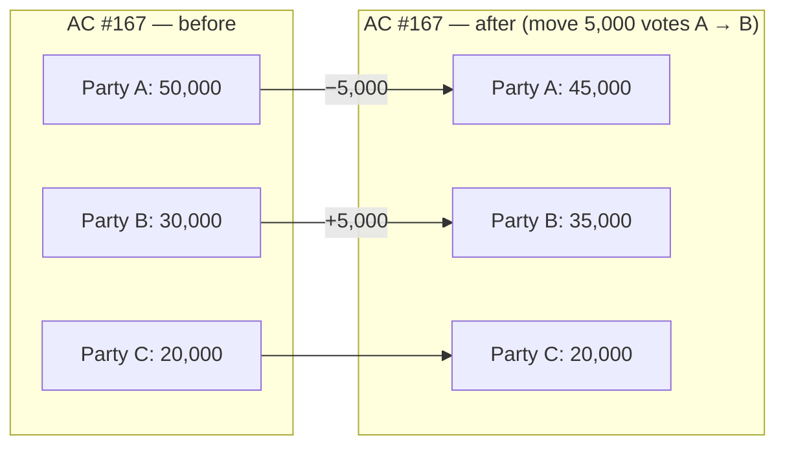
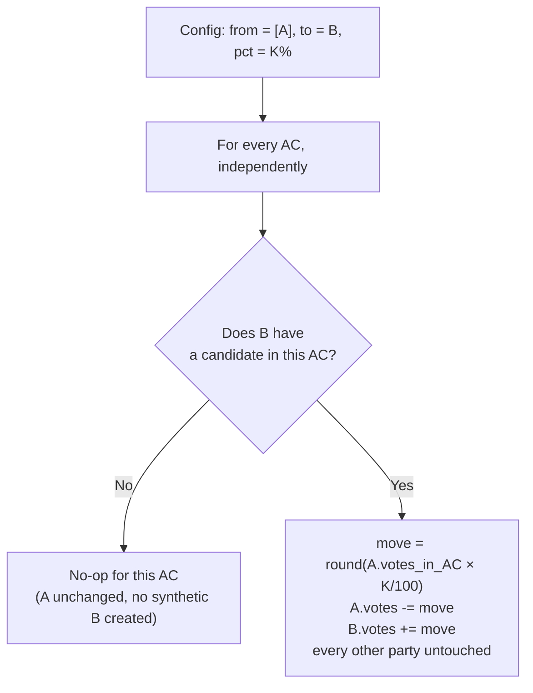
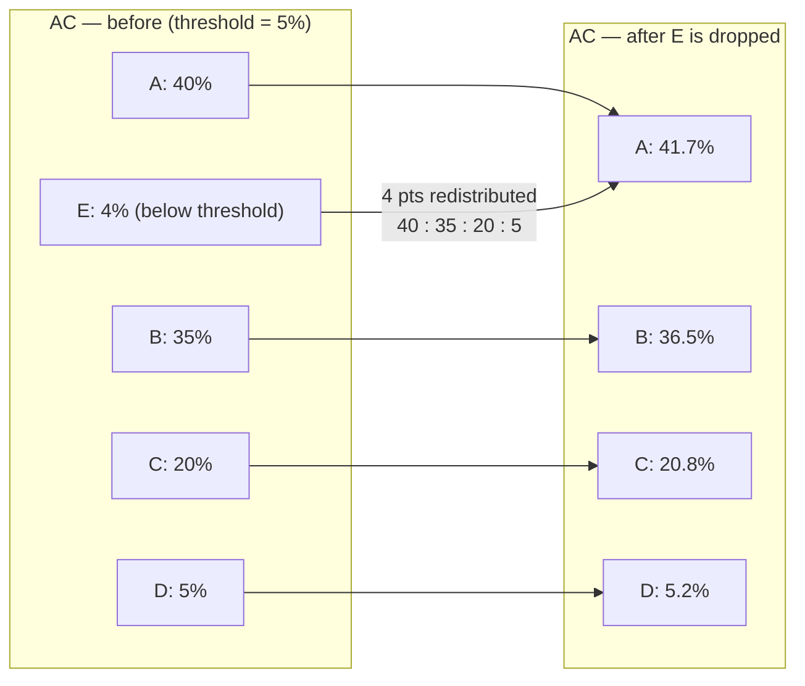
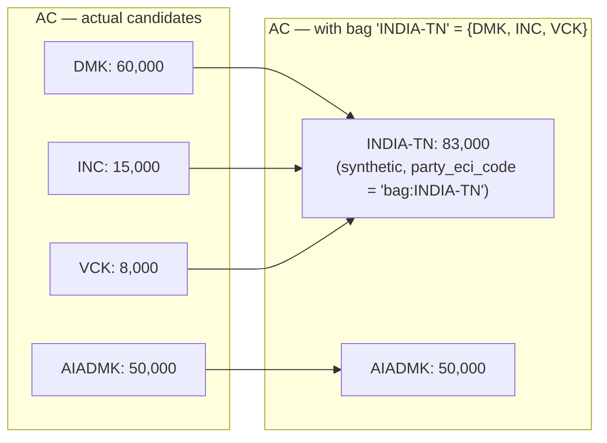

# Psephlab — the what-if simulator

**Last Updated**: 2026-05-10 (v1 shipped; per-mutation deep-dive + UI info icons)

Psephlab is the strategist-facing surface that lets a user mutate election inputs and re-count the result under a chosen counting rule. It is a pure, deterministic, in-browser computation: actuals come from `datasets/`, the user's mutations + rule choice define a *scenario*, and the rendered output is a function of `(actuals, scenario)` only.

This page covers the engine architecture, the mutation catalog, the counting-rule plugin contract, the scenario URL format, and the UI shape. It does not cover the map (see [map](map.md)) or shared chart components (see [overview > visualization catalog](overview.md#visualization-catalog)).

## The two orthogonal axes

A scenario is two independent choices:

1. **Input mutations** — transformations applied to the actual vote tallies. Multiple mutations compose in a documented order. Mutations preserve invariants (per-AC vote totals or, when turnout is uplifted, total ≤ electorate).
2. **Counting rule** — how the (mutated) tallies are converted into seats. Default is FPTP. Plugin contract below.

Output = `count(mutate(actuals, mutations), rule)`. Pure function. Same scenario URL → same render, forever.

## Engine pipeline

```
actuals (frozen, from datasets/)
   │
   ▼
[mutation 1] → [mutation 2] → [mutation N]   (ordered, each is (Tallies) → Tallies)
   │
   ▼
mutated_tallies
   │
   ▼
[counting rule]                              (Tallies → SeatAllocation)
   │
   ▼
result (seats per party, vote share, deltas vs actuals)
```

Lives under `frontend/src/lib/psephlab/`. Files marked *(planned)* are listed for design clarity only — v1 ships just FPTP and the four mutations checked in the catalog below.

```
psephlab/
├── types.ts            Tallies, MutationConfig, CountingRule, Scenario, RunResult
├── actuals.ts          loadActuals(event, state) — reads results.sqlite via cached sql.js Database
├── mutations/
│   ├── index.ts        MUTATIONS registry + mutationById()
│   ├── perAcSwing.ts
│   ├── statewideSwing.ts
│   ├── thresholdDrop.ts
│   ├── partyBag.ts     ad-hoc alliance merge (exports bagCode())
│   ├── turnoutUplift.ts    (planned)
│   └── transferMatrix.ts   (planned)
├── rules/
│   ├── index.ts        RULES registry + ruleById()
│   ├── fptp.ts         v1 default
│   ├── tworound.ts     (planned)
│   ├── irv.ts          (planned — needs synthesised ranks)
│   ├── stv.ts          (planned)
│   ├── dhondt.ts       (planned)
│   └── sainteLague.ts  (planned)
├── scenario.ts         encode/decode scenario ↔ base64url(JSON); writeScenarioToHash(prefix, scenario)
└── engine.ts           run(actuals, scenario): RunResult
```

`run()` is synchronous and pure. No I/O, no `await`. The page calls it on every scenario change; for TN-scale data (234 ACs × ≤30 candidates) it returns in <5 ms — fast enough that we recompute on every slider tick rather than debouncing.

### Tallies (the contract between phases)

```ts
type Tallies = {
  scope: { country: 'IN'; state: string; election: string };
  acs: Array<{
    eci_no: string;
    name: string;
    electorate: number;
    candidates: Array<{
      party_eci_code: string;  // 'NOTA' is a valid party code
      name: string;
      votes: number;
    }>;
  }>;
};
```

`Tallies` is the only shape mutations and rules see. Loaders translate `datasets/` JSON into it; this keeps the engine decoupled from schema versions.

## Mutation catalog (v1)

| Mutation | v1? | Knob | Conserves total votes? | Notes |
| --- | :---: | --- | :---: | --- |
| **Per-AC manual swing** | ✅ | drag votes from candidate X to Y in one AC | yes | The "what if 2,000 BJP voters had voted DMK in AC #167" case |
| **Statewide swing** | ✅ | "shift K% from Party A to Party B across all ACs" | yes | Single-target: only B benefits, other parties untouched. Per-AC, proportional to A's per-AC votes. No-op in ACs where B didn't contest. See [How statewide swing works](#how-statewide-swing-works). |
| **Threshold drop** | ✅ | "eliminate candidates below N%, redistribute proportionally to non-NOTA survivors" | yes | NOTA exempt from drop and from redistribution receipt; rounding drift goes to the largest survivor |
| **Ad-hoc party bag** | ✅ | "treat {DMK, INC, VCK} as one bloc" | yes | Members are pooled per-AC into one synthetic candidate (`party_eci_code = bag:<name>`). Bags are scenario-local (CLAUDE.md decision: no `datasets/reference/alliances/`) |
| **Turnout uplift** | planned | per-AC: `uplift_pct` (0–100) + per-AC split rule (defaults to current top-2 ratio, override allowed) | **no** — adds new votes up to `min(electorate, current + uplift_pct × non_voters)` | Caps so even at 100% the user can model realistic loss (e.g. uplift to 90%) |
| **Custom transfer matrix** | planned | per-region matrix `{from_party → {to_party: pct, ...}}` | yes | Applied per-AC within the region. Region defaults to state; override to district |

Mutations compose in the order the user adds them. Order matters (a threshold drop after a swing differs from before). The UI shows a stack the user can reorder.

### Why mutations are scenario-local, not contract-level

Alliances especially: party blocs change between elections, mid-cycle, and even between two strategists comparing notes. Baking an `alliances.json` into `datasets/reference/` would create a contract surface that needs version-bumps for every news event. Keeping the bag inside the scenario URL means each shared link self-describes its blocs.

## How each mutation works

Each Psephlab mutation row in the UI carries an `ⓘ` icon that deep-links into one of the subsections below. Diagrams use Mermaid (rendered natively by GitHub) so the algorithm — not just the prose — is reviewable.

The four primitives answer four different counterfactuals. They are deliberately separate; combining them in a stack is how you express richer scenarios.

### How per-AC swing works



- Acts on **one AC only** — the `eci_no` you select.
- `from_party_eci_codes` may list one or many sources; the engine pulls the requested `votes` proportionally from each source's per-AC pile, clamped so no candidate ever goes negative.
- `to_party_eci_code` is a single party. If the destination has no candidate in the AC, you can name a write-in candidate.
- Total votes in the AC are conserved; other parties (here, C) are untouched.
- Composes well after a `partyBag` (swing votes into the bag) or after a `thresholdDrop` (swing inside the surviving pool).

### How statewide swing works



Worked example, `from = [C], to = B, pct = 100%`:

| AC  | A before | B before | C before | move out of C | A after | B after | C after |
| --- | -------: | -------: | -------: | ------------: | ------: | ------: | ------: |
| 1   |   50,000 |   40,000 |   10,000 |        10,000 |  50,000 |  50,000 |       0 |
| 2   |   35,000 |   45,000 |   20,000 |        20,000 |  35,000 |  65,000 |       0 |
| 3   |   30,000 |  *(absent)* |   70,000 |     no-op |  30,000 |     —   |  70,000 |

Key properties:

- **Single-target.** All moved votes land on `to_party_eci_code`. **A** does not benefit from a `C → B` swing — even at `K = 100%`. If you want C's votes split proportionally between A and B, that is **threshold drop**, not statewide swing.
- **Per-AC.** No vote ever crosses an AC boundary; AC turnout is conserved.
- **Source-proportional.** A `K%` swing means *"K% of party A's voters in each AC defected"*, which matches Indian psephology's colloquial usage ("a 3% anti-incumbency swing").
- **Many-to-one supported.** `from = [C, D], to = B, pct = 50%` pools 50% of C's and 50% of D's votes into B per AC.
- **Slider range:** `0–100%`. Nudging to 100% in a `from = [C], to = B` config wipes C entirely from every AC where B contested and dumps the lot into B.
- **Default:** `from = top-1 party (statewide), to = top-2 party, pct = 0` — a safe identity. The 0% start is intentional; the user picks the direction that interests them.

### How threshold drop works



- Per AC: drop every candidate whose vote share is below `threshold_pct`.
- Their freed votes split among **survivors** in proportion to each survivor's pre-drop share.
- **NOTA is exempt** from being dropped *and* from receiving redistributed votes (NOTA represents abstention, not a candidate preference).
- Rounding drift (always ≤ 1 vote per AC) goes to the largest survivor.
- This is the right primitive for *"if Party X hadn't contested, voters would have gone to whoever they were already leaning toward"*. Rank order between survivors is preserved by construction, so the AC winner only ever changes when the dropped party was ahead of one of the survivors.

### How party bag works



- For every AC, all member-party candidates are removed and replaced by one synthetic candidate whose votes equal the sum of theirs.
- Synthetic `party_eci_code = "bag:<name>"`, so it cannot collide with a real ECI code; the counting rule treats it as just another party.
- Bags compose **before** swings/drops in the user's stack are typically what you want (alliance first, then ask "what swing flips it?"); the UI lets you reorder.
- Bags are **scenario-local** — membership rides in the share URL, never in `datasets/`. Rationale above in *Why mutations are scenario-local*.

## Counting rules

```ts
type CountingRule = {
  id: string;                           // 'fptp', 'irv', 'dhondt', ...
  needs: ('first_preferences' | 'ranks' | 'list_votes')[];
  apply(t: Tallies): SeatAllocation;
};
```

| Rule | Status | Notes |
| --- | --- | --- |
| **FPTP** | v1 | Per-AC winner = max votes. Default. |
| **Two-Round** | v2 | Top-2 advance, head-to-head sum reuses same tallies + a synthesised second-round split (slider in UI) |
| **Instant-Runoff (AV)** | v2 | Needs ranks; we don't have ranks. Synthesise from a user-defined preference matrix (party → ranked list of fallbacks) |
| **STV (multi-member)** | v3 | Requires multi-member districts; Indian ACs are single-member. Useful only if we let users *combine* ACs into multi-member districts (interesting research mode) |
| **D'Hondt list PR** | v2 | Treat the state as one district; party vote totals → seat allocation. Toggle district size |
| **Sainte-Laguë** | v2 | Same as D'Hondt with different divisor |
| **Approval / weighted** | v3 | Requires user-supplied weights per voter; pure thought experiment |

Each rule is a file under `lib/psephlab/rules/`. The registry exposes `availableRules(t)` filtered by `rule.needs ⊆ tallies.available`. Rules without their data requirement (e.g. IRV without ranks) appear in the UI with a "synthesise input" prompt.

### Why pluggable rules instead of FPTP-only with switches

The user's framing: "election can be conducted in many ways — representative, FPTP, rank order, weighted — Psephlab should support applying those concepts to the same results." A switch-based design ties every new rule to engine changes; a plugin contract lets each rule live in its own file with its own tests. Cost: one extra layer of indirection. Benefit: a contributor can add D'Hondt without touching the engine.

## Scenario as URL state

A scenario serialises to a compact URL fragment. URL is the source of truth; `localStorage` keeps a recents list (last 20, FIFO) so the user can rehydrate without bookmarking.

### Format

```
#/lab/:state/:event?s=<base64url(JSON)>
```

The URL parameter is named `event` in the route (matches our identifier vocabulary, CLAUDE.md §3), e.g. `AcGenMay2026`. The router strips `?s=...` before pattern matching so the scenario fragment never breaks navigation.

The decoded JSON (live shape, v1):

```json
{
  "v": 1,
  "rule": "fptp",
  "mutations": [
    { "id": "statewideSwing",
      "from_party_eci_codes": ["582"],
      "to_party_eci_code": "3679",
      "pct": 3.0
    },
    { "id": "partyBag",
      "name": "INDIA-TN",
      "members": ["582", "INC", "VCK"]
    }
  ]
}
```

- `v` — scenario format version. Bumping `v` is a breaking change to the URL; loaders refuse unknown versions and fall back to the empty scenario with a `console.warn`.
- `rule` — counting rule id from the registry. Unknown ids fall back to `fptp` (engine never throws on stale URLs).
- `mutations` — ordered list. Each entry is a discriminated `MutationConfig` typed by `id`. Field names use the ECI-suffix vocabulary consistent with the rest of the schemas — not the bare `from`/`to` shown in earlier drafts. Both `perAcSwing` and `statewideSwing` accept `from_party_eci_codes: string[]` (an array, possibly with one element) so a single destination party can pool votes from many sources. Legacy URLs that stored a singular `from_party_eci_code: string` are still decoded — the loaders treat them as `[<that code>]`.
- `colors` — *(planned)* user's party color overrides. Not currently embedded in the URL; persisted only in `localStorage` under `yen-gov:party-colors`.

Empty/default fields are stripped during encoding so a fresh scenario produces the shortest possible URL (`?s=eyJ2IjoxLCJydWxlIjoiZnB0cCJ9`).

### Why URL + localStorage instead of a server

CLAUDE.md Holy Law #1 forbids a production backend. URL-as-state means scenarios are shareable, screenshot-able, and survive the bundle being redeployed with a new code version (loaders are version-tolerant for additive `mutations` fields). `localStorage` is a UX convenience — recents only — and is opt-in (a Settings toggle clears it).

### URL — alternatives considered

- **Server-stored scenarios with short slugs.** Rejected — needs a backend (Holy Law #1) and creates a content-moderation surface we do not want to own.
- **Form-encoded query string.** Readable but explodes for non-trivial mutation stacks (transfer matrices, party bags). Base64-JSON wins on compactness and round-trip safety.
- **Pure localStorage + manual export/import.** Rejected — kills shareability, the central strategist workflow.

## UI shape (v1, as shipped)

```
┌──────────────────────┬────────────────────────────────────────┐
│ MUTATIONS (sticky)   │  SUMMARY STRIP                         │
│ ┌──────────────────┐ │  total seats · majority · mutated votes│
│ │ + Add mutation ▾ │ │                                        │
│ └──────────────────┘ │  PARLIAMENT ARC                        │
│ ▣ Statewide swing    │  ◯◯◯◯◯◉◉◉◉◉◉  majority 118             │
│   TVK → DMK 10 %     │  + per-party legend below              │
│ ▣ Party bag "INDIA"  │                                        │
│   DMK + INC + VCK    │  SWING SANKEY (actuals → scenario)     │
│                      │  TVK ░░░░░ ───── DMK +1.28 M votes     │
│ COUNTING RULE        │                                        │
│ [ FPTP        ▾ ]    │  PARTY BAR (Actuals | Scenario | Δ)    │
│                      │  ▰▰▰▰▰▰▰▰  TVK 78  −0 / −30            │
│ [ Copy URL ][ Reset ]│  ▰▰▰▰▰     DMK 98  −0 / +39            │
│                      │                                        │
│                      │  PARTY DELTAS table                    │
└──────────────────────┴────────────────────────────────────────┘
```

No map in the v1 result canvas — by design, the existing state map at `#/s/:state` is one click away. A scenario-aware map overlay is part of the Compare phase.

Single-AC mode (entered from `#/s/:state/ac/:eci_no` → "Open in Psephlab") — *planned*; v1 shows all ACs and all mutation types.

## See also

- [Frontend overview](overview.md) — personas, IA, viz catalog, phasing.
- [Map](map.md) — choropleth layer used by Psephlab.
- [Compare](compare.md) — Phase 3 split-screen view that diffs two scenarios (or two events) side by side.
- CLAUDE.md §1 (static-first), §6 (correction levels — Psephlab is Level 5).

## v1 implementation status (2026-05-09)

Shipped:

- Engine, mutations (perAcSwing, statewideSwing, thresholdDrop, partyBag), FPTP rule, scenario URL codec at `frontend/src/lib/psephlab/`.
- Route `#/lab/:state/:event` ([Psephlab.svelte](../../../frontend/src/routes/Psephlab.svelte)) with sticky mutation editor, before/after PartyBar comparison, party-deltas table, copy-share-URL.
- Router strips fragment query (`?s=...`) before pattern match — see [router.svelte.ts](../../../frontend/src/lib/router.svelte.ts).
- Mutation field name `from`/`to` in this doc landed in code as `from_party_eci_codes` (array) and `to_party_eci_code` (single string) — explicit suffixes match the rest of the schema vocabulary; pluralising the source side keeps many-to-one swings first-class.
- [`ParliamentArc.svelte`](../../../frontend/src/lib/ParliamentArc.svelte) — pure-SVG seat-dot semicircle. Row count auto-picked from `sqrt(total/6)` (4–12 rows); dots packed proportional to row arc length, then ordered left→right with the largest party on the left. Rounding drift is reconciled across the last rows so the dot total is always exact. Majority midline + per-party legend.
- [`SwingSankey.svelte`](../../../frontend/src/lib/SwingSankey.svelte) — pure-SVG approximate vote-flow diagram. We don't have the true bipartite flow matrix (per-AC mutations may overlap), so each loser's drop is redistributed across gainers in proportion to each gainer's share of total gain. Documented in the chart caption so users don't read it as ground truth.

Deferred to next pass: per-mutation labels in URL (currently only IDs); persisted custom party colors in the scenario object.

### Majority-mark convention (2026-05-10)

The summary strip's "Majority mark" is computed as `Math.floor(total_seats / 2) + 1` — the Indian legislature convention that a winning side needs *more than half* the seats, not merely half. For a 234-seat assembly (Tamil Nadu) the magic number is **118**, not 117. The same rule governs the Lok Sabha (543 → 272) and every state legislative assembly.

An earlier version used `Math.ceil(total_seats / 2)`, which gives the right answer for odd-N houses but is off by one for even-N houses (the common case for Indian assemblies). Fixed in this commit. The `ParliamentArc` midline already reads `majority` from the same prop, so the visual midline now matches the published convention without a separate change.

### Mutation editor: ECI-code column hidden (2026-05-10)

The `statewideSwing` and `partyBag` party-picker checkbox lists previously rendered each row as `<eci_code>  <party_short>` (e.g. `3679  DMK`). The numeric prefix is the ECI's internal party code — useful when authoring URLs by hand or debugging, but mystery-meat to a Citizen who doesn't know the registry. The column was dropped; rows now show party short-name only. The codes are still the canonical identifier inside scenario URLs and the engine, but the editor surface is name-only. (`perAcSwing` was unaffected — its picker shows party + vote count, not codes.)

Update (2026-05-09, post-Compare): both `perAcSwing` and `statewideSwing` accept `from_party_eci_codes: string[]` to model many-to-one swings (e.g. "AIADMK + BJP supporters defecting to DMK"). The legacy singular `from_party_eci_code` lives only as a URL back-compat shim in each mutation's `apply()` — no other code path knows about it. Editor for `from` is a checkbox cluster (party rows scoped to the AC for `perAcSwing`, to all parties in scope for `statewideSwing`). Pool-pull algorithm: `target = min(votes, pool)`, sources contribute proportional to share, rounding drift absorbed by the largest source, per-source clamp prevents negatives.
